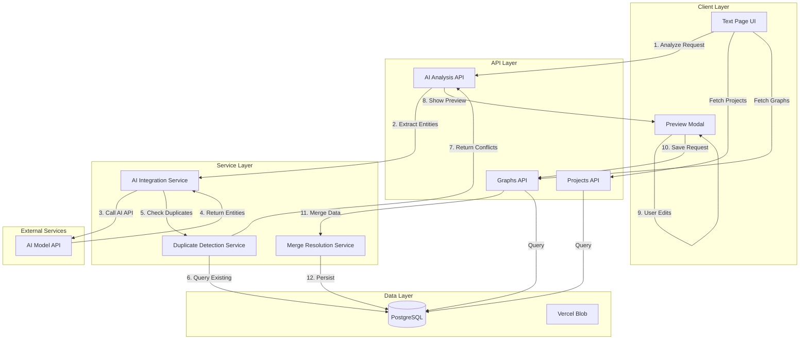

# Design Document: AI-Powered Document Analysis

## Overview

This feature enables users to upload documents (text, JSON, CSV, Excel, Markdown) and automatically generate knowledge graphs using AI-powered entity extraction and relationship detection. The system integrates with an external AI model API to analyze document content, extract structured data (nodes and edges), and present the results in an interactive preview modal where users can edit and refine the AI-generated graph before saving it to the database.

The feature is designed to work seamlessly with the existing Next.js application, leveraging the current database schema (Prisma + PostgreSQL), project/graph management system, and 2D/3D visualization components. Key capabilities include:

- AI-powered entity and relationship extraction from unstructured text
- Intelligent duplicate detection and conflict resolution when adding to existing graphs
- Interactive preview and editing before committing changes
- Support for both creating new graphs and augmenting existing ones
- Integration with the existing text page UI

## Architecture

### High-Level Architecture



### Component Interaction Flow

1. **User Initiates Analysis**: User enters text or uploads a file on the text page and clicks "Analyze with AI"
2. **AI Processing**: System sends document content to AI Model API for entity extraction
3. **Duplicate Detection**: System compares AI-generated nodes/edges against existing graph data
4. **Preview Display**: System shows preview modal with extracted entities, relationships, and conflict warnings
5. **User Refinement**: User edits node labels, properties, edge relationships, and resolves conflicts
6. **Data Persistence**: System merges new data with existing graph, maintaining referential integrity

## Components and Interfaces

### 1. AI Analysis API Endpoint

**Location**: `app/api/ai/analyze/route.ts`

**Purpose**: Receives document text, calls AI Model API, performs duplicate detection, and returns structured graph data with conflict information.

**Interface**:
```typescript
// Request
POST /api/ai/analyze
{
  documentText: string;
  projectId?: string;  // Optional: for duplicate detection
  graphId?: string;    // Optional: for duplicate detection
  visualizationType: '2d' | '3d';
}

// Response
{
  success: boolean;
  data?: {
    nodes: Array<{
      id: string;  // Temporary client-side ID
      name: string;
      type: string;
      properties: Record<string, any>;
      isDuplicate?: boolean;
      duplicateOf?: string;  // ID of existing node
      conflicts?: Array<{
        property: string;
        existingValue: any;
        newValue: any;
      }>;
    }>;
    edges: Array<{
      id: string;  // Temporary client-side ID
      fromNodeId: string;
      toNodeId: string;
      label: string;
      properties: Record<string, any>;
      isRedundant?: boolean;
    }>;
    stats: {
      totalNodes: number;
      totalEdges: number;
      duplicateNodes: number;
      redundantEdges: number;
      conflicts: number;
    };
  };
  error?: string;
}
```

### 2. AI Integration Service

**Location**: `lib/services/ai-integration.ts`

**Purpose**: Handles communication with the external AI Model API, transforms responses into application format.

**Interface**:
```typescript
interface AIIntegrationService {
  /**
   * Analyzes document text and extracts entities and relationships
   */
  analyzeDocument(text: string): Promise<{
    entities: Array<{
      name: string;
      type: string;
      properties: Record<string, any>;
    }>;
    relationships: Array<{
      from: string;  // Entity name
      to: string;    // Entity name
      type: string;
      properties: Record<string, any>;
    }>;
  }>;
}

// Implementation
class AIIntegrationServiceImpl implements AIIntegrationService {
  private apiKey: string = process.env.AI_API_KEY || 'sk-your-api-key-here';
  private apiEndpoint: string;  // To be determined based on AI API docs
  
  async analyzeDocument(text: string) {
    const response = await fetch(this.apiEndpoint, {
      method: 'POST',
      headers: {
        'Authorization': `Bearer ${this.apiKey}`,
        'Content-Type': 'application/json',
      },
      body: JSON.stringify({
        text,
        extractEntities: true,
        extractRelationships: true,
      }),
    });
    
    if (!response.ok) {
      throw new Error(`AI API error: ${response.statusText}`);
    }
    
    const data = await response.json();
    return this.transformResponse(data);
  }
  
  private transformResponse(apiResponse: any) {
    // Transform AI API response format to application format
    // This will depend on the actual AI API response structure
    return {
      entities: apiResponse.entities || [],
      relationships: apiResponse.relationships || [],
    };
  }
}
```

### 3. Duplicate Detection Service

**Location**: `lib/services/duplicate-detection.ts`

**Purpose**: Compares AI-generated nodes and edges against existing graph data to identify duplicates and conflicts.

**Interface**:
```typescript
interface DuplicateDetectionService {
  /**
   * Detects duplicate nodes by comparing labels (case-insensitive)
   */
  detectDuplicateNodes(
    newNodes: Array<{ name: string; properties: Record<string, any> }>,
    existingNodes: Array<{ id: string; name: string; metadata: string | null }>
  ): Array<{
    newNodeIndex: number;
    existingNodeId: string;
    conflicts: Array<{ property: string; existingValue: any; newValue: any }>;
  }>;
  
  /**
   * Detects redundant edges by comparing source, target, and relationship type
   */
  detectRedundantEdges(
    newEdges: Array<{ from: string; to: string; type: string }>,
    existingEdges: Array<{ fromNodeId: string; toNodeId: string; label: string }>,
    nodeMapping: Map<string, string>  // Maps node names to IDs
  ): Array<number>;  // Indices of redundant edges
}

// Implementation
class DuplicateDetectionServiceImpl implements DuplicateDetectionService {
  detectDuplicateNodes(newNodes, existingNodes) {
    const duplicates = [];
    
    for (let i = 0; i < newNodes.length; i++) {
      const newNode = newNodes[i];
      const existing = existingNodes.find(
        e => e.name.toLowerCase() === newNode.name.toLowerCase()
      );
      
      if (existing) {
        const conflicts = this.detectPropertyConflicts(
          newNode.properties,
          existing.metadata ? JSON.parse(existing.metadata) : {}
        );
        
        duplicates.push({
          newNodeIndex: i,
          existingNodeId: existing.id,
          conflicts,
        });
      }
    }
    
    return duplicates;
  }
  
  private detectPropertyConflicts(
    newProps: Record<string, any>,
    existingProps: Record<string, any>
  ) {
    const conflicts = [];
    
    for (const [key, newValue] of Object.entries(newProps)) {
      if (key in existingProps && existingProps[key] !== newValue) {
        conflicts.push({
          property: key,
          existingValue: existingProps[key],
          newValue,
        });
      }
    }
    
    return conflicts;
  }
  
  detectRedundantEdges(newEdges, existingEdges, nodeMapping) {
    const redundant = [];
    
    for (let i = 0; i < newEdges.length; i++) {
      const newEdge = newEdges[i];
      const fromId = nodeMapping.get(newEdge.from);
      const toId = nodeMapping.get(newEdge.to);
      
      if (!fromId || !toId) continue;
      
      const exists = existingEdges.some(
        e => e.fromNodeId === fromId &&
             e.toNodeId === toId &&
             e.label.toLowerCase() === newEdge.type.toLowerCase()
      );
      
      if (exists) {
        redundant.push(i);
      }
    }
    
    return redundant;
  }
}
```

### 4. Merge Resolution Service

**Location**: `lib/services/merge-resolution.ts`

**Purpose**: Handles merging of duplicate nodes and resolution of property conflicts based on user decisions.

**Interface**:
```typescript
interface MergeDecision {
  action: 'merge' | 'keep-both' | 'skip';
  nodeId: string;  // Existing node ID
  propertyResolutions?: Record<string, 'keep-existing' | 'use-new' | 'combine'>;
}

interface MergeResolutionService {
  /**
   * Merges nodes according to user decisions
   */
  mergeNodes(
    decisions: MergeDecision[],
    newNodes: Array<{ name: string; type: string; properties: Record<string, any> }>,
    existingNodes: Map<string, any>
  ): {
    nodesToCreate: Array<any>;
    nodesToUpdate: Array<{ id: string; updates: any }>;
    nodeIdMapping: Map<string, string>;  // Maps temp IDs to final IDs
  };
  
  /**
   * Filters out redundant edges and updates node references
   */
  processEdges(
    edges: Array<{ fromNodeId: string; toNodeId: string; label: string; properties: any }>,
    nodeIdMapping: Map<string, string>,
    redundantIndices: number[]
  ): Array<any>;
}

// Implementation
class MergeResolutionServiceImpl implements MergeResolutionService {
  mergeNodes(decisions, newNodes, existingNodes) {
    const nodesToCreate = [];
    const nodesToUpdate = [];
    const nodeIdMapping = new Map();
    
    for (const decision of decisions) {
      if (decision.action === 'merge') {
        const existingNode = existingNodes.get(decision.nodeId);
        const newNode = newNodes.find(/* match by temp ID */);
        
        const mergedProperties = this.resolveProperties(
          existingNode.metadata ? JSON.parse(existingNode.metadata) : {},
          newNode.properties,
          decision.propertyResolutions || {}
        );
        
        nodesToUpdate.push({
          id: decision.nodeId,
          updates: { metadata: JSON.stringify(mergedProperties) },
        });
        
        nodeIdMapping.set(newNode.tempId, decision.nodeId);
      } else if (decision.action === 'keep-both') {
        // Create new node with modified name to avoid confusion
        nodesToCreate.push(/* new node */);
      }
      // 'skip' means don't create the new node
    }
    
    return { nodesToCreate, nodesToUpdate, nodeIdMapping };
  }
  
  private resolveProperties(existing, newProps, resolutions) {
    const merged = { ...existing };
    
    for (const [key, value] of Object.entries(newProps)) {
      const resolution = resolutions[key] || 'use-new';
      
      if (resolution === 'use-new') {
        merged[key] = value;
      } else if (resolution === 'combine' && typeof value === 'string') {
        merged[key] = `${existing[key]}; ${value}`;
      }
      // 'keep-existing' means don't change
    }
    
    return merged;
  }
  
  processEdges(edges, nodeIdMapping, redundantIndices) {
    return edges
      .filter((_, i) => !redundantIndices.includes(i))
      .map(edge => ({
        ...edge,
        fromNodeId: nodeIdMapping.get(edge.fromNodeId) || edge.fromNodeId,
        toNodeId: nodeIdMapping.get(edge.toNodeId) || edge.toNodeId,
      }));
  }
}
```

### 5. Preview Modal Component

**Location**: `components/AIPreviewModal.tsx`

**Purpose**: Displays AI-generated graph data with interactive editing capabilities and conflict resolution UI.

**Interface**:
```typescript
interface AIPreviewModalProps {
  isOpen: boolean;
  onClose: () => void;
  data: {
    nodes: Array<{
      id: string;
      name: string;
      type: string;
      properties: Record<string, any>;
      isDuplicate?: boolean;
      duplicateOf?: string;
      conflicts?: Array<{
        property: string;
        existingValue: any;
        newValue: any;
      }>;
    }>;
    edges: Array<{
      id: string;
      fromNodeId: string;
      toNodeId: string;
      label: string;
      properties: Record<string, any>;
      isRedundant?: boolean;
    }>;
    stats: {
      totalNodes: number;
      totalEdges: number;
      duplicateNodes: number;
      redundantEdges: number;
      conflicts: number;
    };
  };
  onSave: (editedData: any, mergeDecisions: MergeDecision[]) => Promise<void>;
  visualizationType: '2d' | '3d';
}

// Component structure
const AIPreviewModal: React.FC<AIPreviewModalProps> = ({
  isOpen,
  onClose,
  data,
  onSave,
  visualizationType,
}) => {
  const [editedNodes, setEditedNodes] = useState(data.nodes);
  const [editedEdges, setEditedEdges] = useState(data.edges);
  const [mergeDecisions, setMergeDecisions] = useState<MergeDecision[]>([]);
  const [selectedNode, setSelectedNode] = useState<string | null>(null);
  const [isSaving, setIsSaving] = useState(false);
  
  // Render sections:
  // 1. Stats summary (total nodes, edges, conflicts)
  // 2. Conflict resolution panel (if conflicts exist)
  // 3. Graph visualization preview (2D or 3D)
  // 4. Node/Edge editing panel
  // 5. Action buttons (Save, Cancel)
  
  return (
    <Modal isOpen={isOpen} onClose={onClose}>
      {/* Implementation */}
    </Modal>
  );
};
```

### 6. Text Page Integration

**Location**: `app/text-page/page.tsx` (modifications)

**Changes Required**:
1. Add "Analyze with AI" button next to "Generate Knowledge Graph" button
2. Add loading state for AI processing
3. Integrate AIPreviewModal component
4. Connect to AI Analysis API endpoint
5. Fetch projects and graphs from database (replace mock data)

**New State Variables**:
```typescript
const [isAnalyzing, setIsAnalyzing] = useState(false);
const [showAIPreview, setShowAIPreview] = useState(false);
const [aiGeneratedData, setAIGeneratedData] = useState<any>(null);
const [projects, setProjects] = useState<Project[]>([]);
const [graphs, setGraphs] = useState<Graph[]>([]);
```

**New Handler**:
```typescript
const handleAIAnalysis = async () => {
  if (!inputText && !uploadedFile) return;
  if (!selectedProject) {
    alert('Please select a project first');
    return;
  }
  
  setIsAnalyzing(true);
  
  try {
    const response = await fetch('/api/ai/analyze', {
      method: 'POST',
      headers: { 'Content-Type': 'application/json' },
      body: JSON.stringify({
        documentText: uploadedFile?.content || inputText,
        projectId: selectedProject,
        graphId: selectedGraph || undefined,
        visualizationType: outputFormat,
      }),
    });
    
    const result = await response.json();
    
    if (result.success) {
      setAIGeneratedData(result.data);
      setShowAIPreview(true);
    } else {
      alert(`Error: ${result.error}`);
    }
  } catch (error) {
    console.error('AI analysis error:', error);
    alert('Failed to analyze document');
  } finally {
    setIsAnalyzing(false);
  }
};
```

## Data Models

### AI Analysis Request/Response

The system uses temporary client-side IDs for nodes and edges in the preview phase, then maps them to database IDs during the save operation.

**Node Structure (Preview Phase)**:
```typescript
interface PreviewNode {
  id: string;  // Temporary UUID
  name: string;
  type: string;
  properties: Record<string, any>;
  
  // Duplicate detection metadata
  isDuplicate?: boolean;
  duplicateOf?: string;  // ID of existing node in database
  conflicts?: Array<{
    property: string;
    existingValue: any;
    newValue: any;
  }>;
  
  // Visual properties (for preview)
  x?: number;
  y?: number;
  z?: number;
  color?: string;
  size?: number;
}
```

**Edge Structure (Preview Phase)**:
```typescript
interface PreviewEdge {
  id: string;  // Temporary UUID
  fromNodeId: string;  // References PreviewNode.id
  toNodeId: string;    // References PreviewNode.id
  label: string;
  properties: Record<string, any>;
  
  // Redundancy detection metadata
  isRedundant?: boolean;
  
  // Visual properties
  color?: string;
  style?: 'solid' | 'dashed' | 'dotted';
}
```

### Database Models (Existing)

The system uses the existing Prisma schema models:
- **Project**: Container for multiple graphs
- **Graph**: Container for nodes and edges
- **Node**: Entity in the knowledge graph
- **Edge**: Relationship between nodes

**Key Fields Used**:
- `Node.name`: Entity name (used for duplicate detection)
- `Node.type`: Entity type (document, concept, entity, etc.)
- `Node.metadata`: JSON string storing custom properties
- `Edge.label`: Relationship type
- `Edge.properties`: JSON string storing custom edge properties

## Correctness Properties

*A property is a characteristic or behavior that should hold true across all valid executions of a system—essentially, a formal statement about what the system should do. Properties serve as the bridge between human-readable specifications and machine-verifiable correctness guarantees.*

### Property 1: AI API Response Validation

*For any* valid document text input, when the AI Model API returns a response, the response should contain well-formed entities and relationships arrays, and all entity names referenced in relationships should exist in the entities array.

**Validates: Requirements 1.1, 1.2, 1.3**

### Property 2: Duplicate Node Detection Accuracy

*For any* set of AI-generated nodes and existing graph nodes, when duplicate detection runs, every node pair with case-insensitive matching names should be flagged as duplicates, and no non-matching pairs should be flagged.

**Validates: Requirements 5.1, 5.2, 5.3, 5.4**

### Property 3: Redundant Edge Detection Accuracy

*For any* set of AI-generated edges and existing graph edges, when redundancy detection runs, every edge with matching source node, target node, and relationship type should be flagged as redundant, and no non-matching edges should be flagged.

**Validates: Requirements 6.1, 6.2, 6.3**

### Property 4: Property Conflict Detection Completeness

*For any* duplicate node pair, when property comparison runs, all properties with different values between the new and existing node should be identified as conflicts, and properties with matching values should not be flagged.

**Validates: Requirements 7.1, 7.2, 7.3, 7.4**

### Property 5: Node Merge Referential Integrity

*For any* merge operation where a duplicate node is merged with an existing node, all edges that reference the duplicate node's temporary ID should be updated to reference the existing node's database ID, and no edges should reference non-existent node IDs after the merge.

**Validates: Requirements 8.4**

### Property 6: Data Persistence Atomicity

*For any* save operation, either all nodes and edges should be successfully persisted to the database, or none should be persisted (rollback on error), ensuring no partial graph states exist.

**Validates: Requirements 9.7**

### Property 7: Project-Graph Association Consistency

*For any* saved graph data, all nodes and edges should have matching projectId and graphId values, and these IDs should reference existing Project and Graph records in the database.

**Validates: Requirements 9.1, 9.2, 9.3, 9.4**

### Property 8: Preview Modal Data Immutability

*For any* user edit in the preview modal, the original AI-generated data should remain unchanged until the user clicks "Save", and clicking "Cancel" should discard all edits without affecting the database.

**Validates: Requirements 4.6**

### Property 9: Loading State Consistency

*For any* AI analysis operation, the loading state should be true during API processing and false after completion (success or error), and the UI should be disabled during loading to prevent duplicate requests.

**Validates: Requirements 1.4, 10.4**

### Property 10: Error Message Clarity

*For any* error condition (AI API failure, database error, validation error), the system should display a user-friendly error message that describes the problem without exposing sensitive information like API keys or database connection strings.

**Validates: Requirements 12.1, 12.2, 12.3, 12.4, 12.6**

## Error Handling

### AI API Errors

**Scenario**: AI Model API is unavailable or returns an error
**Handling**:
1. Catch fetch errors and API error responses
2. Log detailed error for debugging (server-side only)
3. Display user-friendly message: "Unable to analyze document. Please try again later."
4. Provide retry button in the UI
5. Do not expose API key or endpoint details to client

**Implementation**:
```typescript
try {
  const response = await fetch(AI_API_ENDPOINT, { /* ... */ });
  if (!response.ok) {
    throw new Error(`AI API returned ${response.status}`);
  }
} catch (error) {
  console.error('[AI Service] Analysis failed:', error);
  return {
    success: false,
    error: 'Unable to analyze document. Please try again later.',
  };
}
```

### Database Errors

**Scenario**: Database connection fails or query errors occur
**Handling**:
1. Wrap all Prisma operations in try-catch blocks
2. Use Prisma transactions for multi-step operations (create nodes + edges)
3. Rollback on any error to maintain consistency
4. Log error details server-side
5. Return generic error message to client

**Implementation**:
```typescript
try {
  await prisma.$transaction(async (tx) => {
    // Create nodes
    const createdNodes = await tx.node.createMany({ /* ... */ });
    // Create edges
    const createdEdges = await tx.edge.createMany({ /* ... */ });
    // Update graph stats
    await tx.graph.update({ /* ... */ });
  });
} catch (error) {
  console.error('[Database] Transaction failed:', error);
  return {
    success: false,
    error: 'Failed to save graph data. Please try again.',
  };
}
```

### Validation Errors

**Scenario**: User attempts to save without required selections
**Handling**:
1. Validate project and graph selection before API calls
2. Display inline validation messages
3. Disable save button until validation passes
4. Highlight missing fields in red

**Validation Rules**:
- Project must be selected (either existing or new)
- Graph must be selected or "Create New" chosen
- Document text or uploaded file must be present
- At least one node must exist in preview data

### Network Errors

**Scenario**: Network request fails or times out
**Handling**:
1. Set reasonable timeout (30 seconds for AI analysis)
2. Catch network errors separately from API errors
3. Display message: "Network error. Please check your connection and try again."
4. Provide retry button
5. Preserve user's input data during retry

### Conflict Resolution Errors

**Scenario**: User doesn't resolve all conflicts before saving
**Handling**:
1. Validate that all conflicts have merge decisions
2. Display warning banner: "Please resolve all conflicts before saving"
3. Scroll to first unresolved conflict
4. Highlight unresolved conflicts in red
5. Disable save button until all conflicts resolved

## Testing Strategy

### Dual Testing Approach

This feature requires both unit tests and property-based tests to ensure comprehensive coverage:

**Unit Tests**: Focus on specific examples, edge cases, and integration points
- Test AI API integration with mock responses
- Test duplicate detection with specific node pairs
- Test merge resolution with known conflict scenarios
- Test UI component rendering and user interactions
- Test error handling with specific error conditions

**Property-Based Tests**: Verify universal properties across all inputs
- Test duplicate detection accuracy across random node sets
- Test edge redundancy detection across random edge sets
- Test merge operations maintain referential integrity
- Test data persistence atomicity with random graph data
- Test property conflict detection completeness

### Property-Based Testing Configuration

**Library**: Use `fast-check` for TypeScript property-based testing

**Configuration**: Each property test should run minimum 100 iterations

**Test Tagging**: Each test must reference its design document property
- Format: `// Feature: ai-document-analysis, Property {number}: {property_text}`

**Example Property Test**:
```typescript
import fc from 'fast-check';

// Feature: ai-document-analysis, Property 2: Duplicate Node Detection Accuracy
describe('Duplicate Detection Properties', () => {
  it('should flag all case-insensitive name matches as duplicates', () => {
    fc.assert(
      fc.property(
        fc.array(fc.record({
          name: fc.string(),
          properties: fc.dictionary(fc.string(), fc.anything()),
        })),
        fc.array(fc.record({
          id: fc.uuid(),
          name: fc.string(),
          metadata: fc.jsonValue(),
        })),
        (newNodes, existingNodes) => {
          const service = new DuplicateDetectionService();
          const duplicates = service.detectDuplicateNodes(newNodes, existingNodes);
          
          // Verify all case-insensitive matches are flagged
          for (const dup of duplicates) {
            const newNode = newNodes[dup.newNodeIndex];
            const existingNode = existingNodes.find(e => e.id === dup.existingNodeId);
            expect(newNode.name.toLowerCase()).toBe(existingNode.name.toLowerCase());
          }
          
          // Verify no false positives
          const flaggedIndices = new Set(duplicates.map(d => d.newNodeIndex));
          for (let i = 0; i < newNodes.length; i++) {
            if (!flaggedIndices.has(i)) {
              const newNode = newNodes[i];
              const hasMatch = existingNodes.some(
                e => e.name.toLowerCase() === newNode.name.toLowerCase()
              );
              expect(hasMatch).toBe(false);
            }
          }
        }
      ),
      { numRuns: 100 }
    );
  });
});
```

### Unit Test Examples

**AI Integration Service Tests**:
```typescript
describe('AIIntegrationService', () => {
  it('should handle API errors gracefully', async () => {
    const service = new AIIntegrationService();
    // Mock fetch to return error
    global.fetch = jest.fn().mockResolvedValue({
      ok: false,
      statusText: 'Internal Server Error',
    });
    
    await expect(service.analyzeDocument('test')).rejects.toThrow();
  });
  
  it('should transform API response correctly', async () => {
    const service = new AIIntegrationService();
    const mockResponse = {
      entities: [{ name: 'Entity1', type: 'concept' }],
      relationships: [{ from: 'Entity1', to: 'Entity2', type: 'relates_to' }],
    };
    
    global.fetch = jest.fn().mockResolvedValue({
      ok: true,
      json: async () => mockResponse,
    });
    
    const result = await service.analyzeDocument('test');
    expect(result.entities).toHaveLength(1);
    expect(result.relationships).toHaveLength(1);
  });
});
```

**Preview Modal Tests**:
```typescript
describe('AIPreviewModal', () => {
  it('should display conflict warnings when duplicates exist', () => {
    const data = {
      nodes: [{
        id: '1',
        name: 'Test',
        isDuplicate: true,
        conflicts: [{ property: 'type', existingValue: 'A', newValue: 'B' }],
      }],
      edges: [],
      stats: { totalNodes: 1, duplicateNodes: 1, conflicts: 1 },
    };
    
    const { getByText } = render(
      <AIPreviewModal isOpen={true} data={data} onSave={jest.fn()} />
    );
    
    expect(getByText(/conflict/i)).toBeInTheDocument();
  });
  
  it('should disable save button when conflicts are unresolved', () => {
    // Test implementation
  });
});
```

### Integration Tests

**End-to-End Flow**:
1. User enters text on text page
2. Clicks "Analyze with AI"
3. System calls AI API (mocked)
4. Preview modal displays results
5. User edits nodes and resolves conflicts
6. User clicks "Save"
7. Data persists to database
8. Graph appears in visualization

**Database Integration**:
- Test project and graph creation
- Test node and edge persistence
- Test transaction rollback on error
- Test duplicate detection with real database queries

### Test Coverage Goals

- **Unit Test Coverage**: Minimum 80% code coverage
- **Property Test Coverage**: All 10 correctness properties implemented
- **Integration Test Coverage**: All critical user flows tested
- **Error Handling Coverage**: All error scenarios tested

### Testing Tools

- **Unit Testing**: Jest + React Testing Library
- **Property Testing**: fast-check
- **API Testing**: Supertest
- **Database Testing**: Prisma with test database
- **E2E Testing**: Playwright (optional, for critical flows)
