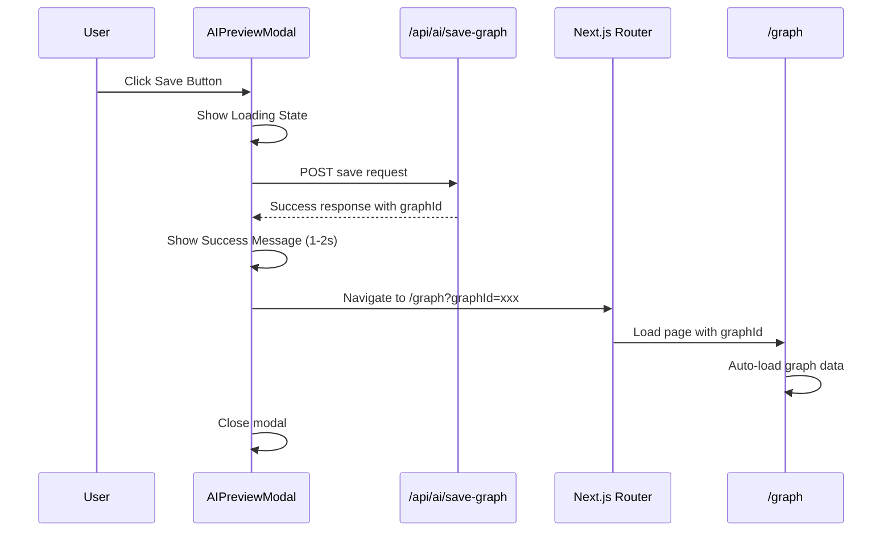

# Design Document: AI Preview Auto Navigation

## Overview

This feature enhances the AI knowledge graph creation workflow by automatically navigating users to the 3D knowledge graph page after successfully saving their generated graph. The implementation involves modifying the existing AI Preview Modal component to include navigation logic after successful save operations, while maintaining backward compatibility and robust error handling.

The solution leverages Next.js's `useRouter` hook for client-side navigation and integrates seamlessly with the existing save workflow without disrupting current functionality.

## Architecture

### Component Architecture

```
AI Creation Workflow
├── TextPage (app/text-page/page.tsx)
│   ├── handleAISave() - Modified to handle navigation
│   └── AIPreviewModal Integration
├── AIPreviewModal (components/AIPreviewModal.tsx)
│   ├── Enhanced Save Logic
│   ├── Navigation State Management
│   └── Error Handling
└── 3D Graph Page (app/graph/page.tsx)
    └── Automatic Graph Loading via graphId parameter
```

### Navigation Flow



## Components and Interfaces

### Modified AIPreviewModal Component

**File**: `components/AIPreviewModal.tsx`

**New Props Interface**:
```typescript
export interface AIPreviewModalProps {
  isOpen: boolean
  onClose: () => void
  data: PreviewData
  onSave: (editedData: PreviewData, mergeDecisions: MergeDecision[]) => Promise<{ success: boolean; graphId?: string; error?: string }>
  visualizationType: '2d' | '3d'
  enableAutoNavigation?: boolean // New optional prop for backward compatibility
}
```

**New State Variables**:
```typescript
const [isNavigating, setIsNavigating] = useState(false)
const [showSuccessMessage, setShowSuccessMessage] = useState(false)
const [navigationError, setNavigationError] = useState<string | null>(null)
```

### Modified TextPage Component

**File**: `app/text-page/page.tsx`

**Enhanced handleAISave Function**:
```typescript
const handleAISave = async (editedData: PreviewData, mergeDecisions: MergeDecision[]) => {
  try {
    const response = await fetch('/api/ai/save-graph', { /* existing logic */ })
    const result = await response.json()

    if (result.success) {
      return {
        success: true,
        graphId: result.data.graphId,
        graphName: result.data.graphName
      }
    } else {
      return {
        success: false,
        error: result.error
      }
    }
  } catch (error) {
    return {
      success: false,
      error: 'Save failed, please try again'
    }
  }
}
```

### Navigation Service

**New File**: `lib/services/navigation-service.ts`

```typescript
export interface NavigationResult {
  success: boolean
  error?: string
}

export class NavigationService {
  static async navigateToGraph(graphId: string, router: any): Promise<NavigationResult> {
    try {
      const url = `/graph?graphId=${graphId}`
      await router.push(url)
      return { success: true }
    } catch (error) {
      console.error('Navigation failed:', error)
      return {
        success: false,
        error: 'Navigation failed. Please manually navigate to the graph.'
      }
    }
  }
}
```

## Data Models

### Save Response Interface

```typescript
interface SaveResponse {
  success: boolean
  data?: {
    graphId: string
    graphName: string
    nodesCreated: number
    nodesUpdated: number
    edgesCreated: number
    totalNodes: number
    totalEdges: number
  }
  error?: string
}
```

### Navigation State Interface

```typescript
interface NavigationState {
  isNavigating: boolean
  showSuccessMessage: boolean
  navigationError: string | null
  targetGraphId: string | null
}
```

## Correctness Properties

*A property is a characteristic or behavior that should hold true across all valid executions of a system-essentially, a formal statement about what the system should do. Properties serve as the bridge between human-readable specifications and machine-verifiable correctness guarantees.*

Now I need to analyze the acceptance criteria for testability using the prework tool:

### Property 1: Successful Save Triggers Navigation

*For any* successful save response containing a graphId, the AI Preview Modal should initiate navigation to the 3D graph page with the correct URL format.

**Validates: Requirements 1.1, 1.2**

### Property 2: Modal Closes After Navigation

*For any* successful navigation initiation, the AI Preview Modal should close automatically.

**Validates: Requirements 1.3**

### Property 3: Graph Page Loads Correct Data

*For any* navigation to the graph page with a graphId parameter, the page should automatically load and display the corresponding graph data.

**Validates: Requirements 1.4, 4.4**

### Property 4: Missing GraphId Error Handling

*For any* successful save response that lacks a graphId field, the AI Preview Modal should display an error message and remain open.

**Validates: Requirements 2.1**

### Property 5: Navigation Failure Handling

*For any* navigation failure, the AI Preview Modal should display a fallback message with manual navigation instructions and log error details.

**Validates: Requirements 2.2, 2.3, 2.4**

### Property 6: API Compatibility Preservation

*For any* save operation, the Save Graph API should maintain its current response format and interface.

**Validates: Requirements 3.1, 5.1**

### Property 7: Failed Save No Navigation

*For any* failed save operation, the AI Preview Modal should display existing error handling without attempting navigation.

**Validates: Requirements 3.2**

### Property 8: Existing Functionality Preservation

*For any* modal operation, all current editing and conflict resolution capabilities should remain intact.

**Validates: Requirements 3.3**

### Property 9: Loading State Management

*For any* save and navigation sequence, the AI Preview Modal should show appropriate loading states during save operations and navigation transitions.

**Validates: Requirements 3.4, 4.1**

### Property 10: Success Message Timing

*For any* successful save completion, the AI Preview Modal should show a brief success message before initiating navigation within 1-2 seconds.

**Validates: Requirements 4.2, 4.3**

### Property 11: Dual Mode Support

*For any* modal configuration, the AI Preview Modal should support both automatic navigation and manual closure modes with appropriate fallback behavior.

**Validates: Requirements 5.2, 5.3**

### Property 12: Direct URL Access Preservation

*For any* direct URL access to the graph page with graphId parameter, the page should continue to function as before.

**Validates: Requirements 5.4**

## Error Handling

### Error Categories

1. **API Response Errors**
   - Missing graphId in successful response
   - Malformed response structure
   - Network timeouts or failures

2. **Navigation Errors**
   - Router push failures
   - Invalid URL construction
   - Browser navigation restrictions

3. **State Management Errors**
   - Modal state inconsistencies
   - Loading state conflicts
   - Memory cleanup issues

### Error Recovery Strategies

```typescript
interface ErrorRecoveryStrategy {
  errorType: 'api' | 'navigation' | 'state'
  fallbackAction: 'showError' | 'retryOperation' | 'manualNavigation'
  userMessage: string
  logLevel: 'error' | 'warn' | 'info'
}

const errorStrategies: ErrorRecoveryStrategy[] = [
  {
    errorType: 'api',
    fallbackAction: 'showError',
    userMessage: 'Graph saved successfully, but automatic navigation failed. Please navigate manually.',
    logLevel: 'error'
  },
  {
    errorType: 'navigation',
    fallbackAction: 'manualNavigation',
    userMessage: 'Navigation failed. Click here to view your saved graph.',
    logLevel: 'warn'
  },
  {
    errorType: 'state',
    fallbackAction: 'retryOperation',
    userMessage: 'Please try again.',
    logLevel: 'error'
  }
]
```

### Error Logging

All errors will be logged with structured information:

```typescript
interface ErrorLog {
  timestamp: string
  errorType: string
  errorMessage: string
  graphId?: string
  userAction: string
  stackTrace?: string
}
```

## Testing Strategy

### Dual Testing Approach

The testing strategy employs both unit tests and property-based tests to ensure comprehensive coverage:

**Unit Tests**: Focus on specific scenarios, edge cases, and integration points
- Modal state transitions
- API response handling
- Error message display
- Navigation timing

**Property Tests**: Verify universal properties across all inputs
- Save-navigation workflows with random data
- Error handling with various failure scenarios
- State management consistency
- Backward compatibility preservation

### Property-Based Testing Configuration

- **Library**: `fast-check` for TypeScript/React applications
- **Iterations**: Minimum 100 iterations per property test
- **Test Tags**: Each property test references its design document property

**Example Property Test Structure**:
```typescript
// Feature: ai-preview-auto-navigation, Property 1: Successful Save Triggers Navigation
describe('Property 1: Successful Save Triggers Navigation', () => {
  it('should navigate to graph page for any successful save with graphId', 
    fc.property(
      fc.record({
        graphId: fc.string({ minLength: 1 }),
        graphName: fc.string({ minLength: 1 }),
        nodesCreated: fc.nat(),
        edgesCreated: fc.nat()
      }),
      async (saveData) => {
        // Test implementation
      }
    )
  )
})
```

### Unit Testing Focus Areas

1. **Modal Component Tests**
   - Save button state management
   - Success message display timing
   - Error message content validation
   - Modal close behavior

2. **Navigation Service Tests**
   - URL construction accuracy
   - Router integration
   - Error handling robustness
   - Fallback mechanism activation

3. **Integration Tests**
   - End-to-end save-navigation flow
   - Graph page parameter reception
   - Backward compatibility verification
   - Performance timing validation

### Test Coverage Requirements

- **Unit Tests**: 95% code coverage for modified components
- **Property Tests**: 100% coverage of correctness properties
- **Integration Tests**: Complete workflow coverage
- **Error Scenarios**: All error paths tested

The testing strategy ensures that the automatic navigation feature works reliably across all scenarios while maintaining the existing functionality and providing robust error handling.