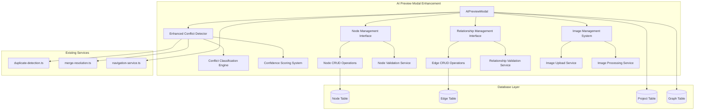
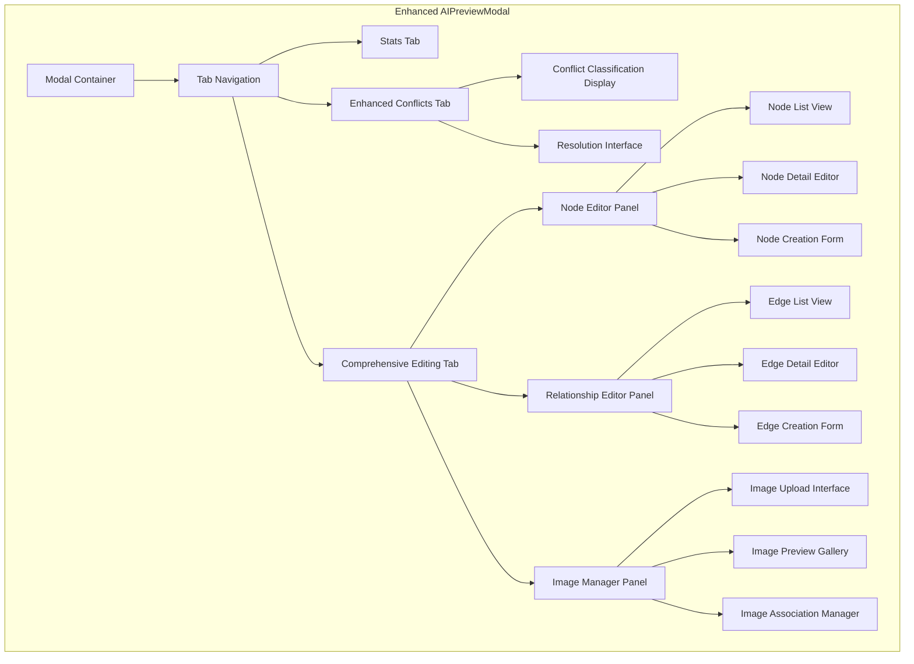

# Design Document

## Overview

The AI Preview Modal Enhancement transforms the existing AIPreviewModal component into a comprehensive conflict detection and editing interface. This enhancement removes visualization capabilities while significantly expanding conflict detection algorithms and providing complete CRUD operations for generated knowledge graph elements.

The design builds upon the existing duplicate-detection.ts and merge-resolution.ts services, extending them with advanced conflict classification, comprehensive editing interfaces, and integrated image management capabilities. The solution maintains backward compatibility with existing AI generation workflows while providing a streamlined, focused editing experience.

## Architecture

### System Architecture



### Component Architecture



## Components and Interfaces

### Enhanced Conflict Detection System

#### ConflictDetectionService Interface

```typescript
interface EnhancedConflictDetectionService extends DuplicateDetectionService {
  /**
   * Comprehensive conflict analysis with classification
   */
  analyzeConflicts(
    generatedGraph: GeneratedGraphData,
    existingGraph: ExistingGraphData
  ): ConflictAnalysisResult;

  /**
   * Classify conflicts into distinct categories
   */
  classifyConflicts(conflicts: DetectedConflict[]): ClassifiedConflicts;

  /**
   * Calculate confidence scores for conflict detection
   */
  calculateConfidenceScores(conflicts: DetectedConflict[]): ConflictConfidenceMap;

  /**
   * Detect orphaned relationships
   */
  detectOrphanedRelationships(
    edges: NewEdgeData[],
    nodeMapping: Map<string, string>
  ): OrphanedRelationship[];

  /**
   * Identify content conflicts within node properties
   */
  detectContentConflicts(
    newNode: NewNodeData,
    existingNode: ExistingNodeData
  ): ContentConflict[];
}
```

#### Conflict Classification Types

```typescript
enum ConflictType {
  DUPLICATE_NODES = 'duplicate_nodes',
  CONFLICTING_EDGES = 'conflicting_edges',
  MISSING_REFERENCES = 'missing_references',
  CONTENT_CONFLICTS = 'content_conflicts',
  PROPERTY_MISMATCHES = 'property_mismatches',
  TYPE_INCONSISTENCIES = 'type_inconsistencies'
}

interface ClassifiedConflicts {
  [ConflictType.DUPLICATE_NODES]: DuplicateNodeConflict[];
  [ConflictType.CONFLICTING_EDGES]: ConflictingEdgeConflict[];
  [ConflictType.MISSING_REFERENCES]: MissingReferenceConflict[];
  [ConflictType.CONTENT_CONFLICTS]: ContentConflict[];
  [ConflictType.PROPERTY_MISMATCHES]: PropertyMismatchConflict[];
  [ConflictType.TYPE_INCONSISTENCIES]: TypeInconsistencyConflict[];
}

interface ConflictConfidenceScore {
  overall: number; // 0-1 confidence score
  factors: {
    nameSimilarity: number;
    contentOverlap: number;
    propertyAlignment: number;
    contextualRelevance: number;
  };
  reasoning: string[];
}
```

### Node Management Interface

#### NodeManagerService Interface

```typescript
interface NodeManagerService {
  /**
   * Get all nodes with pagination and filtering
   */
  getNodes(options: NodeQueryOptions): Promise<PaginatedNodes>;

  /**
   * Create a new node with validation
   */
  createNode(nodeData: CreateNodeData): Promise<ValidationResult<Node>>;

  /**
   * Update existing node with conflict resolution
   */
  updateNode(
    nodeId: string, 
    updates: UpdateNodeData,
    conflictResolution?: ConflictResolution
  ): Promise<ValidationResult<Node>>;

  /**
   * Delete node with dependency checking
   */
  deleteNode(nodeId: string, options: DeleteOptions): Promise<DeletionResult>;

  /**
   * Validate node data before operations
   */
  validateNodeData(nodeData: NodeData): ValidationResult<NodeData>;

  /**
   * Bulk operations for multiple nodes
   */
  bulkOperations(operations: NodeOperation[]): Promise<BulkOperationResult>;
}

interface NodeQueryOptions {
  page?: number;
  limit?: number;
  search?: string;
  type?: string;
  tags?: string[];
  sortBy?: 'name' | 'createdAt' | 'updatedAt' | 'type';
  sortOrder?: 'asc' | 'desc';
}

interface CreateNodeData {
  name: string;
  type: string;
  content?: string;
  properties?: Record<string, any>;
  position?: { x: number; y: number; z: number };
  visualProperties?: VisualProperties;
  imageFile?: File;
}

interface UpdateNodeData extends Partial<CreateNodeData> {
  id: string;
}
```

### Relationship Management Interface

#### RelationshipManagerService Interface

```typescript
interface RelationshipManagerService {
  /**
   * Get all relationships with filtering
   */
  getRelationships(options: RelationshipQueryOptions): Promise<PaginatedRelationships>;

  /**
   * Create new relationship with validation
   */
  createRelationship(relationshipData: CreateRelationshipData): Promise<ValidationResult<Edge>>;

  /**
   * Update existing relationship
   */
  updateRelationship(
    edgeId: string,
    updates: UpdateRelationshipData
  ): Promise<ValidationResult<Edge>>;

  /**
   * Delete relationship with impact analysis
   */
  deleteRelationship(edgeId: string): Promise<DeletionResult>;

  /**
   * Validate relationship data
   */
  validateRelationshipData(data: RelationshipData): ValidationResult<RelationshipData>;

  /**
   * Get available relationship types
   */
  getRelationshipTypes(): RelationshipType[];

  /**
   * Detect duplicate relationships
   */
  detectDuplicateRelationships(
    newRelationship: CreateRelationshipData,
    existingRelationships: Edge[]
  ): DuplicateRelationshipResult;
}

interface CreateRelationshipData {
  fromNodeId: string;
  toNodeId: string;
  label: string;
  properties?: Record<string, any>;
  bidirectional?: boolean;
  visualProperties?: EdgeVisualProperties;
}

interface RelationshipType {
  id: string;
  label: string;
  description: string;
  category: string;
  defaultProperties?: Record<string, any>;
  allowsBidirectional: boolean;
}
```

### Image Management System

#### ImageManagerService Interface

```typescript
interface ImageManagerService {
  /**
   * Upload image with validation and processing
   */
  uploadImage(file: File, options: ImageUploadOptions): Promise<ImageUploadResult>;

  /**
   * Associate image with node
   */
  associateImageWithNode(nodeId: string, imageUrl: string): Promise<AssociationResult>;

  /**
   * Remove image from node
   */
  removeImageFromNode(nodeId: string): Promise<RemovalResult>;

  /**
   * Get image metadata and preview
   */
  getImageMetadata(imageUrl: string): Promise<ImageMetadata>;

  /**
   * Compress and optimize image
   */
  processImage(file: File, options: ImageProcessingOptions): Promise<ProcessedImage>;

  /**
   * Validate image file
   */
  validateImageFile(file: File): ValidationResult<File>;

  /**
   * Get supported image formats
   */
  getSupportedFormats(): ImageFormat[];
}

interface ImageUploadOptions {
  maxSize?: number; // bytes
  quality?: number; // 0-1
  resize?: { width?: number; height?: number };
  format?: 'webp' | 'jpeg' | 'png';
}

interface ImageUploadResult {
  success: boolean;
  imageUrl?: string;
  thumbnailUrl?: string;
  metadata?: ImageMetadata;
  error?: string;
}

interface ImageMetadata {
  url: string;
  filename: string;
  size: number;
  dimensions: { width: number; height: number };
  format: string;
  uploadedAt: Date;
}
```

## Data Models

### Enhanced Preview Data Structures

```typescript
interface EnhancedPreviewNode extends PreviewNode {
  // Enhanced conflict information
  conflictDetails?: {
    type: ConflictType[];
    confidence: ConflictConfidenceScore;
    resolutionOptions: ResolutionOption[];
  };
  
  // Image management
  imageMetadata?: ImageMetadata;
  hasImage: boolean;
  
  // Validation status
  validationStatus: ValidationStatus;
  validationErrors?: ValidationError[];
  
  // Edit history
  editHistory?: EditHistoryEntry[];
  isModified: boolean;
}

interface EnhancedPreviewEdge extends PreviewEdge {
  // Enhanced conflict information
  conflictDetails?: {
    type: ConflictType[];
    confidence: ConflictConfidenceScore;
    resolutionOptions: ResolutionOption[];
  };
  
  // Validation status
  validationStatus: ValidationStatus;
  validationErrors?: ValidationError[];
  
  // Relationship metadata
  relationshipType?: RelationshipType;
  
  // Edit tracking
  isModified: boolean;
}

interface EnhancedPreviewData extends PreviewData {
  nodes: EnhancedPreviewNode[];
  edges: EnhancedPreviewEdge[];
  
  // Enhanced statistics
  enhancedStats: {
    totalNodes: number;
    totalEdges: number;
    conflictsByType: Record<ConflictType, number>;
    validationSummary: ValidationSummary;
    editsSummary: EditsSummary;
  };
  
  // Conflict analysis results
  conflictAnalysis: ConflictAnalysisResult;
  
  // Performance metrics
  performanceMetrics?: {
    conflictDetectionTime: number;
    validationTime: number;
    renderTime: number;
  };
}
```

### Validation and Error Handling

```typescript
interface ValidationResult<T> {
  isValid: boolean;
  data?: T;
  errors: ValidationError[];
  warnings: ValidationWarning[];
}

interface ValidationError {
  field: string;
  message: string;
  code: string;
  severity: 'error' | 'warning' | 'info';
}

interface ValidationSummary {
  totalItems: number;
  validItems: number;
  itemsWithErrors: number;
  itemsWithWarnings: number;
  criticalErrors: number;
}

enum ValidationStatus {
  VALID = 'valid',
  INVALID = 'invalid',
  PENDING = 'pending',
  WARNING = 'warning'
}
```

## Correctness Properties

*A property is a characteristic or behavior that should hold true across all valid executions of a system-essentially, a formal statement about what the system should do. Properties serve as the bridge between human-readable specifications and machine-verifiable correctness guarantees.*

Before defining the correctness properties, I need to analyze the acceptance criteria for testability:

<function_calls>
<invoke name="prework">
<parameter name="featureName">ai-preview-modal-enhancement

### Property Reflection

After analyzing all acceptance criteria, I identified several areas where properties can be consolidated to eliminate redundancy:

**Consolidation Opportunities:**
- Properties 1.1 and 1.2 (node and edge analysis) can be combined into a comprehensive graph analysis property
- Properties 3.1, 4.1 (display completeness) can be unified into a general completeness property
- Properties 5.2, 5.3, 5.4 (image validation aspects) can be combined into comprehensive image validation
- Properties 8.1, 8.2, 8.3 (various validation aspects) can be unified into comprehensive validation
- Properties 9.1, 9.2, 9.3 (performance optimizations) can be combined into performance efficiency

**Final Property Set:**
After consolidation, the following properties provide comprehensive coverage without redundancy:

### Property 1: Comprehensive Conflict Analysis

*For any* generated graph and existing graph, the conflict detection system should analyze all nodes and edges, producing classified conflicts with confidence scores for each detected issue.

**Validates: Requirements 1.1, 1.2, 1.3, 1.4, 1.5, 1.6, 1.7**

### Property 2: Conflict Display Completeness

*For any* set of classified conflicts, the modal should display all conflicts grouped by type, with side-by-side comparisons, confidence scores, and resolution options for each conflict.

**Validates: Requirements 2.2, 2.3, 2.4, 2.5, 2.6, 2.7**

### Property 3: Node Management Completeness

*For any* set of generated nodes, the node editor should display all nodes with editable fields, support CRUD operations with validation, preserve positioning data, and integrate with image management.

**Validates: Requirements 3.1, 3.2, 3.3, 3.4, 3.5, 3.6, 3.8**

### Property 4: Node Edit History Preservation

*For any* sequence of node modifications, the undo/redo functionality should correctly restore previous states while maintaining data integrity.

**Validates: Requirements 3.7**

### Property 5: Relationship Management Completeness

*For any* set of generated edges, the relationship editor should display all edges with node information, support CRUD operations with validation, prevent duplicates, and provide type selection with bidirectionality options.

**Validates: Requirements 4.1, 4.2, 4.3, 4.4, 4.5, 4.6, 4.7, 4.8**

### Property 6: Image Management Integration

*For any* supported image file, the image manager should handle upload, validation, processing, preview, association, and removal operations while integrating with database storage patterns.

**Validates: Requirements 5.1, 5.2, 5.3, 5.4, 5.5, 5.6, 5.7, 5.8**

### Property 7: Workflow Integration Preservation

*For any* existing AI generation workflow, the enhanced modal should maintain integration with text-page workflow, navigation service, save functionality, modal behavior, accessibility features, API compatibility, and error handling.

**Validates: Requirements 7.1, 7.2, 7.3, 7.4, 7.5, 7.6, 7.7**

### Property 8: Comprehensive Data Validation

*For any* graph data (nodes, edges, images), the system should validate all data before save operations, prevent saving invalid structures, provide clear error messages, validate conflict resolutions, and ensure referential integrity.

**Validates: Requirements 8.1, 8.2, 8.3, 8.4, 8.5, 8.6, 8.7, 8.8**

### Property 9: Performance Optimization

*For any* large graph dataset, the system should render efficiently using virtualization, provide search/filtering capabilities, implement lazy loading, optimize algorithms, show progress indicators, use debounced input, cache data, and manage memory effectively.

**Validates: Requirements 9.1, 9.2, 9.3, 9.4, 9.5, 9.6, 9.7, 9.8**

### Property 10: Service Integration Compatibility

*For any* existing service interface (duplicate-detection.ts, merge-resolution.ts), the enhanced system should preserve existing functionality while extending capabilities.

**Validates: Requirements 1.8, 2.8**

## Error Handling

### Error Classification System

```typescript
enum ErrorCategory {
  VALIDATION_ERROR = 'validation_error',
  CONFLICT_RESOLUTION_ERROR = 'conflict_resolution_error',
  IMAGE_PROCESSING_ERROR = 'image_processing_error',
  NETWORK_ERROR = 'network_error',
  PERMISSION_ERROR = 'permission_error',
  SYSTEM_ERROR = 'system_error'
}

interface ErrorContext {
  category: ErrorCategory;
  severity: 'low' | 'medium' | 'high' | 'critical';
  recoverable: boolean;
  userMessage: string;
  technicalDetails: string;
  suggestedActions: string[];
  timestamp: Date;
}
```

### Error Recovery Strategies

#### Validation Errors
- **Strategy**: Inline validation with real-time feedback
- **Recovery**: Allow partial saves, highlight specific issues
- **User Experience**: Clear field-level error messages with correction suggestions

#### Conflict Resolution Errors
- **Strategy**: Graceful degradation with manual resolution options
- **Recovery**: Provide alternative resolution paths, allow skipping problematic conflicts
- **User Experience**: Step-by-step conflict resolution wizard

#### Image Processing Errors
- **Strategy**: Fallback to original image, retry with different settings
- **Recovery**: Allow manual image selection, provide format conversion options
- **User Experience**: Progress indicators with retry options

#### Network Errors
- **Strategy**: Automatic retry with exponential backoff
- **Recovery**: Offline mode with local storage, sync when connection restored
- **User Experience**: Connection status indicators, retry buttons

### Error Boundaries and Fallbacks

```typescript
interface ErrorBoundaryConfig {
  fallbackComponent: React.ComponentType<ErrorFallbackProps>;
  onError: (error: Error, errorInfo: ErrorInfo) => void;
  resetOnPropsChange: boolean;
  isolateFailures: boolean;
}

interface ErrorFallbackProps {
  error: Error;
  resetError: () => void;
  context: ErrorContext;
}
```

## Testing Strategy

### Dual Testing Approach

The testing strategy employs both unit testing and property-based testing to ensure comprehensive coverage:

**Unit Testing Focus:**
- Specific conflict resolution scenarios
- Image upload edge cases  
- Modal interaction workflows
- Error boundary behavior
- Integration points between services

**Property-Based Testing Focus:**
- Universal properties across all graph sizes and types
- Conflict detection accuracy across varied input combinations
- Data validation consistency across all node/edge types
- Performance characteristics under different load conditions

### Property-Based Testing Configuration

**Testing Library**: fast-check (JavaScript/TypeScript property-based testing library)

**Test Configuration:**
- Minimum 100 iterations per property test
- Configurable seed for reproducible test runs
- Custom generators for graph data structures
- Performance benchmarking integration

**Property Test Structure:**
```typescript
// Example property test structure
describe('AI Preview Modal Enhancement Properties', () => {
  it('Property 1: Comprehensive Conflict Analysis', () => {
    fc.assert(fc.property(
      graphDataGenerator(),
      existingGraphGenerator(),
      (generatedGraph, existingGraph) => {
        const result = conflictDetector.analyzeConflicts(generatedGraph, existingGraph);
        
        // All nodes and edges should be analyzed
        expect(result.analyzedNodes).toBe(generatedGraph.nodes.length);
        expect(result.analyzedEdges).toBe(generatedGraph.edges.length);
        
        // All conflicts should have confidence scores
        result.conflicts.forEach(conflict => {
          expect(conflict.confidence).toBeGreaterThanOrEqual(0);
          expect(conflict.confidence).toBeLessThanOrEqual(1);
        });
        
        // Conflicts should be properly classified
        expect(Object.keys(result.classifiedConflicts)).toEqual(
          expect.arrayContaining(Object.values(ConflictType))
        );
      }
    ), { numRuns: 100 });
  });
  
  // Tag: Feature: ai-preview-modal-enhancement, Property 1: Comprehensive conflict analysis across all graph types
});
```

**Custom Generators:**
```typescript
// Graph data generators for property testing
const nodeGenerator = () => fc.record({
  id: fc.string(),
  name: fc.string({ minLength: 1 }),
  type: fc.constantFrom('document', 'chunk', 'concept', 'entity'),
  properties: fc.dictionary(fc.string(), fc.anything())
});

const edgeGenerator = (nodeIds: string[]) => fc.record({
  id: fc.string(),
  fromNodeId: fc.constantFrom(...nodeIds),
  toNodeId: fc.constantFrom(...nodeIds),
  label: fc.string({ minLength: 1 }),
  properties: fc.dictionary(fc.string(), fc.anything())
});

const graphDataGenerator = () => fc.chain(
  fc.array(nodeGenerator(), { minLength: 1, maxLength: 50 }),
  nodes => fc.record({
    nodes: fc.constant(nodes),
    edges: fc.array(edgeGenerator(nodes.map(n => n.id)), { maxLength: 100 })
  })
);
```

### Performance Testing

**Benchmarking Requirements:**
- Conflict detection: < 500ms for graphs with 1000 nodes
- UI rendering: < 100ms for initial load with 100 nodes
- Image processing: < 2s for 5MB images
- Memory usage: < 100MB increase during extended editing sessions

**Load Testing Scenarios:**
- Large graph handling (1000+ nodes, 2000+ edges)
- Concurrent conflict resolution operations
- Bulk image upload operations
- Extended editing sessions (2+ hours)

### Integration Testing

**Workflow Integration Tests:**
- End-to-end AI generation to graph save workflow
- Modal opening/closing with various data states
- Navigation service integration after save operations
- Error recovery across service boundaries

**Service Integration Tests:**
- Enhanced conflict detector with existing duplicate-detection service
- Image manager with database storage patterns
- Validation service with existing merge-resolution service

### Accessibility Testing

**Requirements:**
- WCAG 2.1 AA compliance for all interactive elements
- Keyboard navigation support for all modal functions
- Screen reader compatibility for conflict descriptions
- High contrast mode support for visual elements

**Testing Tools:**
- axe-core for automated accessibility testing
- Manual keyboard navigation testing
- Screen reader testing with NVDA/JAWS
- Color contrast validation tools

Created comprehensive design document for AI Preview Modal Enhancement feature with detailed architecture, component interfaces, data models, correctness properties, error handling, and testing strategy.