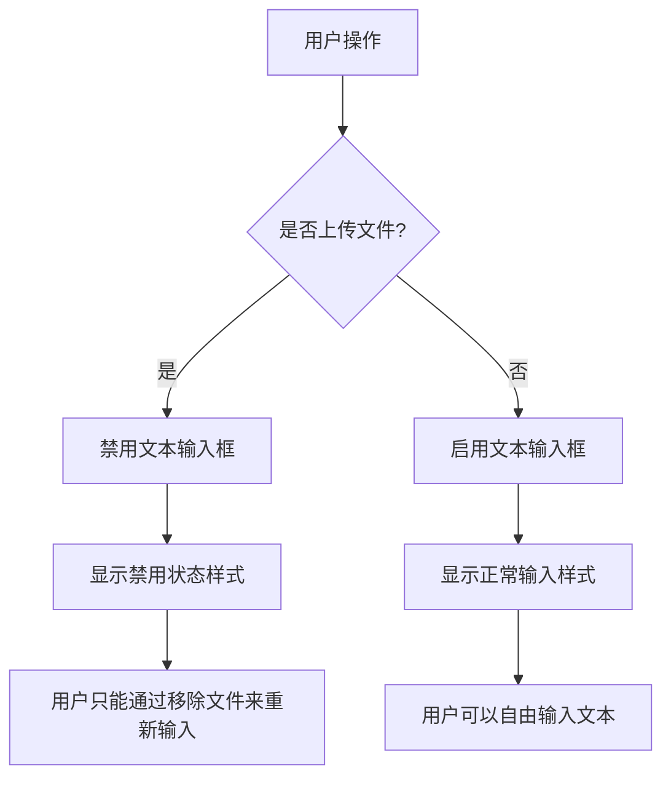
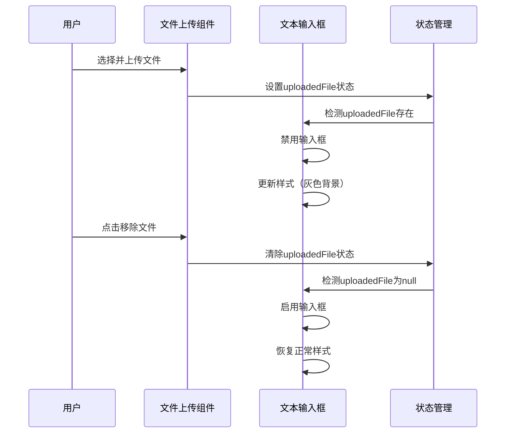

# 设计文档：AI文本输入锁定功能

## 概述

在AI生成知识图谱页面（app/text-page/page.tsx）中，当用户通过文件上传导入数据后，文本输入框应该被禁用，防止用户同时使用两种输入方式造成混淆。这个功能通过条件禁用textarea元素来实现，确保用户体验的一致性和数据输入的清晰性。

## 架构



## 主要工作流程



## 组件和接口

### 组件：TextPage

**目的**：AI知识图谱生成页面的主组件

**状态接口**：
```typescript
interface TextPageState {
  inputText: string
  uploadedFile: {
    name: string
    size: number
    type: string
    content: string
  } | null
  // ... 其他状态
}
```

**职责**：
- 管理文本输入和文件上传状态
- 根据uploadedFile状态控制文本输入框的禁用状态
- 处理文件上传和移除操作

## 数据模型

### UploadedFile

```typescript
interface UploadedFile {
  name: string      // 文件名
  size: number      // 文件大小（字节）
  type: string      // 文件类型描述
  content: string   // 文件内容
}
```

**验证规则**：
- name: 非空字符串
- size: 正整数
- type: 非空字符串
- content: 非空字符串（已在handleFileUpload中验证）

## 核心函数与形式化规范

### 函数 1: 文本输入框禁用逻辑

```typescript
function isTextInputDisabled(uploadedFile: UploadedFile | null): boolean
```

**前置条件**：
- uploadedFile 参数已定义（可以为 null）

**后置条件**：
- 返回布尔值
- 当且仅当 uploadedFile 不为 null 时返回 true
- 无副作用

**循环不变式**：不适用（无循环）

### 函数 2: 文本输入框样式计算

```typescript
function getTextInputStyle(uploadedFile: UploadedFile | null): React.CSSProperties
```

**前置条件**：
- uploadedFile 参数已定义（可以为 null）

**后置条件**：
- 返回有效的 CSS 样式对象
- 当 uploadedFile 存在时，返回禁用样式（灰色背景，禁用光标）
- 当 uploadedFile 不存在时，返回正常样式（白色背景，文本光标）
- 无副作用

**循环不变式**：不适用（无循环）

## 算法伪代码

### 主要禁用逻辑算法

```typescript
ALGORITHM determineTextInputState(uploadedFile)
INPUT: uploadedFile of type UploadedFile | null
OUTPUT: inputState of type { disabled: boolean, style: CSSProperties }

BEGIN
  // 检查文件上传状态
  IF uploadedFile !== null THEN
    disabled ← true
    background ← '#f5f5f5'  // 灰色背景
    cursor ← 'not-allowed'   // 禁用光标
  ELSE
    disabled ← false
    background ← 'white'     // 白色背景
    cursor ← 'text'          // 文本光标
  END IF
  
  // 构建样式对象
  style ← {
    width: '100%',
    minHeight: '250px',
    maxHeight: '500px',
    padding: '16px',
    background: background,
    border: '1px solid #e5e5e5',
    borderRadius: '8px',
    color: disabled ? '#999' : '#2c2c2c',
    fontSize: '14px',
    lineHeight: '1.7',
    resize: 'vertical',
    fontFamily: 'inherit',
    cursor: cursor,
    transition: 'all 0.2s ease'
  }
  
  RETURN { disabled: disabled, style: style }
END
```

**前置条件**：
- uploadedFile 参数已定义（可以为 null）

**后置条件**：
- 返回包含 disabled 和 style 的对象
- disabled 值正确反映文件上传状态
- style 对象包含所有必需的 CSS 属性

**循环不变式**：不适用（无循环）

### 文件移除算法

```typescript
ALGORITHM handleRemoveFile()
INPUT: 无
OUTPUT: 无（副作用：更新状态）

BEGIN
  // 清除文件状态
  setUploadedFile(null)
  
  // 关闭预览
  setShowPreview(false)
  
  // 断言：文件已被移除，文本输入框应该被启用
  ASSERT uploadedFile === null
  ASSERT textInputDisabled === false
END
```

**前置条件**：
- React 状态管理函数可用
- 组件已挂载

**后置条件**：
- uploadedFile 状态设置为 null
- showPreview 状态设置为 false
- 文本输入框自动启用

**循环不变式**：不适用（无循环）

## 示例用法

```typescript
// 示例 1: 基本禁用逻辑
const uploadedFile = {
  name: 'document.txt',
  size: 1024,
  type: '文本文件',
  content: 'Sample content'
}

const isDisabled = !!uploadedFile  // true
const textareaDisabled = isDisabled  // textarea 被禁用

// 示例 2: 移除文件后启用
handleRemoveFile()  // uploadedFile 设置为 null
const isDisabled = !!uploadedFile  // false
const textareaDisabled = isDisabled  // textarea 被启用

// 示例 3: 完整的 textarea 渲染
<textarea
  value={inputText}
  onChange={(e) => setInputText(e.target.value)}
  disabled={!!uploadedFile}
  placeholder={
    uploadedFile 
      ? "已导入文件，如需输入文本请先移除文件" 
      : "输入文本内容，AI 将自动提取实体和关系..."
  }
  style={{
    width: '100%',
    minHeight: '250px',
    padding: '16px',
    background: uploadedFile ? '#f5f5f5' : 'white',
    border: '1px solid #e5e5e5',
    borderRadius: '8px',
    color: uploadedFile ? '#999' : '#2c2c2c',
    fontSize: '14px',
    cursor: uploadedFile ? 'not-allowed' : 'text',
    transition: 'all 0.2s ease',
  }}
/>
```

## 正确性属性

*属性是系统在所有有效执行中应该保持为真的特征或行为——本质上是关于系统应该做什么的形式化陈述。属性作为人类可读规范和机器可验证正确性保证之间的桥梁。*

### 属性 1: 输入框禁用状态与文件状态双向绑定

*对于任意*组件状态，当且仅当 UploadedFile 不为 null 时，TextInputBox 应该被禁用；当 UploadedFile 为 null 时，TextInputBox 应该被启用。

**验证需求：需求 1.1, 1.2, 6.1**

### 属性 2: 禁用状态阻止输入

*对于任意*禁用的 TextInputBox 和任意用户输入操作，输入文本状态应该保持不变，用户输入应该被阻止。

**验证需求：需求 1.3, 1.4**

### 属性 3: 文件移除恢复输入能力

*对于任意*存在 UploadedFile 的状态，执行文件移除操作后，UploadedFile 应该变为 null，TextInputBox 应该被启用，预览窗口应该被关闭。

**验证需求：需求 2.1, 2.2, 2.3**

### 属性 4: 禁用状态样式一致性

*对于任意*被禁用的 TextInputBox，其样式应该包含灰色背景（#f5f5f5）、禁用光标（not-allowed）和浅灰色文本（#999）。

**验证需求：需求 3.1, 3.2, 3.3**

### 属性 5: 启用状态样式一致性

*对于任意*被启用的 TextInputBox，其样式应该包含白色背景、文本光标（text）和深色文本（#2c2c2c）。

**验证需求：需求 3.4, 3.5, 3.6**

### 属性 6: 占位符文本反映状态

*对于任意*组件状态，当 UploadedFile 存在时占位符应显示"已导入文件，如需输入文本请先移除文件"，当 UploadedFile 为 null 时占位符应显示"输入文本内容，AI 将自动提取实体和关系..."。

**验证需求：需求 4.1, 4.2**

### 属性 7: 数据源互斥性和优先级

*对于任意* AI 分析请求，系统应该使用且仅使用一个数据源；当 UploadedFile 存在时使用文件内容，当 UploadedFile 为 null 时使用输入文本。

**验证需求：需求 5.1, 5.2, 5.3, 5.4**

### 属性 8: 上传失败状态保持

*对于任意*文件上传失败的情况，UploadedFile 状态应该保持为 null，TextInputBox 应该保持启用状态。

**验证需求：需求 7.2, 7.3**

## 错误处理

### 错误场景 1: 文件上传失败

**条件**：文件读取过程中发生错误
**响应**：显示错误提示，不设置 uploadedFile 状态
**恢复**：用户可以重新选择文件上传

### 错误场景 2: 文件内容为空

**条件**：文件读取成功但内容为空
**响应**：显示警告提示，不设置 uploadedFile 状态
**恢复**：用户需要选择包含内容的文件

### 错误场景 3: 状态不一致

**条件**：uploadedFile 存在但文本输入框未禁用
**响应**：通过 React 的声明式渲染自动修正
**恢复**：下次渲染时状态将保持一致

## 测试策略

### 单元测试方法

**测试用例 1：文件上传后禁用输入框**
- 初始状态：uploadedFile 为 null，输入框启用
- 操作：上传有效文件
- 预期：uploadedFile 不为 null，输入框禁用，样式更新

**测试用例 2：移除文件后启用输入框**
- 初始状态：uploadedFile 存在，输入框禁用
- 操作：点击移除文件按钮
- 预期：uploadedFile 为 null，输入框启用，样式恢复

**测试用例 3：禁用状态下无法输入**
- 初始状态：uploadedFile 存在，输入框禁用
- 操作：尝试在输入框中输入文本
- 预期：输入被阻止，inputText 状态不变

**测试用例 4：占位符文本更新**
- 初始状态：uploadedFile 为 null
- 操作：上传文件
- 预期：占位符文本从"输入文本内容..."变为"已导入文件，如需输入文本请先移除文件"

### 属性测试方法

**属性测试库**：fast-check（用于 TypeScript/React）

**属性 1：禁用状态双向绑定**
```typescript
fc.property(
  fc.oneof(fc.constant(null), fc.record({
    name: fc.string(),
    size: fc.nat(),
    type: fc.string(),
    content: fc.string()
  })),
  (uploadedFile) => {
    const disabled = !!uploadedFile
    return disabled === (uploadedFile !== null)
  }
)
```

**属性 2：样式计算幂等性**
```typescript
fc.property(
  fc.oneof(fc.constant(null), fc.record({
    name: fc.string(),
    size: fc.nat(),
    type: fc.string(),
    content: fc.string()
  })),
  (uploadedFile) => {
    const style1 = getTextInputStyle(uploadedFile)
    const style2 = getTextInputStyle(uploadedFile)
    return JSON.stringify(style1) === JSON.stringify(style2)
  }
)
```

### 集成测试方法

**集成测试 1：完整的文件上传到移除流程**
- 测试文件上传 → 输入框禁用 → 文件移除 → 输入框启用的完整流程
- 验证每个步骤的状态转换和 UI 更新

**集成测试 2：与 AI 分析功能的集成**
- 测试上传文件后触发 AI 分析
- 验证使用文件内容而非输入框文本
- 确保数据源的正确性

## 性能考虑

- 使用 React 的声明式渲染，避免手动 DOM 操作
- 禁用状态计算为简单的布尔表达式（`!!uploadedFile`），性能开销可忽略
- 样式对象在每次渲染时重新计算，但由于对象较小，性能影响最小
- 可选优化：使用 `useMemo` 缓存样式对象（如果性能分析显示必要）

## 安全考虑

- 文件内容验证已在 `handleFileUpload` 中实现，防止空文件
- 禁用输入框防止用户混淆数据源，提高数据完整性
- 不涉及敏感数据处理，无额外安全风险

## 依赖项

- React 18+（useState, useEffect hooks）
- TypeScript 4+
- 现有的文件上传处理逻辑（handleFileUpload, handleRemoveFile）
- 现有的状态管理（uploadedFile, inputText）
