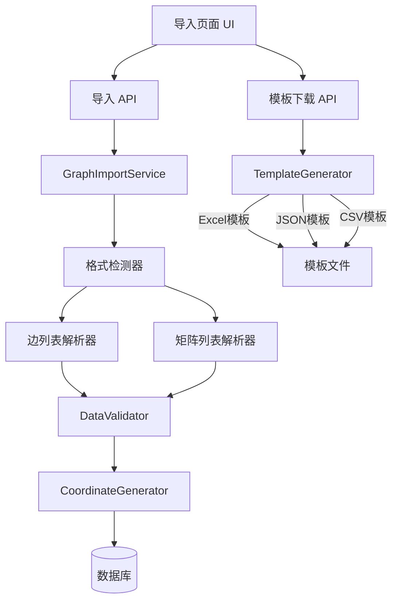
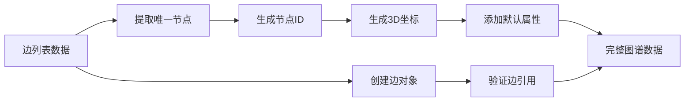

# 设计文档：边列表导入格式

## 概述

本设计文档描述了将导入数据页面的模板格式从矩阵列表格式改为边列表格式的技术实现方案。边列表格式采用简洁的三列结构（源节点-关系-目标节点），使用户能够更直观地理解和填写图谱数据。

### 设计目标

1. **简化数据录入**：采用边列表格式，每行表示一条边关系，降低用户理解成本
2. **保持向后兼容**：继续支持旧的矩阵列表格式，确保历史数据可用
3. **统一格式标准**：Excel、JSON、CSV三种格式统一使用边列表结构
4. **优化性能**：支持至少10000条边的批量导入，提供进度反馈
5. **增强验证**：提供详细的数据验证和错误提示，帮助用户快速定位问题

### 核心变更

- **模板格式**：从矩阵列表（每行一个节点的所有关系）改为边列表（每行一条边）
- **数据解析**：新增边列表解析器，自动从边数据提取节点
- **格式检测**：智能识别文件格式类型，自动选择合适的解析器
- **用户界面**：更新导入页面说明，提供格式对比和迁移指南

## 架构

### 系统架构图



### 数据流


1. **模板下载流程**
   - 用户请求下载模板 → API接收请求 → TemplateGenerator生成边列表格式模板 → 返回文件

2. **数据导入流程**
   - 用户上传文件 → 格式检测 → 选择解析器（边列表/矩阵列表） → 解析数据 → 验证数据 → 生成坐标 → 保存到数据库

3. **格式兼容流程**
   - 检测文件列结构 → 如果是三列且标题匹配，使用边列表解析器 → 否则尝试矩阵列表解析器 → 解析失败返回错误

## 组件和接口

### 1. TemplateGenerator（模板生成器）

**职责**：生成边列表格式的导入模板

**接口变更**：

```typescript
// 新增：边列表格式的Excel模板数据生成
generateExcelEdgeListTemplateData(config?: TemplateConfig): {
  edgeSheet: any[][]      // 边数据工作表（边列表格式）
  instructionSheet: any[][] // 使用说明工作表
}

// 更新：JSON模板生成（支持边列表格式）
generateJSONTemplate(config?: TemplateConfig): string

// 更新：CSV模板生成（支持边列表格式）
generateCSVTemplate(config?: TemplateConfig): string
```

**边列表格式示例**：

Excel格式：
```
| 源节点 | 关系 | 目标节点 |
|--------|------|----------|
| 节点A  | 连接 | 节点B    |
| 节点A  | 包含 | 节点C    |
| 节点B  | 引用 | 节点C    |
```

JSON格式：
```json
{
  "edges": [
    { "source": "节点A", "relation": "连接", "target": "节点B" },
    { "source": "节点A", "relation": "包含", "target": "节点C" },
    { "source": "节点B", "relation": "引用", "target": "节点C" }
  ]
}
```

CSV格式：
```csv
源节点,关系,目标节点
节点A,连接,节点B
节点A,包含,节点C
节点B,引用,节点C
```


### 2. GraphImportService（图谱导入服务）

**职责**：解析和转换导入的图谱数据，支持多种格式

**新增接口**：

```typescript
// 格式检测
detectFileFormat(file: File): 'edge-list' | 'matrix-list' | 'unknown'

// 边列表解析器
parseEdgeListExcel(workbook: XLSX.WorkBook): ParsedGraphData
parseEdgeListCSV(text: string): ParsedGraphData
parseEdgeListJSON(data: any): ParsedGraphData

// 从边列表提取节点和边
extractNodesAndEdgesFromEdgeList(edgeData: EdgeListRow[]): {
  nodes: NodeData[]
  edges: EdgeData[]
}
```

**数据结构**：

```typescript
interface EdgeListRow {
  source: string      // 源节点
  relation?: string   // 关系（可选）
  target: string      // 目标节点
}

interface ParsedGraphData {
  nodes: NodeData[]
  edges: EdgeData[]
  metadata: {
    format: 'edge-list' | 'matrix-list'
    version: string
    nodeCount: number
    edgeCount: number
  }
}
```

**格式检测逻辑**：

```typescript
function detectFileFormat(workbook: XLSX.WorkBook): string {
  const firstSheet = workbook.Sheets[workbook.SheetNames[0]]
  const data = XLSX.utils.sheet_to_json(firstSheet, { header: 1 })
  
  if (data.length === 0) return 'unknown'
  
  const headers = data[0] as string[]
  
  // 检测边列表格式：三列且标题匹配
  if (headers.length === 3 && 
      headers[0]?.includes('源节点') &&
      headers[1]?.includes('关系') &&
      headers[2]?.includes('目标节点')) {
    return 'edge-list'
  }
  
  // 否则尝试矩阵列表格式
  return 'matrix-list'
}
```

### 3. DataValidator（数据验证器）

**职责**：验证边列表数据的完整性和正确性

**新增验证规则**：

```typescript
// 验证边列表数据
validateEdgeListData(edges: EdgeListRow[]): ValidationResult {
  const errors: ValidationError[] = []
  const warnings: ValidationError[] = []
  
  edges.forEach((edge, index) => {
    // 规则1：检查源节点和目标节点非空
    if (!edge.source || edge.source.trim() === '') {
      errors.push({
        type: 'MISSING_SOURCE',
        message: `第 ${index + 1} 行缺少源节点`,
        line: index + 1
      })
    }
    
    if (!edge.target || edge.target.trim() === '') {
      errors.push({
        type: 'MISSING_TARGET',
        message: `第 ${index + 1} 行缺少目标节点`,
        line: index + 1
      })
    }
    
    // 规则2：检查自环边
    if (edge.source === edge.target) {
      warnings.push({
        type: 'SELF_LOOP',
        message: `第 ${index + 1} 行存在自环边: ${edge.source}`,
        line: index + 1
      })
    }
  })
  
  return { isValid: errors.length === 0, errors, warnings }
}

// 统计信息
generateStatistics(data: ParsedGraphData): {
  nodeCount: number
  edgeCount: number
  selfLoopCount: number
  isolatedNodeCount: number
}
```


### 4. CoordinateGenerator（坐标生成器）

**职责**：为从边列表提取的节点生成3D空间坐标

**接口保持不变**，但需要适配边列表提取的节点：

```typescript
generateCoordinates(
  nodes: NodeData[],
  edges: EdgeData[],
  config?: CoordinateGeneratorConfig
): CoordinateGenerationResult
```

**适配说明**：
- 边列表提取的节点初始只有label字段，没有坐标
- CoordinateGenerator需要为所有节点生成x、y、z坐标
- 使用力导向布局算法，考虑边的连接关系
- 确保节点间距合理，避免重叠

### 5. API路由

#### 模板下载API（/api/templates）

**更新**：返回边列表格式的模板

```typescript
// GET /api/templates?format=excel|json|csv
export async function GET(request: NextRequest) {
  const format = request.nextUrl.searchParams.get('format') || 'excel'
  const generator = new TemplateGenerator()
  
  switch (format) {
    case 'excel':
      const { edgeSheet, instructionSheet } = 
        generator.generateExcelEdgeListTemplateData()
      // 创建工作簿，添加边数据工作表和说明工作表
      // 返回文件名：graph-template-edgelist-v2.xlsx
      break
    case 'json':
      const jsonTemplate = generator.generateJSONTemplate()
      // 返回文件名：graph-template-edgelist-v2.json
      break
    case 'csv':
      const csvTemplate = generator.generateCSVTemplate()
      // 返回文件名：graph-template-edgelist-v2.csv
      break
  }
}
```

#### 导入API（/api/import）

**更新**：支持边列表格式的解析

```typescript
// POST /api/import
export async function POST(request: NextRequest) {
  const formData = await request.formData()
  const file = formData.get('file') as File
  
  // 1. 检测格式
  const format = GraphImportService.detectFileFormat(file)
  
  // 2. 根据格式选择解析器
  let parsedData: ParsedGraphData
  if (format === 'edge-list') {
    parsedData = await GraphImportService.parseEdgeListExcel(file)
  } else {
    parsedData = await GraphImportService.parseMatrixListExcel(file)
  }
  
  // 3. 验证数据
  const validation = DataValidator.validateEdgeListData(parsedData.edges)
  if (!validation.isValid) {
    return NextResponse.json({ errors: validation.errors }, { status: 400 })
  }
  
  // 4. 生成坐标
  const nodesWithCoords = CoordinateGenerator.generateCoordinates(
    parsedData.nodes,
    parsedData.edges
  )
  
  // 5. 保存到数据库
  // ...
  
  return NextResponse.json({
    success: true,
    statistics: {
      nodeCount: parsedData.nodes.length,
      edgeCount: parsedData.edges.length
    },
    warnings: validation.warnings
  })
}
```


### 6. 导入页面UI（app/import/page.tsx）

**更新内容**：

1. **格式说明区域**：
```tsx
<div className="format-explanation">
  <h3>边列表格式说明</h3>
  <table>
    <thead>
      <tr>
        <th>源节点</th>
        <th>关系</th>
        <th>目标节点</th>
      </tr>
    </thead>
    <tbody>
      <tr>
        <td>节点A</td>
        <td>连接</td>
        <td>节点B</td>
      </tr>
      <tr>
        <td>节点A</td>
        <td>包含</td>
        <td>节点C</td>
      </tr>
    </tbody>
  </table>
  <p>每行表示一条边关系，系统会自动提取所有唯一节点</p>
</div>
```

2. **格式对比说明**：
```tsx
<div className="format-comparison">
  <h3>格式对比</h3>
  <div className="comparison-grid">
    <div className="old-format">
      <h4>旧格式（矩阵列表）</h4>
      <p>每行表示一个节点的所有关系</p>
      <code>节点A | 关系1 | 关系2 | 节点B | 节点C</code>
    </div>
    <div className="new-format">
      <h4>新格式（边列表）✨</h4>
      <p>每行表示一条边关系</p>
      <code>节点A | 关系1 | 节点B</code>
      <code>节点A | 关系2 | 节点C</code>
    </div>
  </div>
</div>
```

3. **快速入门指南链接**：
```tsx
<a href="/templates/QUICK-START.md" target="_blank">
  📖 查看详细使用指南
</a>
```

4. **错误提示增强**：
```tsx
{uploadStatus.includes('失败') && (
  <div className="error-details">
    <h4>错误详情</h4>
    <ul>
      {errors.map((error, index) => (
        <li key={index}>
          <strong>第 {error.line} 行：</strong>
          {error.message}
        </li>
      ))}
    </ul>
    <div className="format-help">
      <p>支持的格式：</p>
      <ul>
        <li>边列表格式（推荐）：三列结构</li>
        <li>矩阵列表格式（兼容）：旧版格式</li>
      </ul>
    </div>
  </div>
)}
```

## 数据模型

### 边列表数据模型

```typescript
// 边列表行数据
interface EdgeListRow {
  source: string      // 源节点名称（必填）
  relation?: string   // 关系名称（可选）
  target: string      // 目标节点名称（必填）
}

// 解析后的图谱数据
interface ParsedGraphData {
  nodes: NodeData[]   // 从边列表提取的唯一节点
  edges: EdgeData[]   // 边数据
  metadata: {
    format: 'edge-list' | 'matrix-list'  // 格式类型
    version: string                       // 格式版本
    nodeCount: number                     // 节点数量
    edgeCount: number                     // 边数量
    createdAt: Date                       // 创建时间
  }
}

// 节点数据（从边列表提取）
interface NodeData {
  id: string          // 节点ID（自动生成）
  label: string       // 节点名称（从边列表提取）
  description?: string // 节点描述（默认为空）
  x?: number          // X坐标（由CoordinateGenerator生成）
  y?: number          // Y坐标（由CoordinateGenerator生成）
  z?: number          // Z坐标（由CoordinateGenerator生成）
  color?: string      // 颜色（默认值）
  size?: number       // 大小（默认值）
  shape?: string      // 形状（默认值）
}

// 边数据
interface EdgeData {
  source: string      // 源节点ID
  target: string      // 目标节点ID
  label?: string      // 边标签（关系名称）
}
```


### 数据转换流程



**转换步骤**：

1. **提取唯一节点**：遍历所有边，收集所有唯一的源节点和目标节点名称
2. **生成节点ID**：为每个唯一节点生成ID（使用节点名称或UUID）
3. **创建节点对象**：为每个节点创建NodeData对象，初始只有label字段
4. **生成3D坐标**：使用CoordinateGenerator为所有节点生成x、y、z坐标
5. **添加默认属性**：为节点添加默认的颜色、大小、形状属性
6. **创建边对象**：为每条边创建EdgeData对象，包含source、target、label字段
7. **验证边引用**：确保所有边引用的节点都存在于节点列表中

## 正确性属性

*属性是一个特征或行为，应该在系统的所有有效执行中保持为真——本质上是关于系统应该做什么的正式陈述。属性作为人类可读规范和机器可验证正确性保证之间的桥梁。*

### 属性 1: Excel模板边列表结构完整性

*对于任何*生成的Excel模板，边数据工作表应该包含三列且列标题为"源节点"、"关系"、"目标节点"，并且至少包含3行示例数据

**验证：需求 1.1, 1.2, 1.3**

### 属性 2: JSON模板edges数组结构完整性

*对于任何*生成的JSON模板，应该包含edges数组，且数组中的每个对象都包含source、relation和target字段，并且至少包含3条示例边数据

**验证：需求 2.1, 2.2, 2.3**

### 属性 3: CSV模板三列格式完整性

*对于任何*生成的CSV模板，第一行应该是列标题"源节点,关系,目标节点"，并且至少包含3行示例数据

**验证：需求 3.1, 3.2, 3.3**

### 属性 4: 边列表节点提取唯一性

*对于任何*边列表数据，从中提取的节点列表应该包含所有出现在边中的唯一节点名称，且不包含重复节点

**验证：需求 2.5, 4.2**

### 属性 5: 边列表解析数据结构完整性

*对于任何*边列表数据，解析后的每条边应该包含source、target和label字段，每个节点应该包含label字段

**验证：需求 4.1, 4.3, 4.4**

### 属性 6: 空行跳过处理

*对于任何*包含空行或仅包含空白字符的边列表数据，解析器应该跳过这些行，不将它们作为有效边处理

**验证：需求 4.5**

### 属性 7: 边数据必填字段验证

*对于任何*边列表数据，如果边的源节点或目标节点为空或仅包含空白字符，验证器应该返回错误信息，并指明具体的行号和缺失字段

**验证：需求 5.1, 5.2**

### 属性 8: 自环边检测和警告

*对于任何*边列表数据，如果存在源节点等于目标节点的边，验证器应该返回警告信息，提示用户确认

**验证：需求 5.3, 5.4**

### 属性 9: 数据统计准确性

*对于任何*边列表数据，验证器统计的唯一节点数量应该等于从边中提取的唯一节点集合的大小，边数量应该等于有效边的数量

**验证：需求 5.5**

### 属性 10: 3D坐标生成完整性

*对于任何*从边列表提取的节点列表，坐标生成器应该为每个节点生成有效的x、y、z坐标，且坐标值在-500到500范围内，并为节点分配默认的颜色、大小和形状属性

**验证：需求 6.1, 6.4, 6.5**

### 属性 11: 连接节点距离合理性

*对于任何*节点和边数据，使用力导向布局算法生成坐标后，有边连接的节点之间的距离应该在合理范围内（不会过近或过远）

**验证：需求 6.2**

### 属性 12: 节点坐标无重叠

*对于任何*生成坐标的节点列表，任意两个节点之间的欧几里得距离应该大于最小间距阈值，确保节点不会重叠

**验证：需求 6.3**

### 属性 13: 格式检测准确性

*对于任何*Excel文件，如果包含三列且列标题为"源节点"、"关系"、"目标节点"，格式检测器应该返回'edge-list'；否则应该返回'matrix-list'或'unknown'

**验证：需求 7.1, 7.2, 7.3**

### 属性 14: 批量数据处理能力

*对于任何*包含至少10000条边的边列表数据，导入服务应该能够成功解析、验证和导入，并在完成后返回包含节点数、边数和处理时间的统计信息

**验证：需求 10.1, 10.5**


## 错误处理

### 错误类型定义

```typescript
enum ErrorType {
  // 格式错误
  INVALID_FILE_FORMAT = 'INVALID_FILE_FORMAT',
  UNSUPPORTED_FORMAT = 'UNSUPPORTED_FORMAT',
  
  // 数据错误
  MISSING_SOURCE = 'MISSING_SOURCE',
  MISSING_TARGET = 'MISSING_TARGET',
  INVALID_EDGE_REFERENCE = 'INVALID_EDGE_REFERENCE',
  
  // 验证警告
  SELF_LOOP = 'SELF_LOOP',
  DUPLICATE_EDGE = 'DUPLICATE_EDGE',
  
  // 系统错误
  PARSE_ERROR = 'PARSE_ERROR',
  COORDINATE_GENERATION_ERROR = 'COORDINATE_GENERATION_ERROR',
  DATABASE_ERROR = 'DATABASE_ERROR'
}

interface ErrorDetail {
  type: ErrorType
  message: string
  line?: number
  column?: string
  suggestions: string[]
}
```

### 错误处理策略

#### 1. 文件格式错误

**场景**：用户上传了不支持的文件格式

**处理**：
- 在文件上传时立即验证文件扩展名和MIME类型
- 返回清晰的错误信息，列出支持的格式
- 提供模板下载链接

**错误信息示例**：
```
错误：不支持的文件格式
详情：文件类型为 .txt，系统仅支持以下格式：
  - Excel (.xlsx, .xls)
  - CSV (.csv)
  - JSON (.json)
建议：
  1. 下载模板文件参考正确格式
  2. 将数据转换为支持的格式后重新上传
```

#### 2. 数据缺失错误

**场景**：边列表中某些行缺少源节点或目标节点

**处理**：
- 在验证阶段检测所有缺失字段
- 返回详细的错误列表，包含行号和缺失字段
- 不保存任何数据，要求用户修复后重新上传

**错误信息示例**：
```
错误：数据验证失败
详情：发现 3 处数据错误
  - 第 5 行：缺少源节点
  - 第 12 行：缺少目标节点
  - 第 18 行：源节点和目标节点均为空
建议：
  1. 检查并填写缺失的字段
  2. 确保每行都包含源节点和目标节点
  3. 修复后重新上传文件
```

#### 3. 格式识别失败

**场景**：文件格式无法识别为边列表或矩阵列表

**处理**：
- 尝试两种解析器
- 如果都失败，返回详细的格式说明
- 提供格式对比和示例

**错误信息示例**：
```
错误：无法识别文件格式
详情：文件不符合边列表格式或矩阵列表格式
支持的格式：
  1. 边列表格式（推荐）
     - 三列：源节点、关系、目标节点
     - 示例：节点A | 连接 | 节点B
  2. 矩阵列表格式（兼容）
     - 每行一个节点的所有关系
     - 示例：节点A | 关系1 | 关系2 | 节点B | 节点C
建议：
  1. 下载模板文件参考正确格式
  2. 查看快速入门指南了解详细说明
```

#### 4. 自环边警告

**场景**：数据中存在源节点等于目标节点的边

**处理**：
- 不阻止导入，但返回警告信息
- 列出所有自环边的位置
- 允许用户确认后继续

**警告信息示例**：
```
警告：发现 2 条自环边
详情：
  - 第 8 行：节点A → 节点A
  - 第 15 行：节点C → 节点C
说明：自环边在某些场景下是有效的，但请确认这是预期的连接关系
操作：点击"确认导入"继续，或"取消"返回修改
```

#### 5. 大数据处理超时

**场景**：导入超过10000条边的数据时处理时间过长

**处理**：
- 使用异步处理，避免阻塞UI
- 显示进度指示器
- 如果超时，保存已处理的数据
- 返回部分成功的统计信息

**处理流程**：
```typescript
async function importLargeDataset(edges: EdgeListRow[]) {
  const batchSize = 1000
  const batches = Math.ceil(edges.length / batchSize)
  let processedCount = 0
  
  for (let i = 0; i < batches; i++) {
    const batch = edges.slice(i * batchSize, (i + 1) * batchSize)
    
    try {
      await processBatch(batch)
      processedCount += batch.length
      
      // 更新进度
      updateProgress({
        current: processedCount,
        total: edges.length,
        percentage: (processedCount / edges.length) * 100
      })
    } catch (error) {
      // 保存已处理的数据
      await savePartialData()
      
      return {
        success: false,
        processedCount,
        totalCount: edges.length,
        error: `处理到第 ${processedCount} 条时发生错误`
      }
    }
  }
  
  return {
    success: true,
    processedCount: edges.length,
    totalCount: edges.length
  }
}
```

### 错误恢复机制

#### 1. 部分数据保存

当导入大量数据时发生错误，系统应该：
- 保存已成功处理的数据
- 记录失败的位置
- 提供继续导入的选项

#### 2. 事务回滚

对于关键操作，使用数据库事务：
- 开始事务
- 执行所有数据库操作
- 如果任何操作失败，回滚整个事务
- 确保数据一致性

```typescript
async function importWithTransaction(data: ParsedGraphData) {
  const transaction = await db.transaction()
  
  try {
    // 插入节点
    await transaction.nodes.createMany(data.nodes)
    
    // 插入边
    await transaction.edges.createMany(data.edges)
    
    // 提交事务
    await transaction.commit()
    
    return { success: true }
  } catch (error) {
    // 回滚事务
    await transaction.rollback()
    
    return {
      success: false,
      error: '导入失败，所有更改已回滚'
    }
  }
}
```

#### 3. 重试机制

对于临时性错误（如网络问题），实现重试机制：
- 最多重试3次
- 使用指数退避策略
- 记录重试次数和原因


## 测试策略

### 测试方法

本功能采用**双重测试方法**，结合单元测试和基于属性的测试（Property-Based Testing, PBT）：

- **单元测试**：验证具体示例、边缘情况和错误条件
- **属性测试**：验证跨所有输入的通用属性
- **集成测试**：验证组件之间的交互和端到端流程

两种测试方法是互补的，共同确保全面覆盖：
- 单元测试捕获具体的错误
- 属性测试验证一般正确性

### 属性测试库

使用 **fast-check** 作为TypeScript/JavaScript的属性测试库。

安装：
```bash
npm install --save-dev fast-check
```

配置：每个属性测试运行至少 **100次迭代**，以确保充分的随机输入覆盖。

### 测试用例

#### 1. 模板生成测试

**单元测试**：
```typescript
describe('TemplateGenerator - Edge List Format', () => {
  const generator = new TemplateGenerator()
  
  test('Excel模板包含正确的列标题', () => {
    const { edgeSheet } = generator.generateExcelEdgeListTemplateData()
    expect(edgeSheet[0]).toEqual(['源节点', '关系', '目标节点'])
  })
  
  test('Excel模板包含使用说明工作表', () => {
    const { instructionSheet } = generator.generateExcelEdgeListTemplateData()
    expect(instructionSheet.length).toBeGreaterThan(0)
    expect(instructionSheet[0][0]).toContain('使用说明')
  })
  
  test('JSON模板包含edges数组', () => {
    const template = JSON.parse(generator.generateJSONTemplate())
    expect(template).toHaveProperty('edges')
    expect(Array.isArray(template.edges)).toBe(true)
  })
  
  test('CSV模板第一行是列标题', () => {
    const csv = generator.generateCSVTemplate()
    const lines = csv.split('\n').filter(line => !line.startsWith('#'))
    expect(lines[0]).toBe('源节点,关系,目标节点')
  })
})
```

**属性测试**：
```typescript
import fc from 'fast-check'

describe('TemplateGenerator - Property Tests', () => {
  // Feature: edge-list-import-format, Property 1: Excel模板边列表结构完整性
  test('属性1: Excel模板始终包含三列和至少3行示例数据', () => {
    fc.assert(
      fc.property(
        fc.record({
          includeExamples: fc.boolean(),
          exampleNodeCount: fc.integer({ min: 3, max: 10 })
        }),
        (config) => {
          const generator = new TemplateGenerator()
          const { edgeSheet } = generator.generateExcelEdgeListTemplateData(config)
          
          // 验证列标题
          expect(edgeSheet[0]).toEqual(['源节点', '关系', '目标节点'])
          
          // 验证至少3行示例数据（不包括标题行）
          expect(edgeSheet.length).toBeGreaterThanOrEqual(4)
        }
      ),
      { numRuns: 100 }
    )
  })
  
  // Feature: edge-list-import-format, Property 2: JSON模板edges数组结构完整性
  test('属性2: JSON模板始终包含edges数组且每个对象有source/relation/target字段', () => {
    fc.assert(
      fc.property(
        fc.record({
          includeExamples: fc.boolean(),
          exampleEdgeCount: fc.integer({ min: 3, max: 10 })
        }),
        (config) => {
          const generator = new TemplateGenerator()
          const template = JSON.parse(generator.generateJSONTemplate(config))
          
          // 验证edges数组存在
          expect(template).toHaveProperty('edges')
          expect(Array.isArray(template.edges)).toBe(true)
          
          // 验证至少3条边
          expect(template.edges.length).toBeGreaterThanOrEqual(3)
          
          // 验证每条边的结构
          template.edges.forEach((edge: any) => {
            expect(edge).toHaveProperty('source')
            expect(edge).toHaveProperty('relation')
            expect(edge).toHaveProperty('target')
          })
        }
      ),
      { numRuns: 100 }
    )
  })
  
  // Feature: edge-list-import-format, Property 3: CSV模板三列格式完整性
  test('属性3: CSV模板始终包含三列标题和至少3行数据', () => {
    fc.assert(
      fc.property(
        fc.record({
          includeExamples: fc.boolean(),
          exampleEdgeCount: fc.integer({ min: 3, max: 10 })
        }),
        (config) => {
          const generator = new TemplateGenerator()
          const csv = generator.generateCSVTemplate(config)
          const lines = csv.split('\n').filter(line => line.trim() && !line.startsWith('#'))
          
          // 验证列标题
          expect(lines[0]).toBe('源节点,关系,目标节点')
          
          // 验证至少3行数据
          expect(lines.length).toBeGreaterThanOrEqual(4)
        }
      ),
      { numRuns: 100 }
    )
  })
})
```


#### 2. 数据解析测试

**单元测试**：
```typescript
describe('GraphImportService - Edge List Parsing', () => {
  test('解析边列表Excel文件', async () => {
    const mockFile = createMockExcelFile([
      ['源节点', '关系', '目标节点'],
      ['节点A', '连接', '节点B'],
      ['节点A', '包含', '节点C'],
      ['节点B', '引用', '节点C']
    ])
    
    const result = await GraphImportService.parseEdgeListExcel(mockFile)
    
    expect(result.nodes.length).toBe(3) // A, B, C
    expect(result.edges.length).toBe(3)
    expect(result.metadata.format).toBe('edge-list')
  })
  
  test('跳过空行和空白行', async () => {
    const mockFile = createMockExcelFile([
      ['源节点', '关系', '目标节点'],
      ['节点A', '连接', '节点B'],
      ['', '', ''],           // 空行
      ['   ', '  ', '   '],   // 空白行
      ['节点B', '引用', '节点C']
    ])
    
    const result = await GraphImportService.parseEdgeListExcel(mockFile)
    
    expect(result.edges.length).toBe(2) // 只有2条有效边
  })
  
  test('格式检测：识别边列表格式', () => {
    const edgeListWorkbook = createMockWorkbook([
      ['源节点', '关系', '目标节点'],
      ['节点A', '连接', '节点B']
    ])
    
    const format = GraphImportService.detectFileFormat(edgeListWorkbook)
    expect(format).toBe('edge-list')
  })
  
  test('格式检测：识别矩阵列表格式', () => {
    const matrixWorkbook = createMockWorkbook([
      ['节点', '关系A', '关系B', '节点A', '节点B'],
      ['节点1', '连接', '包含', '节点2', '节点3']
    ])
    
    const format = GraphImportService.detectFileFormat(matrixWorkbook)
    expect(format).toBe('matrix-list')
  })
})
```

**属性测试**：
```typescript
describe('GraphImportService - Property Tests', () => {
  // Feature: edge-list-import-format, Property 4: 边列表节点提取唯一性
  test('属性4: 从边列表提取的节点应该是唯一的', () => {
    fc.assert(
      fc.property(
        fc.array(
          fc.record({
            source: fc.string({ minLength: 1, maxLength: 20 }),
            relation: fc.string({ minLength: 1, maxLength: 20 }),
            target: fc.string({ minLength: 1, maxLength: 20 })
          }),
          { minLength: 1, maxLength: 100 }
        ),
        (edges) => {
          const result = GraphImportService.extractNodesAndEdgesFromEdgeList(edges)
          
          // 收集所有应该出现的唯一节点
          const expectedNodes = new Set<string>()
          edges.forEach(edge => {
            expectedNodes.add(edge.source)
            expectedNodes.add(edge.target)
          })
          
          // 验证提取的节点数量
          expect(result.nodes.length).toBe(expectedNodes.size)
          
          // 验证没有重复节点
          const nodeLabels = result.nodes.map(n => n.label)
          const uniqueLabels = new Set(nodeLabels)
          expect(nodeLabels.length).toBe(uniqueLabels.size)
        }
      ),
      { numRuns: 100 }
    )
  })
  
  // Feature: edge-list-import-format, Property 5: 边列表解析数据结构完整性
  test('属性5: 解析后的边和节点应该有完整的结构', () => {
    fc.assert(
      fc.property(
        fc.array(
          fc.record({
            source: fc.string({ minLength: 1, maxLength: 20 }),
            relation: fc.option(fc.string({ minLength: 1, maxLength: 20 })),
            target: fc.string({ minLength: 1, maxLength: 20 })
          }),
          { minLength: 1, maxLength: 50 }
        ),
        (edges) => {
          const result = GraphImportService.extractNodesAndEdgesFromEdgeList(edges)
          
          // 验证每个节点有label字段
          result.nodes.forEach(node => {
            expect(node).toHaveProperty('label')
            expect(typeof node.label).toBe('string')
            expect(node.label.length).toBeGreaterThan(0)
          })
          
          // 验证每条边有source、target和label字段
          result.edges.forEach(edge => {
            expect(edge).toHaveProperty('source')
            expect(edge).toHaveProperty('target')
            expect(edge).toHaveProperty('label')
            expect(typeof edge.source).toBe('string')
            expect(typeof edge.target).toBe('string')
          })
        }
      ),
      { numRuns: 100 }
    )
  })
  
  // Feature: edge-list-import-format, Property 6: 空行跳过处理
  test('属性6: 解析器应该跳过空行和空白行', () => {
    fc.assert(
      fc.property(
        fc.array(
          fc.oneof(
            // 有效边
            fc.record({
              source: fc.string({ minLength: 1, maxLength: 20 }),
              relation: fc.string({ minLength: 1, maxLength: 20 }),
              target: fc.string({ minLength: 1, maxLength: 20 })
            }),
            // 空行
            fc.constant({ source: '', relation: '', target: '' }),
            // 空白行
            fc.constant({ source: '   ', relation: '  ', target: '   ' })
          ),
          { minLength: 5, maxLength: 20 }
        ),
        (edges) => {
          const result = GraphImportService.extractNodesAndEdgesFromEdgeList(edges)
          
          // 计算有效边数量（非空且非空白）
          const validEdges = edges.filter(e => 
            e.source.trim() !== '' && e.target.trim() !== ''
          )
          
          // 验证解析结果只包含有效边
          expect(result.edges.length).toBe(validEdges.length)
        }
      ),
      { numRuns: 100 }
    )
  })
})
```

#### 3. 数据验证测试

**单元测试**：
```typescript
describe('DataValidator - Edge List Validation', () => {
  test('检测缺少源节点的边', () => {
    const edges = [
      { source: '', relation: '连接', target: '节点B' },
      { source: '节点A', relation: '包含', target: '节点C' }
    ]
    
    const result = DataValidator.validateEdgeListData(edges)
    
    expect(result.isValid).toBe(false)
    expect(result.errors.length).toBe(1)
    expect(result.errors[0].type).toBe('MISSING_SOURCE')
    expect(result.errors[0].line).toBe(1)
  })
  
  test('检测缺少目标节点的边', () => {
    const edges = [
      { source: '节点A', relation: '连接', target: '' }
    ]
    
    const result = DataValidator.validateEdgeListData(edges)
    
    expect(result.isValid).toBe(false)
    expect(result.errors[0].type).toBe('MISSING_TARGET')
  })
  
  test('检测自环边并返回警告', () => {
    const edges = [
      { source: '节点A', relation: '自引用', target: '节点A' }
    ]
    
    const result = DataValidator.validateEdgeListData(edges)
    
    expect(result.isValid).toBe(true) // 自环边不阻止导入
    expect(result.warnings.length).toBe(1)
    expect(result.warnings[0].type).toBe('SELF_LOOP')
  })
  
  test('统计节点和边数量', () => {
    const data = {
      nodes: [
        { label: '节点A' },
        { label: '节点B' },
        { label: '节点C' }
      ],
      edges: [
        { source: '节点A', target: '节点B', label: '连接' },
        { source: '节点A', target: '节点C', label: '包含' }
      ]
    }
    
    const stats = DataValidator.generateStatistics(data)
    
    expect(stats.nodeCount).toBe(3)
    expect(stats.edgeCount).toBe(2)
  })
})
```

**属性测试**：
```typescript
describe('DataValidator - Property Tests', () => {
  // Feature: edge-list-import-format, Property 7: 边数据必填字段验证
  test('属性7: 验证器应该检测所有空源节点或目标节点', () => {
    fc.assert(
      fc.property(
        fc.array(
          fc.record({
            source: fc.option(fc.string({ minLength: 1 }), { nil: '' }),
            relation: fc.string(),
            target: fc.option(fc.string({ minLength: 1 }), { nil: '' })
          }),
          { minLength: 1, maxLength: 50 }
        ),
        (edges) => {
          const result = DataValidator.validateEdgeListData(edges)
          
          // 计算应该有多少错误
          const expectedErrors = edges.filter(e => 
            e.source.trim() === '' || e.target.trim() === ''
          ).length
          
          if (expectedErrors > 0) {
            expect(result.isValid).toBe(false)
            expect(result.errors.length).toBeGreaterThanOrEqual(expectedErrors)
            
            // 验证错误信息包含行号
            result.errors.forEach(error => {
              expect(error).toHaveProperty('line')
              expect(error.line).toBeGreaterThan(0)
            })
          } else {
            expect(result.isValid).toBe(true)
          }
        }
      ),
      { numRuns: 100 }
    )
  })
  
  // Feature: edge-list-import-format, Property 8: 自环边检测和警告
  test('属性8: 验证器应该检测所有自环边并返回警告', () => {
    fc.assert(
      fc.property(
        fc.array(
          fc.record({
            source: fc.string({ minLength: 1, maxLength: 20 }),
            relation: fc.string(),
            target: fc.string({ minLength: 1, maxLength: 20 })
          }),
          { minLength: 1, maxLength: 50 }
        ),
        (edges) => {
          const result = DataValidator.validateEdgeListData(edges)
          
          // 计算自环边数量
          const selfLoops = edges.filter(e => e.source === e.target).length
          
          if (selfLoops > 0) {
            expect(result.warnings.length).toBeGreaterThanOrEqual(selfLoops)
            
            const selfLoopWarnings = result.warnings.filter(w => w.type === 'SELF_LOOP')
            expect(selfLoopWarnings.length).toBe(selfLoops)
          }
        }
      ),
      { numRuns: 100 }
    )
  })
  
  // Feature: edge-list-import-format, Property 9: 数据统计准确性
  test('属性9: 统计的节点和边数量应该准确', () => {
    fc.assert(
      fc.property(
        fc.array(
          fc.record({
            source: fc.string({ minLength: 1, maxLength: 20 }),
            relation: fc.string(),
            target: fc.string({ minLength: 1, maxLength: 20 })
          }),
          { minLength: 1, maxLength: 100 }
        ),
        (edges) => {
          const result = GraphImportService.extractNodesAndEdgesFromEdgeList(edges)
          const stats = DataValidator.generateStatistics(result)
          
          // 验证节点数量
          const uniqueNodes = new Set<string>()
          edges.forEach(e => {
            uniqueNodes.add(e.source)
            uniqueNodes.add(e.target)
          })
          expect(stats.nodeCount).toBe(uniqueNodes.size)
          
          // 验证边数量
          expect(stats.edgeCount).toBe(edges.length)
        }
      ),
      { numRuns: 100 }
    )
  })
})
```


#### 4. 坐标生成测试

**单元测试**：
```typescript
describe('CoordinateGenerator - Edge List Nodes', () => {
  test('为所有节点生成3D坐标', () => {
    const nodes = [
      { label: '节点A' },
      { label: '节点B' },
      { label: '节点C' }
    ]
    const edges = [
      { source: '节点A', target: '节点B', label: '连接' },
      { source: '节点B', target: '节点C', label: '引用' }
    ]
    
    const generator = new CoordinateGenerator()
    const result = generator.generateCoordinates(nodes, edges)
    
    // 验证所有节点都有坐标
    result.nodes.forEach(node => {
      expect(node).toHaveProperty('x')
      expect(node).toHaveProperty('y')
      expect(node).toHaveProperty('z')
      expect(typeof node.x).toBe('number')
      expect(typeof node.y).toBe('number')
      expect(typeof node.z).toBe('number')
    })
  })
  
  test('坐标在合理范围内', () => {
    const nodes = Array.from({ length: 10 }, (_, i) => ({ label: `节点${i}` }))
    const edges = []
    
    const generator = new CoordinateGenerator()
    const result = generator.generateCoordinates(nodes, edges)
    
    result.nodes.forEach(node => {
      expect(Math.abs(node.x!)).toBeLessThanOrEqual(500)
      expect(Math.abs(node.y!)).toBeLessThanOrEqual(500)
      expect(Math.abs(node.z!)).toBeLessThanOrEqual(500)
    })
  })
  
  test('节点不重叠', () => {
    const nodes = Array.from({ length: 20 }, (_, i) => ({ label: `节点${i}` }))
    const edges = []
    
    const generator = new CoordinateGenerator()
    const result = generator.generateCoordinates(nodes, edges, {
      minDistance: 20
    })
    
    // 检查任意两个节点之间的距离
    for (let i = 0; i < result.nodes.length; i++) {
      for (let j = i + 1; j < result.nodes.length; j++) {
        const node1 = result.nodes[i]
        const node2 = result.nodes[j]
        
        const distance = Math.sqrt(
          Math.pow(node1.x! - node2.x!, 2) +
          Math.pow(node1.y! - node2.y!, 2) +
          Math.pow(node1.z! - node2.z!, 2)
        )
        
        expect(distance).toBeGreaterThan(20)
      }
    }
  })
})
```

**属性测试**：
```typescript
describe('CoordinateGenerator - Property Tests', () => {
  // Feature: edge-list-import-format, Property 10: 3D坐标生成完整性
  test('属性10: 所有节点应该有有效的3D坐标和默认属性', () => {
    fc.assert(
      fc.property(
        fc.array(
          fc.string({ minLength: 1, maxLength: 20 }),
          { minLength: 1, maxLength: 100 }
        ).map(labels => labels.map(label => ({ label }))),
        (nodes) => {
          const generator = new CoordinateGenerator()
          const result = generator.generateCoordinates(nodes, [])
          
          result.nodes.forEach(node => {
            // 验证3D坐标
            expect(node).toHaveProperty('x')
            expect(node).toHaveProperty('y')
            expect(node).toHaveProperty('z')
            expect(typeof node.x).toBe('number')
            expect(typeof node.y).toBe('number')
            expect(typeof node.z).toBe('number')
            expect(isNaN(node.x!)).toBe(false)
            expect(isNaN(node.y!)).toBe(false)
            expect(isNaN(node.z!)).toBe(false)
            
            // 验证坐标范围
            expect(Math.abs(node.x!)).toBeLessThanOrEqual(500)
            expect(Math.abs(node.y!)).toBeLessThanOrEqual(500)
            expect(Math.abs(node.z!)).toBeLessThanOrEqual(500)
            
            // 验证默认属性
            expect(node).toHaveProperty('color')
            expect(node).toHaveProperty('size')
            expect(node).toHaveProperty('shape')
          })
        }
      ),
      { numRuns: 100 }
    )
  })
  
  // Feature: edge-list-import-format, Property 11: 连接节点距离合理性
  test('属性11: 有边连接的节点距离应该合理', () => {
    fc.assert(
      fc.property(
        fc.array(
          fc.record({
            source: fc.string({ minLength: 1, maxLength: 20 }),
            target: fc.string({ minLength: 1, maxLength: 20 })
          }),
          { minLength: 1, maxLength: 50 }
        ),
        (edges) => {
          // 提取节点
          const nodeSet = new Set<string>()
          edges.forEach(e => {
            nodeSet.add(e.source)
            nodeSet.add(e.target)
          })
          const nodes = Array.from(nodeSet).map(label => ({ label }))
          
          const generator = new CoordinateGenerator()
          const result = generator.generateCoordinates(nodes, edges)
          
          // 创建节点坐标映射
          const coordMap = new Map<string, { x: number, y: number, z: number }>()
          result.nodes.forEach(node => {
            coordMap.set(node.label, { x: node.x!, y: node.y!, z: node.z! })
          })
          
          // 检查连接节点的距离
          edges.forEach(edge => {
            const sourceCoord = coordMap.get(edge.source)
            const targetCoord = coordMap.get(edge.target)
            
            if (sourceCoord && targetCoord) {
              const distance = Math.sqrt(
                Math.pow(sourceCoord.x - targetCoord.x, 2) +
                Math.pow(sourceCoord.y - targetCoord.y, 2) +
                Math.pow(sourceCoord.z - targetCoord.z, 2)
              )
              
              // 连接节点的距离应该在合理范围内（不会太近或太远）
              expect(distance).toBeGreaterThan(10)  // 不会太近
              expect(distance).toBeLessThan(1000)   // 不会太远
            }
          })
        }
      ),
      { numRuns: 100 }
    )
  })
  
  // Feature: edge-list-import-format, Property 12: 节点坐标无重叠
  test('属性12: 任意两个节点之间应该保持最小间距', () => {
    fc.assert(
      fc.property(
        fc.array(
          fc.string({ minLength: 1, maxLength: 20 }),
          { minLength: 2, maxLength: 50 }
        ).map(labels => Array.from(new Set(labels)).map(label => ({ label }))),
        (nodes) => {
          const minDistance = 20
          const generator = new CoordinateGenerator()
          const result = generator.generateCoordinates(nodes, [], { minDistance })
          
          // 检查所有节点对之间的距离
          for (let i = 0; i < result.nodes.length; i++) {
            for (let j = i + 1; j < result.nodes.length; j++) {
              const node1 = result.nodes[i]
              const node2 = result.nodes[j]
              
              const distance = Math.sqrt(
                Math.pow(node1.x! - node2.x!, 2) +
                Math.pow(node1.y! - node2.y!, 2) +
                Math.pow(node1.z! - node2.z!, 2)
              )
              
              expect(distance).toBeGreaterThan(minDistance)
            }
          }
        }
      ),
      { numRuns: 100 }
    )
  })
})
```

#### 5. 格式检测测试

**单元测试**：
```typescript
describe('Format Detection', () => {
  test('识别边列表格式', () => {
    const edgeListData = [
      ['源节点', '关系', '目标节点'],
      ['节点A', '连接', '节点B']
    ]
    
    const format = detectFormat(edgeListData)
    expect(format).toBe('edge-list')
  })
  
  test('识别矩阵列表格式', () => {
    const matrixData = [
      ['节点', '关系A', '关系B', '节点A', '节点B'],
      ['节点1', '连接', '包含', '节点2', '节点3']
    ]
    
    const format = detectFormat(matrixData)
    expect(format).toBe('matrix-list')
  })
  
  test('无法识别的格式返回unknown', () => {
    const unknownData = [
      ['列1', '列2'],
      ['数据1', '数据2']
    ]
    
    const format = detectFormat(unknownData)
    expect(format).toBe('unknown')
  })
})
```

**属性测试**：
```typescript
describe('Format Detection - Property Tests', () => {
  // Feature: edge-list-import-format, Property 13: 格式检测准确性
  test('属性13: 格式检测应该准确识别边列表格式', () => {
    fc.assert(
      fc.property(
        fc.array(
          fc.record({
            source: fc.string({ minLength: 1, maxLength: 20 }),
            relation: fc.string({ minLength: 1, maxLength: 20 }),
            target: fc.string({ minLength: 1, maxLength: 20 })
          }),
          { minLength: 1, maxLength: 50 }
        ),
        (edges) => {
          // 构造边列表格式的数据
          const data = [
            ['源节点', '关系', '目标节点'],
            ...edges.map(e => [e.source, e.relation, e.target])
          ]
          
          const format = detectFormat(data)
          expect(format).toBe('edge-list')
        }
      ),
      { numRuns: 100 }
    )
  })
})
```

#### 6. 批量数据处理测试

**单元测试**：
```typescript
describe('Batch Import', () => {
  test('导入10000条边', async () => {
    const edges = Array.from({ length: 10000 }, (_, i) => ({
      source: `节点${i % 1000}`,
      relation: '连接',
      target: `节点${(i + 1) % 1000}`
    }))
    
    const startTime = Date.now()
    const result = await GraphImportService.importEdgeList(edges)
    const endTime = Date.now()
    
    expect(result.success).toBe(true)
    expect(result.statistics.edgeCount).toBe(10000)
    expect(result.statistics.processingTime).toBe(endTime - startTime)
  }, 30000) // 30秒超时
  
  test('显示进度指示器', async () => {
    const edges = Array.from({ length: 5000 }, (_, i) => ({
      source: `节点${i % 500}`,
      relation: '连接',
      target: `节点${(i + 1) % 500}`
    }))
    
    const progressUpdates: number[] = []
    
    await GraphImportService.importEdgeList(edges, {
      onProgress: (progress) => {
        progressUpdates.push(progress.percentage)
      }
    })
    
    // 验证进度更新
    expect(progressUpdates.length).toBeGreaterThan(0)
    expect(progressUpdates[progressUpdates.length - 1]).toBe(100)
  })
})
```

**属性测试**：
```typescript
describe('Batch Import - Property Tests', () => {
  // Feature: edge-list-import-format, Property 14: 批量数据处理能力
  test('属性14: 系统应该能处理大量边数据', () => {
    fc.assert(
      fc.property(
        fc.integer({ min: 1000, max: 10000 }),
        async (edgeCount) => {
          const edges = Array.from({ length: edgeCount }, (_, i) => ({
            source: `节点${i % 100}`,
            relation: '连接',
            target: `节点${(i + 1) % 100}`
          }))
          
          const result = await GraphImportService.importEdgeList(edges)
          
          expect(result.success).toBe(true)
          expect(result.statistics).toHaveProperty('nodeCount')
          expect(result.statistics).toHaveProperty('edgeCount')
          expect(result.statistics).toHaveProperty('processingTime')
          expect(result.statistics.edgeCount).toBe(edgeCount)
        }
      ),
      { numRuns: 10 } // 减少运行次数以避免测试时间过长
    )
  })
})
```

### 集成测试

```typescript
describe('End-to-End Import Flow', () => {
  test('完整的边列表导入流程', async () => {
    // 1. 生成模板
    const generator = new TemplateGenerator()
    const template = generator.generateJSONTemplate()
    
    // 2. 模拟用户填写数据
    const userData = JSON.parse(template)
    userData.edges = [
      { source: '节点A', relation: '连接', target: '节点B' },
      { source: '节点B', relation: '引用', target: '节点C' },
      { source: '节点C', relation: '包含', target: '节点A' }
    ]
    
    // 3. 解析数据
    const parsed = GraphImportService.parseEdgeListJSON(userData)
    
    // 4. 验证数据
    const validation = DataValidator.validateEdgeListData(parsed.edges)
    expect(validation.isValid).toBe(true)
    
    // 5. 生成坐标
    const generator2 = new CoordinateGenerator()
    const withCoords = generator2.generateCoordinates(parsed.nodes, parsed.edges)
    
    // 6. 保存到数据库
    const saved = await saveToDatabase(withCoords)
    expect(saved.success).toBe(true)
  })
  
  test('向后兼容：导入矩阵列表格式', async () => {
    // 使用旧格式的数据
    const matrixData = [
      ['节点A', '连接', '引用', '节点B', '节点C']
    ]
    
    // 系统应该自动检测并使用矩阵列表解析器
    const parsed = await GraphImportService.parseMatrixList(matrixData)
    
    expect(parsed.nodes.length).toBe(3)
    expect(parsed.edges.length).toBe(2)
    expect(parsed.metadata.format).toBe('matrix-list')
  })
})
```

### 测试覆盖率目标

- **代码覆盖率**：至少90%
- **分支覆盖率**：至少85%
- **属性测试迭代**：每个属性至少100次
- **性能测试**：10000条边导入时间不超过10秒

### 持续集成

在CI/CD流程中自动运行所有测试：

```yaml
# .github/workflows/test.yml
name: Test

on: [push, pull_request]

jobs:
  test:
    runs-on: ubuntu-latest
    steps:
      - uses: actions/checkout@v2
      - uses: actions/setup-node@v2
        with:
          node-version: '18'
      - run: npm install
      - run: npm run test:unit
      - run: npm run test:property
      - run: npm run test:integration
      - run: npm run test:coverage
```


## 实现计划

### 阶段1：模板生成器更新（优先级：高）

**任务**：
1. 更新TemplateGenerator类，添加边列表格式生成方法
2. 实现generateExcelEdgeListTemplateData()方法
3. 更新generateJSONTemplate()支持边列表格式
4. 更新generateCSVTemplate()支持边列表格式
5. 添加使用说明和示例数据

**验收标准**：
- 所有模板格式测试通过
- 属性测试1、2、3通过
- 生成的模板符合需求文档规范

### 阶段2：数据解析器实现（优先级：高）

**任务**：
1. 实现格式检测函数detectFileFormat()
2. 实现边列表解析器parseEdgeListExcel()
3. 实现边列表解析器parseEdgeListCSV()
4. 实现边列表解析器parseEdgeListJSON()
5. 实现节点提取函数extractNodesAndEdgesFromEdgeList()
6. 添加空行跳过逻辑

**验收标准**：
- 所有解析测试通过
- 属性测试4、5、6、13通过
- 格式检测准确率100%

### 阶段3：数据验证器增强（优先级：高）

**任务**：
1. 添加边列表数据验证方法validateEdgeListData()
2. 实现必填字段检查
3. 实现自环边检测
4. 实现统计信息生成generateStatistics()
5. 优化错误信息格式

**验收标准**：
- 所有验证测试通过
- 属性测试7、8、9通过
- 错误信息清晰且包含行号

### 阶段4：坐标生成器适配（优先级：中）

**任务**：
1. 确保CoordinateGenerator支持边列表提取的节点
2. 优化力导向布局算法
3. 添加节点间距检查
4. 添加默认属性分配

**验收标准**：
- 所有坐标生成测试通过
- 属性测试10、11、12通过
- 节点分布均匀，无重叠

### 阶段5：API路由更新（优先级：高）

**任务**：
1. 更新/api/templates路由，返回边列表格式模板
2. 更新模板文件名，包含版本标识
3. 更新/api/import路由，支持格式检测和边列表解析
4. 添加进度反馈机制
5. 实现批量数据处理

**验收标准**：
- API测试通过
- 支持10000条边的导入
- 属性测试14通过

### 阶段6：UI更新（优先级：中）

**任务**：
1. 更新导入页面，添加格式说明
2. 添加格式对比说明
3. 添加快速入门指南链接
4. 优化错误提示显示
5. 添加进度指示器

**验收标准**：
- UI显示正确的格式说明
- 错误提示清晰且有帮助
- 进度指示器工作正常

### 阶段7：向后兼容性测试（优先级：高）

**任务**：
1. 测试旧格式（矩阵列表）的导入
2. 确保格式检测正确识别旧格式
3. 验证旧格式数据仍能正常导入
4. 添加格式迁移指南

**验收标准**：
- 所有旧格式测试通过
- 格式检测准确
- 提供清晰的迁移指南

### 阶段8：文档和培训（优先级：低）

**任务**：
1. 更新用户文档
2. 创建快速入门指南
3. 录制演示视频
4. 准备发布说明

**验收标准**：
- 文档完整且易懂
- 快速入门指南清晰
- 演示视频覆盖主要功能

## 性能考虑

### 1. 大数据处理优化

**问题**：导入10000条边时可能导致UI阻塞

**解决方案**：
- 使用Web Worker进行后台处理
- 分批处理数据（每批1000条）
- 实时更新进度

```typescript
// 使用Web Worker处理大数据
const worker = new Worker('/workers/import-worker.js')

worker.postMessage({
  type: 'import',
  data: edges
})

worker.onmessage = (event) => {
  if (event.data.type === 'progress') {
    updateProgress(event.data.percentage)
  } else if (event.data.type === 'complete') {
    handleImportComplete(event.data.result)
  }
}
```

### 2. 内存优化

**问题**：大量节点和边数据占用内存

**解决方案**：
- 使用流式处理，避免一次性加载所有数据
- 及时释放不需要的数据
- 使用数据库分页查询

### 3. 坐标生成优化

**问题**：力导向布局算法对大量节点计算密集

**解决方案**：
- 根据节点数量动态调整迭代次数
- 使用Barnes-Hut算法优化斥力计算
- 对超过1000个节点的图使用简化布局

```typescript
function optimizeLayoutForLargeGraph(nodeCount: number) {
  if (nodeCount < 100) {
    return { iterations: 100, algorithm: 'force-directed' }
  } else if (nodeCount < 500) {
    return { iterations: 50, algorithm: 'force-directed' }
  } else if (nodeCount < 1000) {
    return { iterations: 30, algorithm: 'force-directed' }
  } else {
    return { iterations: 10, algorithm: 'random-sphere' }
  }
}
```

## 安全考虑

### 1. 文件上传安全

**风险**：恶意文件上传

**防护措施**：
- 验证文件类型和大小
- 限制文件大小（最大10MB）
- 使用安全的文件解析库
- 不执行文件中的任何代码

### 2. 数据注入防护

**风险**：恶意数据注入

**防护措施**：
- 对所有输入数据进行验证和清理
- 使用参数化查询防止SQL注入
- 转义特殊字符
- 限制字符串长度

### 3. 资源限制

**风险**：DoS攻击（上传超大文件）

**防护措施**：
- 限制文件大小
- 限制节点和边数量
- 设置处理超时时间
- 实现速率限制

## 监控和日志

### 1. 导入统计

记录以下指标：
- 导入成功/失败次数
- 平均处理时间
- 数据量分布（节点数、边数）
- 格式类型分布（边列表vs矩阵列表）

### 2. 错误日志

记录以下信息：
- 错误类型和频率
- 失败的文件格式
- 用户操作路径
- 系统环境信息

### 3. 性能监控

监控以下指标：
- 解析时间
- 验证时间
- 坐标生成时间
- 数据库写入时间
- 总处理时间

## 发布策略

### 1. 灰度发布

**阶段1**：内部测试（1周）
- 开发团队测试所有功能
- 修复发现的问题

**阶段2**：Beta测试（2周）
- 邀请部分用户测试新格式
- 收集反馈和问题
- 优化用户体验

**阶段3**：全量发布
- 向所有用户开放新格式
- 保持旧格式兼容
- 提供迁移指南

### 2. 回滚计划

如果发现严重问题：
- 立即回滚到旧版本
- 保留用户数据
- 分析问题原因
- 修复后重新发布

### 3. 用户通知

- 发布公告说明新格式优势
- 提供详细的使用指南
- 举办在线培训会
- 提供技术支持

## 总结

本设计文档详细描述了边列表导入格式的技术实现方案，包括：

1. **架构设计**：清晰的组件划分和数据流
2. **接口定义**：详细的API和数据结构
3. **正确性属性**：14个可测试的属性，确保系统正确性
4. **错误处理**：全面的错误类型和处理策略
5. **测试策略**：单元测试、属性测试和集成测试的完整覆盖
6. **性能优化**：针对大数据处理的优化方案
7. **安全考虑**：文件上传和数据注入的防护措施
8. **实现计划**：分阶段的开发和发布策略

通过遵循本设计文档，我们将实现一个简洁、高效、可靠的边列表导入功能，同时保持向后兼容性，为用户提供更好的数据导入体验。
