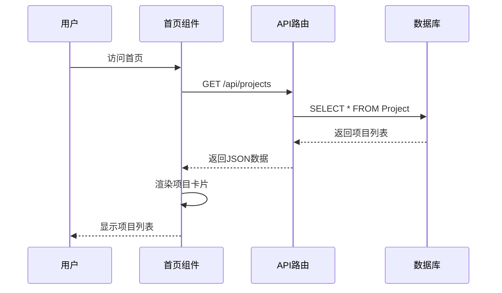
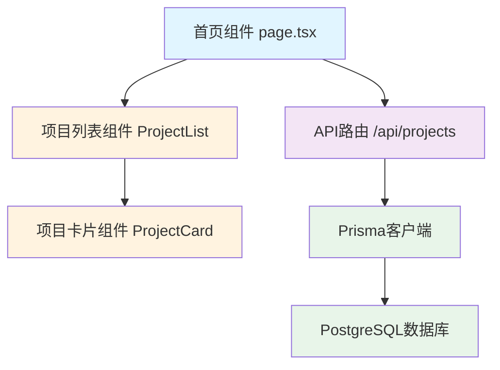

# 设计文档：首页项目列表区域重新设计

## 概述

本设计文档描述了首页项目列表区域的重新设计方案。主要目标是优化用户界面，提升视觉体验和数据展示的准确性。核心改进包括：缩小卡片面积以展示更多项目、使用统一的项目图标、采用简洁的白色背景、从数据库project表读取真实项目名称。

## 主要算法/工作流程



## 核心接口/类型

```typescript
// 项目数据类型
interface Project {
  id: string
  name: string
  description: string | null
  nodeCount: number
  edgeCount: number
  createdAt: Date
  updatedAt: Date
}

// API响应类型
interface ProjectsResponse {
  projects: Project[]
  total: number
}

// 项目卡片组件属性
interface ProjectCardProps {
  project: Project
  onClick: (projectId: string) => void
}

// 项目列表组件属性
interface ProjectListProps {
  maxItems?: number
  columns?: number
}
```

## 关键函数与形式化规范

### 函数 1: fetchProjects()

```typescript
async function fetchProjects(): Promise<Project[]>
```

**前置条件:**
- API端点 `/api/projects` 可访问
- 数据库连接正常

**后置条件:**
- 返回有效的项目数组
- 如果成功: `result.length >= 0`
- 如果失败: 抛出错误异常
- 不修改数据库状态

**循环不变式:** 不适用（无循环）

### 函数 2: renderProjectCard()

```typescript
function renderProjectCard(project: Project): JSX.Element
```

**前置条件:**
- `project` 对象非空
- `project.id` 是有效的字符串
- `project.name` 是非空字符串

**后置条件:**
- 返回有效的React元素
- 卡片包含项目图标、名称和统计信息
- 卡片具有点击事件处理器
- 不修改输入参数

**循环不变式:** 不适用（无循环）

### 函数 3: handleProjectClick()

```typescript
function handleProjectClick(projectId: string): void
```

**前置条件:**
- `projectId` 是有效的项目ID字符串
- 项目ID存在于数据库中

**后置条件:**
- 导航到项目详情页面或编辑页面
- URL更新为 `/creation?projectId={projectId}`
- 不修改项目数据

**循环不变式:** 不适用（无循环）

## 算法伪代码

### 主要处理算法

```typescript
ALGORITHM renderProjectList(maxItems)
INPUT: maxItems 最大显示项目数量（可选）
OUTPUT: 渲染的项目列表组件

BEGIN
  // 步骤 1: 初始化状态
  projects ← []
  loading ← true
  error ← null
  
  // 步骤 2: 获取项目数据（带循环不变式）
  TRY
    response ← await fetch('/api/projects')
    ASSERT response.ok = true
    
    data ← await response.json()
    projects ← data.projects
    
    // 如果指定了最大数量，截取数组
    IF maxItems IS NOT NULL AND maxItems > 0 THEN
      projects ← projects.slice(0, maxItems)
    END IF
    
    loading ← false
  CATCH error
    error ← error.message
    loading ← false
  END TRY
  
  // 步骤 3: 渲染UI
  IF loading THEN
    RETURN <LoadingSpinner />
  END IF
  
  IF error IS NOT NULL THEN
    RETURN <ErrorMessage message={error} />
  END IF
  
  // 步骤 4: 渲染项目卡片（带循环不变式）
  cards ← []
  FOR each project IN projects DO
    ASSERT project.id IS NOT NULL
    ASSERT project.name IS NOT NULL
    
    card ← createProjectCard(project)
    cards.add(card)
  END FOR
  
  ASSERT cards.length = projects.length
  
  RETURN <ProjectGrid cards={cards} />
END
```

**前置条件:**
- React组件已挂载
- API端点可用
- maxItems为正整数或null

**后置条件:**
- 渲染完整的项目列表
- 所有项目卡片正确显示
- 加载和错误状态正确处理

**循环不变式:**
- 在项目遍历循环中：所有已处理的项目都已转换为有效的卡片组件
- 卡片数组长度等于已处理的项目数量

### 项目卡片创建算法

```typescript
ALGORITHM createProjectCard(project)
INPUT: project 项目对象
OUTPUT: card React卡片元素

BEGIN
  // 验证输入
  IF project = null OR project.id = null THEN
    THROW Error("Invalid project data")
  END IF
  
  // 创建卡片元素
  card ← {
    key: project.id,
    icon: "/项目1.png",
    title: project.name,
    stats: {
      nodes: project.nodeCount,
      edges: project.edgeCount
    },
    onClick: () => handleProjectClick(project.id)
  }
  
  RETURN <ProjectCard {...card} />
END
```

**前置条件:**
- project对象已定义且包含必需字段
- 项目图标文件存在于public目录

**后置条件:**
- 返回有效的React卡片组件
- 卡片包含所有必需的视觉元素
- 点击处理器已绑定

**循环不变式:** 不适用（无循环）

## 示例用法

```typescript
// 示例 1: 基本用法 - 在首页组件中使用
import ProjectList from '@/components/ProjectList'

export default function HomePage() {
  return (
    <main>
      <HeroSection />
      <ProjectList maxItems={12} columns={6} />
    </main>
  )
}

// 示例 2: 获取项目数据
const fetchProjects = async () => {
  try {
    const response = await fetch('/api/projects')
    if (!response.ok) {
      throw new Error('Failed to fetch projects')
    }
    const data = await response.json()
    return data.projects
  } catch (error) {
    console.error('Error fetching projects:', error)
    throw error
  }
}

// 示例 3: 渲染单个项目卡片
const ProjectCard = ({ project, onClick }: ProjectCardProps) => {
  return (
    <div 
      className={styles.projectCard}
      onClick={() => onClick(project.id)}
    >
      <div className={styles.iconContainer}>
        
      </div>
      <div className={styles.cardContent}>
        <h3>{project.name}</h3>
        <div className={styles.stats}>
          <span>{project.nodeCount} 节点</span>
          <span>{project.edgeCount} 边</span>
        </div>
      </div>
    </div>
  )
}

// 示例 4: 完整工作流程
const ProjectListComponent = () => {
  const [projects, setProjects] = useState<Project[]>([])
  const [loading, setLoading] = useState(true)
  
  useEffect(() => {
    const loadProjects = async () => {
      try {
        const data = await fetchProjects()
        setProjects(data)
      } catch (error) {
        console.error(error)
      } finally {
        setLoading(false)
      }
    }
    
    loadProjects()
  }, [])
  
  if (loading) return <LoadingSpinner />
  
  return (
    <div className={styles.projectGrid}>
      {projects.map(project => (
        <ProjectCard 
          key={project.id}
          project={project}
          onClick={handleProjectClick}
        />
      ))}
    </div>
  )
}
```

## 架构

本设计采用典型的Next.js应用架构，包含以下层次：



### 架构说明

1. **表现层**: 首页组件负责整体布局和用户交互
2. **组件层**: 项目列表和卡片组件负责数据展示
3. **API层**: Next.js API路由处理数据请求
4. **数据访问层**: Prisma ORM提供类型安全的数据库访问
5. **数据层**: PostgreSQL存储项目数据

## 组件和接口

### 组件 1: ProjectList

**目的**: 管理项目列表的数据获取和整体布局

**接口**:
```typescript
interface ProjectListProps {
  maxItems?: number      // 最大显示数量，默认12
  columns?: number       // 列数，默认6
  onProjectClick?: (projectId: string) => void
}

export function ProjectList(props: ProjectListProps): JSX.Element
```

**职责**:
- 从API获取项目数据
- 管理加载和错误状态
- 渲染项目卡片网格
- 处理项目点击事件

### 组件 2: ProjectCard

**目的**: 渲染单个项目卡片

**接口**:
```typescript
interface ProjectCardProps {
  project: Project
  onClick: (projectId: string) => void
}

export function ProjectCard(props: ProjectCardProps): JSX.Element
```

**职责**:
- 显示项目图标（项目1.png）
- 显示项目名称
- 显示项目统计信息（节点数、边数）
- 处理卡片点击事件
- 提供悬停动画效果

### 组件 3: API路由 /api/projects

**目的**: 提供项目数据的RESTful接口

**接口**:
```typescript
// GET /api/projects
// Query参数: limit (可选)
// 响应: ProjectsResponse

export async function GET(request: Request): Promise<Response>
```

**职责**:
- 查询数据库获取项目列表
- 返回JSON格式的项目数据
- 处理错误情况
- 支持分页和限制数量

## 数据模型

### 模型 1: Project

```typescript
interface Project {
  id: string          // 项目唯一标识符 (cuid)
  name: string        // 项目名称
  description: string | null  // 项目描述
  nodeCount: number   // 节点数量
  edgeCount: number   // 边数量
  createdAt: Date     // 创建时间
  updatedAt: Date     // 更新时间
}
```

**验证规则**:
- `id`: 必须是有效的cuid格式
- `name`: 非空字符串，长度1-100字符
- `description`: 可选，最大长度500字符
- `nodeCount`: 非负整数
- `edgeCount`: 非负整数
- `createdAt`: 有效的日期时间
- `updatedAt`: 有效的日期时间，不早于createdAt

### 模型 2: ProjectsResponse

```typescript
interface ProjectsResponse {
  projects: Project[]  // 项目数组
  total: number        // 总项目数
}
```

**验证规则**:
- `projects`: 有效的Project对象数组
- `total`: 非负整数，表示数据库中的总项目数

## 错误处理

### 错误场景 1: API请求失败

**条件**: 网络错误或服务器错误导致API请求失败
**响应**: 显示错误提示信息，提供重试按钮
**恢复**: 用户可以点击重试按钮重新加载数据

### 错误场景 2: 数据库查询失败

**条件**: 数据库连接失败或查询错误
**响应**: API返回500错误，前端显示友好错误信息
**恢复**: 记录错误日志，提示用户稍后重试

### 错误场景 3: 项目数据不完整

**条件**: 数据库返回的项目缺少必需字段
**响应**: 跳过该项目，记录警告日志
**恢复**: 继续渲染其他有效项目

### 错误场景 4: 图标文件缺失

**条件**: 项目1.png文件不存在
**响应**: 显示默认占位符图标
**恢复**: 提示管理员上传图标文件

## 测试策略

### 单元测试方法

**测试目标**: 验证各个组件和函数的独立功能

**关键测试用例**:
1. ProjectCard组件正确渲染项目信息
2. fetchProjects函数正确处理API响应
3. handleProjectClick函数正确导航到项目页面
4. 数据验证函数正确识别无效数据

**覆盖率目标**: 80%以上的代码覆盖率

### 属性测试方法

**属性测试库**: fast-check (JavaScript/TypeScript)

**测试属性**:
1. **属性1 - 数据完整性**: 对于任意有效的项目数组，渲染的卡片数量应等于项目数量
2. **属性2 - 排序稳定性**: 多次渲染相同的项目列表应产生相同的顺序
3. **属性3 - 点击处理**: 点击任意项目卡片应导航到正确的项目ID
4. **属性4 - 数据截断**: 当maxItems小于总项目数时，应只显示前maxItems个项目

### 集成测试方法

**测试目标**: 验证组件间的交互和数据流

**测试场景**:
1. 首页加载时正确获取并显示项目列表
2. 点击项目卡片正确导航到项目详情页
3. API错误时正确显示错误信息
4. 加载状态正确显示和隐藏

## 性能考虑

### 性能要求

- **首次加载时间**: 项目列表应在2秒内完成渲染
- **API响应时间**: /api/projects端点应在500ms内响应
- **图片加载**: 项目图标应使用Next.js Image组件优化加载
- **内存使用**: 单页面内存占用不超过50MB

### 优化策略

1. **数据分页**: 实现分页加载，避免一次加载过多项目
2. **图片优化**: 使用WebP格式，启用懒加载
3. **缓存策略**: 使用SWR或React Query缓存API响应
4. **虚拟滚动**: 当项目数量超过100时，使用虚拟滚动技术
5. **代码分割**: 使用动态导入延迟加载非关键组件

## 安全考虑

### 安全要求

1. **输入验证**: 所有用户输入必须经过验证和清理
2. **SQL注入防护**: 使用Prisma ORM的参数化查询
3. **XSS防护**: React自动转义输出，避免直接使用dangerouslySetInnerHTML
4. **CSRF防护**: API路由使用Next.js内置的CSRF保护

### 威胁模型

- **威胁1**: 恶意用户尝试注入SQL代码
  - **缓解**: 使用Prisma ORM，所有查询都是参数化的
  
- **威胁2**: XSS攻击通过项目名称注入脚本
  - **缓解**: React自动转义所有文本内容
  
- **威胁3**: 未授权访问项目数据
  - **缓解**: 实现身份验证和授权检查（未来功能）

## 依赖项

### 核心依赖

- **Next.js 14+**: React框架，提供SSR和API路由
- **React 18+**: UI库
- **TypeScript 5+**: 类型安全
- **Prisma 5+**: ORM和数据库访问
- **PostgreSQL**: 数据库

### 开发依赖

- **@types/react**: React类型定义
- **@types/node**: Node.js类型定义
- **eslint**: 代码检查
- **prettier**: 代码格式化

### 外部资源

- **项目1.png**: 项目图标文件，位于public目录
- **字体**: 系统默认字体或Google Fonts

## 正确性属性

### 通用量化属性

1. **∀ project ∈ projects**: `project.id ≠ null ∧ project.name ≠ ""`
   - 所有项目必须有有效的ID和非空名称

2. **∀ card ∈ renderedCards**: `card.onClick` 是有效的函数
   - 所有渲染的卡片必须有点击处理器

3. **|renderedCards| ≤ min(maxItems, |projects|)**
   - 渲染的卡片数量不超过指定的最大值和实际项目数

4. **∀ project ∈ projects**: `project.nodeCount ≥ 0 ∧ project.edgeCount ≥ 0`
   - 所有项目的节点数和边数必须是非负数

5. **loading = true ⟹ projects = []**
   - 加载状态时，项目列表应为空

6. **error ≠ null ⟹ projects = []**
   - 错误状态时，项目列表应为空

7. **∀ i, j ∈ [0, |projects|): i < j ⟹ projects[i].createdAt ≥ projects[j].createdAt**
   - 项目按创建时间降序排列（最新的在前）
