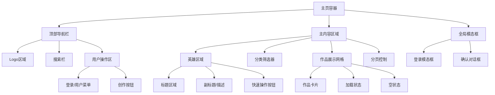

# 设计文档：主页UI界面优化

## 概述

本设计旨在全面优化3D知识图谱网站的主页UI界面，解决当前存在的布局、视觉设计和用户体验问题。通过现代化的设计语言、改进的响应式布局和增强的交互体验，创建一个美观、直观且用户友好的主页界面。

优化重点包括：重新设计导航栏和侧边栏、优化作品展示网格、改进搜索和筛选功能、实现更好的响应式设计，以及应用现代化的视觉风格。

## 架构



## 组件和接口

### 组件 1: 增强型导航栏 (EnhancedNavbar)

**目的**: 提供现代化、响应式的顶部导航体验

**接口**:
```typescript
interface EnhancedNavbarProps {
  user: User | null
  isLoggedIn: boolean
  onLoginClick: () => void
  onLogout: () => void
  onCreateClick: () => void
  searchQuery: string
  onSearchChange: (query: string) => void
  onSearchSubmit: () => void
}
```

**职责**:
- 显示品牌Logo和网站标识
- 提供全局搜索功能
- 管理用户认证状态显示
- 响应式布局适配

### 组件 2: 英雄区域 (HeroSection)

**目的**: 创建引人注目的页面顶部区域，突出网站价值主张

**接口**:
```typescript
interface HeroSectionProps {
  title: string
  subtitle?: string
  primaryAction: {
    text: string
    onClick: () => void
    disabled?: boolean
  }
  secondaryAction?: {
    text: string
    onClick: () => void
  }
}
```

**职责**:
- 展示主要标题和描述
- 提供主要行动号召按钮
- 创建视觉层次和焦点

### 组件 3: 智能分类筛选器 (SmartCategoryFilter)

**目的**: 提供直观的内容分类和筛选功能

**接口**:
```typescript
interface SmartCategoryFilterProps {
  categories: Category[]
  selectedCategory: string
  onCategoryChange: (category: string) => void
  workCount: Record<string, number>
  loading?: boolean
}

interface Category {
  id: string
  name: string
  icon?: string
  color?: string
}
```

**职责**:
- 显示可用的内容分类
- 提供分类切换功能
- 显示每个分类的内容数量
- 支持键盘导航

### 组件 4: 响应式作品网格 (ResponsiveWorkGrid)

**目的**: 以美观的网格布局展示作品，支持多种设备尺寸

**接口**:
```typescript
interface ResponsiveWorkGridProps {
  works: Work[]
  loading: boolean
  onWorkClick: (work: Work) => void
  onWorkLike?: (workId: string) => void
  onWorkShare?: (work: Work) => void
  gridColumns?: {
    mobile: number
    tablet: number
    desktop: number
    wide: number
  }
}

interface Work {
  id: string
  title: string
  author: string
  thumbnail: string
  category: string
  likes: number
  views: number
  createdAt: Date
  featured?: boolean
}
```

**职责**:
- 响应式网格布局
- 作品卡片展示
- 交互状态管理
- 加载和空状态处理

### 组件 5: 增强型作品卡片 (EnhancedWorkCard)

**目的**: 提供丰富的作品信息展示和交互功能

**接口**:
```typescript
interface EnhancedWorkCardProps {
  work: Work
  onClick: () => void
  onLike?: () => void
  onShare?: () => void
  featured?: boolean
  size?: 'small' | 'medium' | 'large'
}
```

**职责**:
- 展示作品缩略图和基本信息
- 提供悬停和点击交互
- 支持点赞和分享功能
- 特色作品高亮显示

## 数据模型

### 模型 1: Work (作品)

```typescript
interface Work {
  id: string
  title: string
  description?: string
  author: string
  authorId: string
  thumbnail: string
  category: string
  tags: string[]
  likes: number
  views: number
  createdAt: Date
  updatedAt: Date
  featured: boolean
  published: boolean
}
```

**验证规则**:
- title: 必填，1-100字符
- author: 必填，有效用户名
- category: 必填，有效分类ID
- thumbnail: 必填，有效图片URL

### 模型 2: Category (分类)

```typescript
interface Category {
  id: string
  name: string
  description?: string
  icon?: string
  color?: string
  order: number
  active: boolean
}
```

**验证规则**:
- name: 必填，唯一，1-50字符
- order: 必填，正整数
- color: 可选，有效十六进制颜色代码

### 模型 3: SearchFilters (搜索筛选)

```typescript
interface SearchFilters {
  query?: string
  category?: string
  author?: string
  tags?: string[]
  sortBy: 'newest' | 'popular' | 'views' | 'likes'
  sortOrder: 'asc' | 'desc'
  page: number
  limit: number
}
```

**验证规则**:
- query: 可选，最大200字符
- page: 必填，正整数，最小值1
- limit: 必填，正整数，范围10-100

## 错误处理

### 错误场景 1: 网络连接失败

**条件**: API请求超时或网络不可用
**响应**: 显示友好的错误提示，提供重试按钮
**恢复**: 自动重试机制，降级到缓存数据

### 错误场景 2: 搜索无结果

**条件**: 用户搜索查询没有匹配结果
**响应**: 显示空状态页面，提供搜索建议
**恢复**: 提供相关推荐或热门内容

### 错误场景 3: 图片加载失败

**条件**: 作品缩略图无法加载
**响应**: 显示默认占位图，记录错误日志
**恢复**: 提供图片重新加载功能

### 错误场景 4: 用户认证失效

**条件**: 用户token过期或无效
**响应**: 自动跳转到登录页面，保存当前状态
**恢复**: 登录成功后恢复到原页面状态

## 测试策略

### 单元测试方法

针对每个组件进行独立测试，重点关注：
- 组件渲染正确性
- 属性传递和状态管理
- 事件处理函数调用
- 边界条件和错误状态

测试覆盖率目标：90%以上

### 属性测试方法

**属性测试库**: fast-check

使用属性测试验证组件行为的一致性：
- 搜索功能的输入输出一致性
- 分页逻辑的数学正确性
- 筛选器组合的逻辑正确性
- 响应式布局的断点行为

### 集成测试方法

测试组件间的交互和数据流：
- 搜索到结果展示的完整流程
- 用户登录到创作的完整流程
- 分类筛选到内容更新的流程
- 响应式布局在不同设备上的表现

## 性能考虑

### 渲染优化
- 使用React.memo优化组件重渲染
- 实现虚拟滚动处理大量作品列表
- 图片懒加载和渐进式加载
- 组件代码分割和动态导入

### 数据获取优化
- 实现智能分页和预加载
- 使用SWR或React Query进行数据缓存
- 搜索防抖和请求去重
- CDN加速静态资源加载

### 交互性能
- 使用CSS transforms进行动画
- 避免布局抖动和重排
- 优化触摸和鼠标事件处理
- 实现平滑的页面过渡效果

## 安全考虑

### 输入验证
- 搜索查询XSS防护
- 文件上传类型和大小限制
- 用户输入内容过滤和转义

### 认证安全
- JWT token安全存储
- 自动登录状态检查
- 敏感操作二次确认

### 数据保护
- 用户隐私信息保护
- 图片和内容版权保护
- API访问频率限制

## 依赖项

### 核心依赖
- React 18+ (用户界面框架)
- Next.js 13+ (全栈框架)
- TypeScript (类型安全)
- Tailwind CSS (样式框架)

### UI组件库
- Framer Motion (动画库)
- React Hook Form (表单处理)
- React Query (数据获取)
- React Intersection Observer (懒加载)

### 工具库
- date-fns (日期处理)
- lodash (工具函数)
- clsx (条件样式)
- react-hot-toast (通知提示)

### 开发工具
- ESLint (代码检查)
- Prettier (代码格式化)
- Jest (单元测试)
- Cypress (端到端测试)