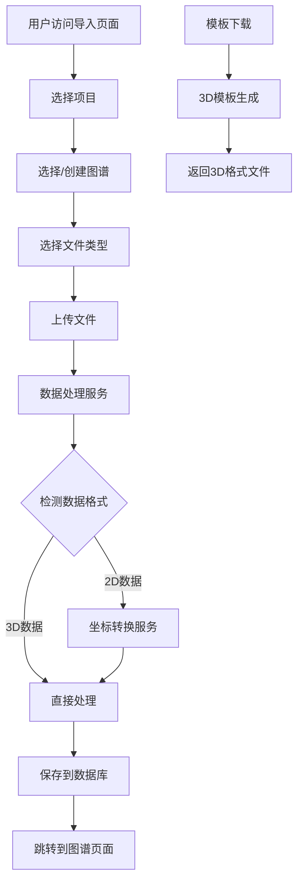
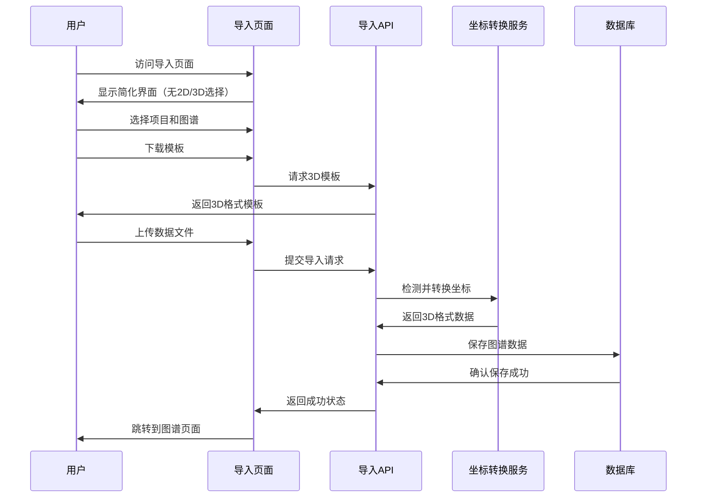

# 设计文档：导入页面3D统一化

## 概述

本功能旨在简化导入数据页面的用户体验，移除当前2D和3D图谱类型的区分，统一使用3D模式。这将简化用户界面，减少用户选择的复杂性，同时保持向后兼容性，确保现有的2D数据能够自动转换为3D格式。

主要改进包括：移除图谱类型选择器、统一模板下载为3D格式、更新数据导入处理逻辑以自动将2D坐标转换为3D坐标、简化用户界面流程。

## 架构



## 序列图



## 组件和接口

### 组件1: ImportPage

**目的**: 提供简化的数据导入用户界面

**接口**:
```typescript
interface ImportPageProps {}

interface ImportPageState {
  projects: Project[]
  graphs: Graph[]
  selectedProject: string
  selectedGraph: string
  selectedFile: File | null
  fileType: 'excel' | 'csv' | 'json' | null
  uploading: boolean
  uploadStatus: string
  showNewProjectModal: boolean
  showNewGraphModal: boolean
  showConfirmModal: boolean
  newProjectName: string
  newGraphName: string
  creating: boolean
}
```

**职责**:
- 渲染简化的用户界面（移除图谱类型选择）
- 处理项目和图谱选择
- 管理文件上传流程
- 提供3D模板下载功能

### 组件2: CoordinateConverter

**目的**: 处理2D到3D坐标的自动转换

**接口**:
```typescript
interface CoordinateConverter {
  convertNodeCoordinates(nodes: Node[]): Node[]
  detectCoordinateSystem(nodes: Node[]): '2D' | '3D'
  generate3DCoordinates(x: number, y: number): { x: number, y: number, z: number }
}

interface Node {
  id: string
  label: string
  description?: string
  x: number
  y: number
  z?: number
  color?: string
  size?: number
  shape?: string
}
```

**职责**:
- 检测输入数据的坐标系统类型
- 将2D坐标自动转换为3D坐标
- 保持3D数据不变
- 提供合理的Z轴默认值

## 数据模型

### 模型1: GraphData

```typescript
interface GraphData {
  nodes: Node[]
  edges: Edge[]
  metadata: {
    type: '3D'  // 固定为3D
    version: string
    createdAt: Date
    updatedAt: Date
  }
}

interface Node {
  id: string
  label: string
  description?: string
  x: number
  y: number
  z: number  // 必需字段，不再可选
  color?: string
  size?: number
  shape?: string
}

interface Edge {
  source: string
  target: string
  label?: string
  color?: string
  width?: number
}
```

**验证规则**:
- 所有节点必须包含x, y, z坐标
- 节点ID必须唯一
- 边的source和target必须引用存在的节点

### 模型2: ImportRequest

```typescript
interface ImportRequest {
  projectId: string
  graphId: string
  file: File
  fileType: 'excel' | 'csv' | 'json'
  // 移除graphType字段，固定使用3D
}
```

## 算法伪代码

### 主要处理算法

```pascal
ALGORITHM processImportData(importRequest)
INPUT: importRequest of type ImportRequest
OUTPUT: result of type ImportResult

BEGIN
  ASSERT validateImportRequest(importRequest) = true
  
  // 步骤1: 解析文件数据
  rawData ← parseFileData(importRequest.file, importRequest.fileType)
  ASSERT rawData.nodes.length > 0
  
  // 步骤2: 检测坐标系统并转换
  coordinateSystem ← detectCoordinateSystem(rawData.nodes)
  
  IF coordinateSystem = '2D' THEN
    convertedNodes ← convertTo3D(rawData.nodes)
  ELSE
    convertedNodes ← rawData.nodes
  END IF
  
  // 步骤3: 验证和标准化数据
  validatedData ← validateGraphData({
    nodes: convertedNodes,
    edges: rawData.edges,
    metadata: {
      type: '3D',
      version: '1.0',
      createdAt: now(),
      updatedAt: now()
    }
  })
  
  // 步骤4: 保存到数据库
  result ← saveGraphData(importRequest.graphId, validatedData)
  
  ASSERT result.success = true
  
  RETURN result
END
```

**前置条件**:
- importRequest包含有效的项目ID和图谱ID
- 文件格式受支持且数据结构正确
- 数据库连接可用

**后置条件**:
- 图谱数据已保存为3D格式
- 所有节点都包含x, y, z坐标
- 返回成功结果或详细错误信息

**循环不变式**: 在数据转换过程中，节点的ID和标签保持不变

### 坐标转换算法

```pascal
ALGORITHM convertTo3D(nodes)
INPUT: nodes of type Node[] (2D coordinates)
OUTPUT: convertedNodes of type Node[] (3D coordinates)

BEGIN
  convertedNodes ← []
  
  FOR each node IN nodes DO
    ASSERT node.x IS defined AND node.y IS defined
    
    // 保持原有x, y坐标，生成合理的z坐标
    newNode ← {
      ...node,
      z: generateZCoordinate(node.x, node.y)
    }
    
    convertedNodes.add(newNode)
  END FOR
  
  ASSERT convertedNodes.length = nodes.length
  
  RETURN convertedNodes
END
```

**前置条件**:
- 所有节点都包含有效的x, y坐标
- 节点数组不为空

**后置条件**:
- 所有节点都包含x, y, z坐标
- 原有的x, y坐标保持不变
- z坐标在合理范围内

**循环不变式**: 
- 已处理的节点都包含完整的3D坐标
- 节点的其他属性保持不变

## 关键函数的形式化规范

### 函数1: detectCoordinateSystem()

```typescript
function detectCoordinateSystem(nodes: Node[]): '2D' | '3D'
```

**前置条件**:
- `nodes`数组不为空
- 每个节点都包含x, y坐标

**后置条件**:
- 返回'2D'当且仅当所有节点都缺少z坐标或z坐标为undefined
- 返回'3D'当且仅当至少一个节点包含有效的z坐标
- 函数执行不修改输入数据

### 函数2: generateZCoordinate()

```typescript
function generateZCoordinate(x: number, y: number): number
```

**前置条件**:
- `x`和`y`是有效的数值
- `x`和`y`不是NaN或Infinity

**后置条件**:
- 返回值是有效的数值
- 返回值在合理范围内（-1000到1000）
- 相同的x, y输入产生相同的z输出（确定性）

### 函数3: validateGraphData()

```typescript
function validateGraphData(data: GraphData): GraphData
```

**前置条件**:
- `data`包含nodes和edges数组
- `data.metadata.type`为'3D'

**后置条件**:
- 所有节点ID唯一
- 所有边引用存在的节点
- 所有节点包含完整的3D坐标
- 如果验证失败，抛出详细错误信息

## 示例用法

```typescript
// 示例1: 基本导入流程
const importRequest: ImportRequest = {
  projectId: "project-123",
  graphId: "graph-456", 
  file: selectedFile,
  fileType: "json"
}

const result = await processImportData(importRequest)

// 示例2: 坐标转换
const nodes2D = [
  { id: "1", label: "Node A", x: 100, y: 200 },
  { id: "2", label: "Node B", x: 300, y: 150 }
]

const nodes3D = convertTo3D(nodes2D)
// 结果: [
//   { id: "1", label: "Node A", x: 100, y: 200, z: 0 },
//   { id: "2", label: "Node B", x: 300, y: 150, z: 0 }
// ]

// 示例3: 模板下载（统一3D格式）
const templateUrl = "/api/templates?format=excel"
// 不再需要type参数，默认返回3D格式
```

## 正确性属性

*属性是一个特征或行为，应该在系统的所有有效执行中保持为真——本质上，是关于系统应该做什么的正式陈述。属性作为人类可读规范和机器可验证正确性保证之间的桥梁。*

### 属性 1: 坐标完整性

*对于任何*处理后的节点，该节点都应该包含完整的x, y, z坐标信息

**验证需求: 需求 1.3, 2.2, 4.2**

### 属性 2: 数据保持性

*对于任何*输入节点和对应的输出节点，如果它们具有相同的ID，那么原始的x, y坐标应该保持不变

**验证需求: 需求 2.3**

### 属性 3: 转换确定性

*对于任何*给定的x, y坐标值，生成Z坐标的函数应该总是返回相同的结果

**验证需求: 需求 2.4**

### 属性 4: 节点唯一性

*对于任何*验证后的图谱数据中的两个不同节点，它们的ID应该是唯一的

**验证需求: 需求 4.4**

### 属性 5: 边引用完整性

*对于任何*验证后的边，其源节点和目标节点都应该在节点列表中存在

**验证需求: 需求 4.5**

### 属性 6: 坐标系统检测准确性

*对于任何*包含2D坐标的节点数组，坐标系统检测函数应该正确识别为2D类型

**验证需求: 需求 2.1**

### 属性 7: 3D格式统一性

*对于任何*导入的数据，无论原始格式如何，最终输出都应该是3D格式

**验证需求: 需求 1.3**

### 属性 8: 文件格式验证

*对于任何*上传的文件，系统都应该验证其格式是否在支持的类型列表中

**验证需求: 需求 4.1, 7.1**

### 属性 9: 错误信息完整性

*对于任何*验证失败的数据，系统都应该返回包含具体问题描述和修复建议的错误信息

**验证需求: 需求 4.3, 5.1**

### 属性 10: 权限验证

*对于任何*导入请求，系统都应该验证用户对目标项目和图谱的访问权限

**验证需求: 需求 7.3**

## 错误处理

### 错误场景1: 无效文件格式

**条件**: 用户上传不支持的文件格式
**响应**: 显示错误消息"不支持的文件格式，请上传Excel、CSV或JSON文件"
**恢复**: 允许用户重新选择文件

### 错误场景2: 数据结构错误

**条件**: 文件内容不符合预期的数据结构
**响应**: 显示详细的验证错误信息，指出具体问题
**恢复**: 提供模板下载链接，建议用户参考正确格式

### 错误场景3: 坐标转换失败

**条件**: 节点坐标数据无效或缺失
**响应**: 显示"坐标数据无效，请检查节点的x, y坐标"
**恢复**: 提供数据修复建议，允许重新上传

## 测试策略

### 单元测试方法

测试坐标转换函数、数据验证函数和文件解析函数的正确性，确保边界条件和异常情况得到妥善处理。

**关键测试用例**:
- 2D到3D坐标转换的准确性
- 数据验证规则的完整性
- 文件格式解析的鲁棒性

### 属性测试方法

**属性测试库**: fast-check

使用属性测试验证系统的不变性质，特别是坐标转换的确定性和数据完整性。

**关键属性**:
- 坐标转换的幂等性
- 数据结构的完整性保持
- 错误处理的一致性

### 集成测试方法

测试完整的导入流程，从文件上传到数据保存的端到端功能，确保用户界面和后端API的正确集成。

## 性能考虑

**文件大小限制**: 支持最大10MB的导入文件，对于大型图谱数据提供分批处理机制。

**内存优化**: 使用流式处理大型文件，避免将整个文件加载到内存中。

**响应时间**: 确保小型文件（<1MB）的处理时间在2秒内，大型文件提供进度指示器。

## 安全考虑

**文件验证**: 严格验证上传文件的类型和内容，防止恶意文件上传。

**数据清理**: 对所有用户输入进行清理和验证，防止XSS和注入攻击。

**权限控制**: 确保用户只能导入到自己有权限的项目和图谱中。

## 依赖项

**前端依赖**:
- React 18+ (现有)
- TypeScript (现有)
- 文件上传组件库

**后端依赖**:
- Next.js API Routes (现有)
- XLSX库用于Excel文件处理 (现有)
- 数据验证库（如Zod）

**数据库**:
- 现有的Prisma ORM和数据库结构
- 可能需要更新图谱数据模型以强制3D坐标