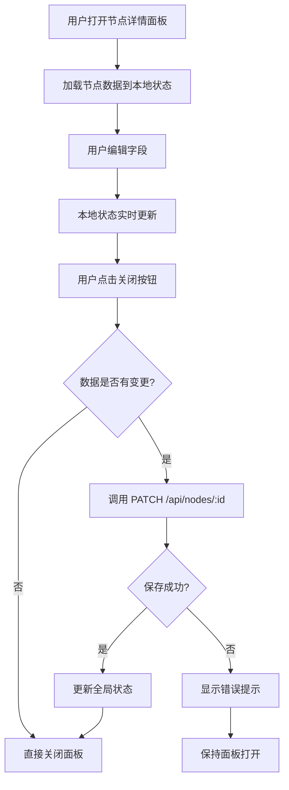

# Design Document: Node Detail Panel Edit Feature

## Overview

本设计文档描述了节点详情面板编辑功能的实现方案。该功能将现有的只读节点详情面板改造为可编辑面板，支持直接修改节点名称、描述和图片，并在关闭面板时自动保存更改。

核心改进包括：
- 将静态展示字段转换为可编辑输入组件
- 实现自动保存机制，在面板关闭时触发
- 用图片上传组件替换现有的媒体展示区域
- 添加数据验证和错误处理
- 保持权限控制（仅管理员可编辑）

## Architecture

### Component Structure

```
NodeDetailPanel (修改后)
├── Header Section
│   ├── Title
│   └── Close Button (触发自动保存)
├── Content Section
│   ├── Editable Name Input
│   ├── Editable Description Textarea
│   ├── Image Upload Component (新增)
│   └── Metadata Display (只读)
└── Footer Section (管理员可见)
    ├── Edit Button (跳转到2D编辑页面)
    └── Delete Button
```

### Data Flow



### State Management

使用 React 本地状态管理编辑中的数据：

```typescript
interface EditState {
  name: string
  description: string
  imageUrl: string
  isDirty: boolean  // 标记数据是否被修改
  isSaving: boolean // 标记是否正在保存
}
```

## Components and Interfaces

### 1. NodeDetailPanel Component (修改)

**职责：**
- 管理节点编辑状态
- 处理自动保存逻辑
- 协调子组件交互

**Props：** 无（从全局状态获取 selectedNode）

**State：**
```typescript
const [editedName, setEditedName] = useState<string>('')
const [editedDescription, setEditedDescription] = useState<string>('')
const [editedImageUrl, setEditedImageUrl] = useState<string>('')
const [isSaving, setIsSaving] = useState<boolean>(false)
const [isAdmin, setIsAdmin] = useState<boolean>(false)
```

**Key Methods：**

```typescript
// 检查数据是否有变更
const hasChanges = (): boolean => {
  if (!selectedNode) return false
  return (
    editedName !== selectedNode.name ||
    editedDescription !== (selectedNode.description || '') ||
    editedImageUrl !== (selectedNode.imageUrl || '')
  )
}

// 验证输入数据
const validateInput = (): { valid: boolean; error?: string } => {
  if (!editedName.trim()) {
    return { valid: false, error: '节点名称不能为空' }
  }
  if (editedName.length > 100) {
    return { valid: false, error: '节点名称不能超过100个字符' }
  }
  if (editedDescription.length > 1000) {
    return { valid: false, error: '节点描述不能超过1000个字符' }
  }
  return { valid: true }
}

// 保存更改
const saveChanges = async (): Promise<boolean> => {
  if (!selectedNode || !hasChanges()) return true
  
  const validation = validateInput()
  if (!validation.valid) {
    alert(validation.error)
    return false
  }
  
  setIsSaving(true)
  try {
    const response = await fetch(`/api/nodes/${selectedNode.id}`, {
      method: 'PATCH',
      headers: { 'Content-Type': 'application/json' },
      body: JSON.stringify({
        name: editedName,
        description: editedDescription,
        imageUrl: editedImageUrl,
      }),
    })
    
    if (!response.ok) {
      throw new Error('保存失败')
    }
    
    const updatedNode = await response.json()
    // 更新全局状态
    updateNodeInStore(updatedNode)
    return true
  } catch (error) {
    console.error('保存失败:', error)
    alert('保存失败，请重试')
    return false
  } finally {
    setIsSaving(false)
  }
}

// 处理关闭
const handleClose = async () => {
  if (isAdmin && hasChanges()) {
    const saved = await saveChanges()
    if (!saved) return // 保存失败，不关闭面板
  }
  setSelectedNode(null)
}
```

### 2. EditableInput Component (新增)

**职责：**
- 提供可编辑的输入框
- 显示字符计数
- 提供视觉反馈

**Props：**
```typescript
interface EditableInputProps {
  value: string
  onChange: (value: string) => void
  placeholder?: string
  maxLength?: number
  multiline?: boolean
  rows?: number
  disabled?: boolean
  label: string
}
```

**Implementation：**
```typescript
export function EditableInput({
  value,
  onChange,
  placeholder = '',
  maxLength,
  multiline = false,
  rows = 1,
  disabled = false,
  label,
}: EditableInputProps) {
  const Component = multiline ? 'textarea' : 'input'
  
  return (
    <div style={{ marginBottom: '20px' }}>
      <label style={{
        display: 'block',
        fontSize: '14px',
        fontWeight: '500',
        color: '#374151',
        marginBottom: '8px',
      }}>
        {label}
        {maxLength && (
          <span style={{
            float: 'right',
            fontSize: '12px',
            color: value.length > maxLength * 0.9 ? '#ef4444' : '#9ca3af',
          }}>
            {value.length}/{maxLength}
          </span>
        )}
      </label>
      <Component
        value={value}
        onChange={(e) => onChange(e.target.value)}
        placeholder={placeholder}
        disabled={disabled}
        maxLength={maxLength}
        rows={multiline ? rows : undefined}
        style={{
          width: '100%',
          padding: '12px',
          border: disabled ? '2px solid #e5e7eb' : '2px solid #6BB6FF',
          borderRadius: '8px',
          fontSize: '14px',
          background: disabled ? '#f9fafb' : 'white',
          color: '#1f2937',
          minHeight: multiline ? '100px' : '44px',
          resize: multiline ? 'vertical' : 'none',
          outline: 'none',
          transition: 'all 0.2s',
        }}
      />
    </div>
  )
}
```

### 3. InlineImageUpload Component (新增)

**职责：**
- 提供图片上传功能
- 显示当前图片预览
- 支持删除图片

**Props：**
```typescript
interface InlineImageUploadProps {
  nodeId: string
  currentImageUrl?: string
  onImageChange: (url: string) => void
  disabled?: boolean
}
```

**Implementation：**
```typescript
export function InlineImageUpload({
  nodeId,
  currentImageUrl,
  onImageChange,
  disabled = false,
}: InlineImageUploadProps) {
  const [uploading, setUploading] = useState(false)
  const [preview, setPreview] = useState<string | null>(currentImageUrl || null)
  const fileInputRef = useRef<HTMLInputElement>(null)

  const handleFileSelect = async (e: React.ChangeEvent<HTMLInputElement>) => {
    const file = e.target.files?.[0]
    if (!file) return

    // 验证文件类型
    if (!file.type.startsWith('image/')) {
      alert('请选择图片文件')
      return
    }

    // 验证文件大小
    if (file.size > 5 * 1024 * 1024) {
      alert('图片大小不能超过5MB')
      return
    }

    // 显示预览
    const reader = new FileReader()
    reader.onloadend = () => {
      setPreview(reader.result as string)
    }
    reader.readAsDataURL(file)

    // 上传文件
    setUploading(true)
    try {
      const formData = new FormData()
      formData.append('file', file)
      formData.append('nodeId', nodeId)
      formData.append('type', 'image')

      const response = await fetch('/api/upload', {
        method: 'POST',
        body: formData,
      })

      if (!response.ok) {
        throw new Error('上传失败')
      }

      const data = await response.json()
      onImageChange(data.url)
    } catch (error) {
      console.error('上传失败:', error)
      alert('上传失败，请重试')
      setPreview(currentImageUrl || null)
    } finally {
      setUploading(false)
    }
  }

  const handleRemove = () => {
    setPreview(null)
    onImageChange('')
  }

  return (
    <div style={{ marginBottom: '20px' }}>
      <label style={{
        display: 'block',
        fontSize: '14px',
        fontWeight: '500',
        color: '#374151',
        marginBottom: '8px',
      }}>
        节点图片
      </label>

      <input
        ref={fileInputRef}
        type="file"
        accept="image/jpeg,image/png,image/gif,image/webp"
        onChange={handleFileSelect}
        disabled={disabled}
        style={{ display: 'none' }}
      />

      {preview ? (
        <div style={{
          position: 'relative',
          width: '100%',
          height: '200px',
          borderRadius: '8px',
          overflow: 'hidden',
          border: '2px solid #e5e7eb',
        }}>
          
          {!disabled && (
            <button
              onClick={handleRemove}
              style={{
                position: 'absolute',
                top: '8px',
                right: '8px',
                background: 'rgba(239, 68, 68, 0.9)',
                border: 'none',
                borderRadius: '6px',
                color: 'white',
                padding: '6px 12px',
                fontSize: '12px',
                cursor: 'pointer',
                fontWeight: '600',
              }}
            >
              删除图片
            </button>
          )}
        </div>
      ) : (
        <div
          onClick={() => !disabled && fileInputRef.current?.click()}
          style={{
            width: '100%',
            height: '200px',
            border: '2px dashed #6BB6FF',
            borderRadius: '8px',
            display: 'flex',
            flexDirection: 'column',
            alignItems: 'center',
            justifyContent: 'center',
            cursor: disabled ? 'not-allowed' : 'pointer',
            background: disabled ? '#f9fafb' : 'rgba(107, 182, 255, 0.05)',
            transition: 'all 0.2s',
          }}
        >
          <span style={{ fontSize: '48px', marginBottom: '12px' }}>📷</span>
          <span style={{ fontSize: '14px', color: '#6b7280' }}>
            {uploading ? '上传中...' : '点击上传图片'}
          </span>
          <span style={{ fontSize: '12px', color: '#9ca3af', marginTop: '4px' }}>
            支持 JPG、PNG、GIF、WebP，最大 5MB
          </span>
        </div>
      )}
    </div>
  )
}
```

## Data Models

### Node Model (现有)

```typescript
interface Node {
  id: string
  name: string
  description: string | null
  type: string
  x: number
  y: number
  z: number
  color: string
  imageUrl: string | null
  videoUrl: string | null
  tags: string[]
  projectId: string
  graphId: string | null
  createdAt: Date
  updatedAt: Date
}
```

### API Request/Response

**PATCH /api/nodes/:id**

Request Body:
```typescript
{
  name?: string
  description?: string
  imageUrl?: string
  color?: string
  tags?: string[]
}
```

Response:
```typescript
{
  id: string
  name: string
  description: string | null
  imageUrl: string | null
  // ... other node fields
}
```

## Correctness Properties

*属性是一个特征或行为，应该在系统的所有有效执行中保持为真——本质上是关于系统应该做什么的形式化陈述。属性作为人类可读规范和机器可验证正确性保证之间的桥梁。*

### Property 1: 输入状态同步

*For any* 用户在名称或描述字段中输入的文本，组件的本地状态应该立即反映该输入值。

**Validates: Requirements 1.3, 1.4**

### Property 2: 变更检测准确性

*For any* 初始节点状态和编辑后的状态，hasChanges 函数应该正确识别是否存在变更（名称、描述或图片URL的任何差异）。

**Validates: Requirements 2.1**

### Property 3: 保存触发条件

*For any* 有变更的节点数据，当用户关闭面板时，系统应该调用 API 保存更新。

**Validates: Requirements 2.2**

### Property 4: 全局状态更新

*For any* 成功保存的节点数据，全局状态中的节点信息应该与保存后的数据一致。

**Validates: Requirements 2.3**

### Property 5: 保存后关闭

*For any* 成功完成的保存操作，面板应该在保存完成后关闭。

**Validates: Requirements 2.4**

### Property 6: 图片上传触发

*For any* 有效的图片文件（JPEG、PNG、GIF、WebP），选择文件后应该触发上传到服务器的操作。

**Validates: Requirements 3.6**

### Property 7: 图片URL更新

*For any* 成功上传的图片，节点的 imageUrl 应该更新为上传返回的 URL。

**Validates: Requirements 3.7**

### Property 8: 非图片文件拒绝

*For any* 非图片格式的文件（如 PDF、TXT、MP4 等），上传组件应该拒绝该文件并显示错误提示。

**Validates: Requirements 4.4**

### Property 9: 错误信息显示

*For any* 失败的操作（保存失败、上传失败、验证失败），系统应该向用户显示具体的错误信息。

**Validates: Requirements 5.4**


## Error Handling

### Input Validation Errors

**空白名称：**
- 检测：`!editedName.trim()`
- 处理：阻止保存，显示 alert 提示 "节点名称不能为空"
- 恢复：用户修正输入后可重新尝试保存

**名称过长：**
- 检测：`editedName.length > 100`
- 处理：阻止保存，显示 alert 提示 "节点名称不能超过100个字符"
- 恢复：用户缩短名称后可重新尝试保存

**描述过长：**
- 检测：`editedDescription.length > 1000`
- 处理：阻止保存，显示 alert 提示 "节点描述不能超过1000个字符"
- 恢复：用户缩短描述后可重新尝试保存

### API Errors

**保存失败：**
- 场景：网络错误、服务器错误、数据库错误
- 处理：
  1. 捕获异常
  2. 显示 alert 提示 "保存失败，请重试"
  3. 保持面板打开，保留用户编辑的内容
  4. 设置 `isSaving = false`
- 恢复：用户可以重新尝试关闭面板触发保存

**上传失败：**
- 场景：网络错误、文件过大、服务器错误
- 处理：
  1. 捕获异常
  2. 显示 alert 提示 "上传失败，请重试"
  3. 恢复到上传前的预览状态
  4. 设置 `uploading = false`
- 恢复：用户可以重新选择文件上传

### File Validation Errors

**非图片文件：**
- 检测：`!file.type.startsWith('image/')`
- 处理：显示 alert 提示 "请选择图片文件"，不执行上传
- 恢复：用户选择正确的图片文件

**文件过大：**
- 检测：`file.size > 5 * 1024 * 1024`
- 处理：显示 alert 提示 "图片大小不能超过5MB"，不执行上传
- 恢复：用户选择较小的图片文件

### Permission Errors

**非管理员尝试编辑：**
- 检测：`!isAdmin`
- 处理：所有输入字段设置为 `disabled={true}`，隐藏上传功能
- 恢复：用户需要以管理员身份登录

## Testing Strategy

### Unit Tests

单元测试用于验证特定示例、边缘情况和错误条件：

**组件渲染测试：**
- 测试管理员模式下字段是否可编辑
- 测试非管理员模式下字段是否只读
- 测试图片上传组件是否正确渲染
- 测试媒体展示区域是否已移除

**状态管理测试：**
- 测试输入变化是否更新本地状态
- 测试 hasChanges 函数在各种场景下的返回值
- 测试保存成功后全局状态是否更新

**验证逻辑测试：**
- 测试空白名称被拒绝
- 测试超长名称被拒绝
- 测试超长描述被拒绝
- 测试非图片文件被拒绝
- 测试超大文件被拒绝

**错误处理测试：**
- 测试保存失败时面板保持打开
- 测试上传失败时恢复预览状态
- 测试错误提示是否正确显示

### Property-Based Tests

属性测试用于验证跨所有输入的通用属性：

**测试配置：**
- 使用 `@fast-check/jest` 进行属性测试
- 每个属性测试运行最少 100 次迭代
- 每个测试标注对应的设计文档属性

**Property Test 1: 输入状态同步**
```typescript
// Feature: node-detail-edit, Property 1: 输入状态同步
test('property: input changes update local state', () => {
  fc.assert(
    fc.property(
      fc.string(), // 随机字符串
      (inputText) => {
        // 渲染组件
        // 模拟用户输入
        // 验证本地状态是否与输入一致
      }
    ),
    { numRuns: 100 }
  )
})
```

**Property Test 2: 变更检测准确性**
```typescript
// Feature: node-detail-edit, Property 2: 变更检测准确性
test('property: hasChanges correctly detects modifications', () => {
  fc.assert(
    fc.property(
      fc.record({
        name: fc.string(),
        description: fc.string(),
        imageUrl: fc.string(),
      }),
      fc.record({
        name: fc.string(),
        description: fc.string(),
        imageUrl: fc.string(),
      }),
      (original, edited) => {
        const hasChanges = 
          original.name !== edited.name ||
          original.description !== edited.description ||
          original.imageUrl !== edited.imageUrl
        
        // 验证 hasChanges 函数返回值与预期一致
      }
    ),
    { numRuns: 100 }
  )
})
```

**Property Test 3: 非图片文件拒绝**
```typescript
// Feature: node-detail-edit, Property 8: 非图片文件拒绝
test('property: non-image files are rejected', () => {
  fc.assert(
    fc.property(
      fc.constantFrom(
        'application/pdf',
        'text/plain',
        'video/mp4',
        'audio/mp3',
        'application/zip'
      ),
      (mimeType) => {
        const file = new File(['content'], 'test.file', { type: mimeType })
        // 验证文件被拒绝
        // 验证显示错误提示
      }
    ),
    { numRuns: 100 }
  )
})
```

### Integration Tests

集成测试验证组件间的交互：

**完整编辑流程：**
1. 打开节点详情面板
2. 编辑名称和描述
3. 上传图片
4. 关闭面板
5. 验证数据已保存
6. 验证全局状态已更新

**权限控制流程：**
1. 以非管理员身份打开面板
2. 验证字段为只读
3. 切换为管理员
4. 验证字段变为可编辑

### Test Coverage Goals

- 单元测试覆盖率：> 80%
- 属性测试覆盖所有核心逻辑
- 集成测试覆盖主要用户流程
- 边缘情况和错误处理全部测试

## Implementation Notes

### API 修改需求

现有的 `PATCH /api/nodes/:id` API 需要支持 `imageUrl` 字段的更新：

```typescript
// app/api/nodes/[id]/route.ts
export async function PATCH(
  request: NextRequest,
  { params }: { params: { id: string } }
) {
  try {
    const body = await request.json()
    const { name, description, color, tags, imageUrl } = body // 添加 imageUrl
    
    const node = await prisma.node.update({
      where: { id: params.id },
      data: {
        ...(name && { name }),
        ...(description !== undefined && { description }),
        ...(color && { color }),
        ...(tags && { tags }),
        ...(imageUrl !== undefined && { imageUrl }), // 添加 imageUrl 更新
      },
    })
    
    return NextResponse.json(node)
  } catch (error) {
    console.error('更新节点失败:', error)
    return NextResponse.json(
      { error: '更新节点失败', details: String(error) },
      { status: 500 }
    )
  }
}
```

### Store 修改需求

全局状态管理需要添加更新单个节点的方法：

```typescript
// lib/store.ts
updateNode: (nodeId: string, updates: Partial<Node>) => {
  set((state) => ({
    nodes: state.nodes.map((node) =>
      node.id === nodeId ? { ...node, ...updates } : node
    ),
    selectedNode:
      state.selectedNode?.id === nodeId
        ? { ...state.selectedNode, ...updates }
        : state.selectedNode,
  }))
}
```

### 性能优化

**防抖输入：**
- 对于字符计数等实时反馈，不需要防抖
- 对于可能触发的自动保存提示，可以考虑防抖

**图片预览优化：**
- 使用 FileReader 在客户端生成预览，避免立即上传
- 只在用户确认后才上传到服务器

**状态更新优化：**
- 使用 React 的批量更新机制
- 避免不必要的重新渲染

### 用户体验增强

**视觉反馈：**
- 输入框焦点时显示蓝色边框
- 保存中显示加载动画
- 上传中显示进度提示

**键盘快捷键：**
- ESC 键关闭面板（触发自动保存）
- Ctrl/Cmd + S 手动保存（可选）

**确认对话框（可选）：**
- 如果有大量未保存更改，可以在关闭前显示确认对话框
- 使用浏览器原生的 `confirm()` 或自定义模态框

## Migration Plan

### Phase 1: 基础编辑功能
1. 修改 NodeDetailPanel 组件，添加可编辑输入框
2. 实现本地状态管理
3. 实现 hasChanges 检测逻辑
4. 实现自动保存机制

### Phase 2: 图片上传功能
1. 创建 InlineImageUpload 组件
2. 移除现有的媒体展示区域
3. 集成图片上传组件
4. 实现文件验证逻辑

### Phase 3: 验证和错误处理
1. 添加输入验证逻辑
2. 实现错误提示机制
3. 添加加载状态指示器

### Phase 4: 测试和优化
1. 编写单元测试
2. 编写属性测试
3. 编写集成测试
4. 性能优化和用户体验改进

### 向后兼容性

- 保留现有的"修改"按钮，允许用户跳转到 2D 编辑页面
- 保留现有的"删除"按钮功能
- 保留现有的权限控制逻辑
- API 变更向后兼容（imageUrl 为可选字段）
