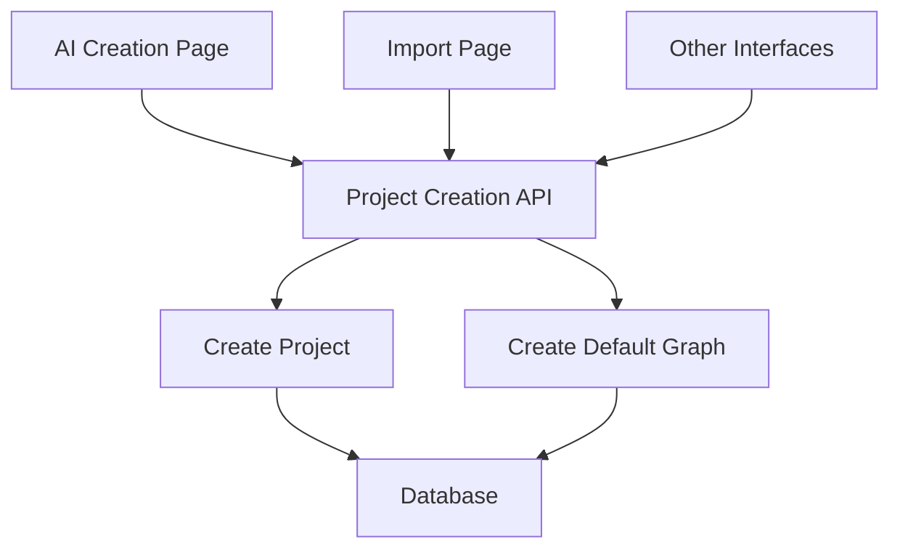
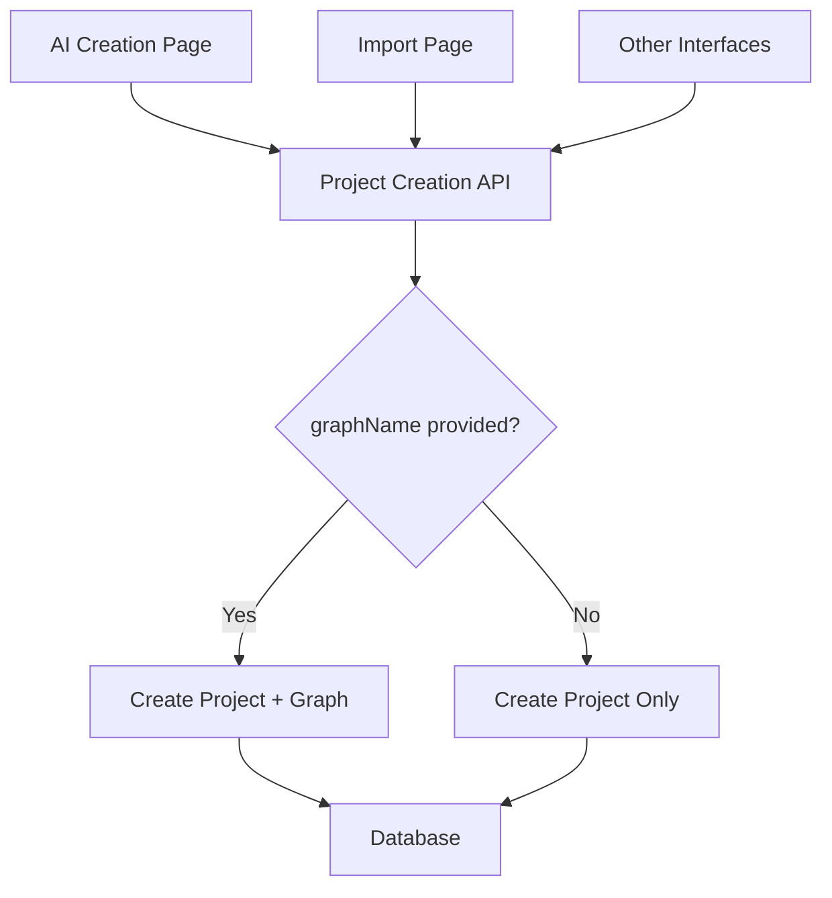
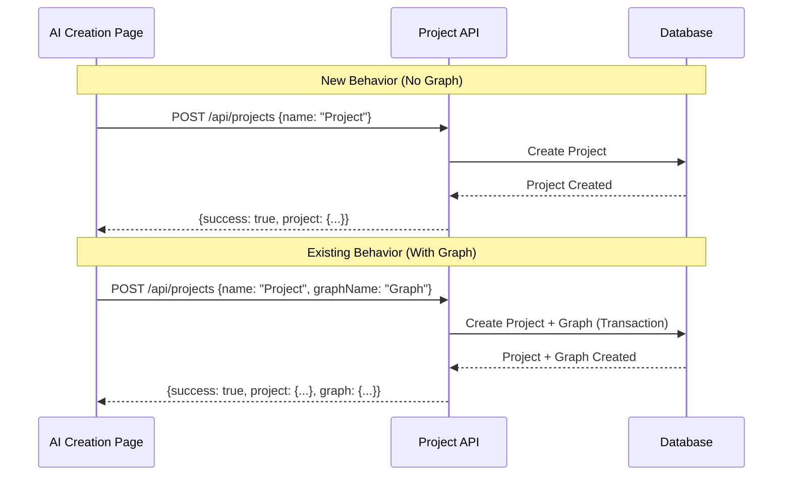

# Design Document

## Overview

This design implements optional graph creation functionality for the AI project creation workflow. Currently, the system automatically creates a "default graph" whenever a project is created through any interface. This modification will make graph creation optional in the project creation API while maintaining backward compatibility.

The key insight is that different user interfaces have different needs:
- **AI Creation Page (text-page)**: Users want to create projects without automatically creating graphs, giving them more control over project structure
- **Import Page**: Users expect automatic graph creation as part of their data import workflow
- **Other interfaces**: Should continue working without modification

This design achieves these goals by making the `graphName` parameter optional in the project creation API, allowing different interfaces to choose their behavior while maintaining full backward compatibility.

## Architecture

### Current Architecture



### New Architecture



### API Flow Changes



## Components and Interfaces

### 1. Project Creation API (`/api/projects`)

**Current Interface:**
```typescript
interface ProjectCreateRequest {
  name: string;
  graphName: string; // Required
}

interface ProjectCreateResponse {
  success: boolean;
  project: Project;
  graph: Graph;
  error?: string;
}
```

**New Interface:**
```typescript
interface ProjectCreateRequest {
  name: string;
  graphName?: string; // Optional
}

interface ProjectCreateResponse {
  success: boolean;
  project: Project;
  graph?: Graph; // Optional - only present when graph is created
  graphCreated?: boolean; // Indicates whether graph was created
  error?: string;
}
```

### 2. AI Creation Page Modifications

**Current Implementation:**
```typescript
const handleCreateProject = async () => {
  const response = await fetch('/api/projects', {
    method: 'POST',
    body: JSON.stringify({
      name: newProjectName.trim(),
      graphName: '默认图谱', // Always includes graphName
    }),
  });
};
```

**New Implementation:**
```typescript
const handleCreateProject = async () => {
  const response = await fetch('/api/projects', {
    method: 'POST',
    body: JSON.stringify({
      name: newProjectName.trim(),
      // No graphName parameter - creates project only
    }),
  });
};
```

### 3. Import Page (No Changes)

The import page will continue to include the `graphName` parameter, maintaining existing behavior:

```typescript
const handleCreateProject = async () => {
  const response = await fetch('/api/projects', {
    method: 'POST',
    body: JSON.stringify({
      name: newProjectName.trim(),
      graphName: '默认图谱', // Continues to include graphName
    }),
  });
};
```

## Data Models

The existing data models remain unchanged. The Prisma schema already supports the relationship structure needed:

```prisma
model Project {
  id          String  @id @default(cuid())
  name        String
  description String?
  // ... other fields
  graphs Graph[] // One-to-many relationship
}

model Graph {
  id        String  @id @default(cuid())
  name      String
  projectId String
  project   Project @relation(fields: [projectId], references: [id])
  // ... other fields
}
```

**Key Points:**
- Projects can exist without graphs (graphs array can be empty)
- Graphs must belong to a project (projectId is required)
- The relationship supports the new optional graph creation pattern

## Correctness Properties

*A property is a characteristic or behavior that should hold true across all valid executions of a system-essentially, a formal statement about what the system should do. Properties serve as the bridge between human-readable specifications and machine-verifiable correctness guarantees.*

### Property 1: API Optional Graph Creation

*For any* valid project name, when the Project Creation API receives a request without a graphName parameter, the API should create only the project and return a response with no graph data.

**Validates: Requirements 1.1, 4.2**

### Property 2: API Backward Compatibility

*For any* valid project name and graph name, when the Project Creation API receives a request with both name and graphName parameters, the API should create both project and graph and return both in the response (preserving existing behavior).

**Validates: Requirements 1.2, 4.1, 4.3**

### Property 3: AI Page Request Format

*For any* project creation request from the AI Creation Page, the request body should contain only the project name and should not include a graphName parameter.

**Validates: Requirements 2.1, 2.2**

### Property 4: Import Page Request Format

*For any* project creation request from the Import Page, the request body should contain both project name and graphName parameters (preserving existing behavior).

**Validates: Requirements 3.1, 3.2**

### Property 5: Response Format Consistency

*For any* project creation request, the API response should have a consistent structure with success indicator, project data, and optional graph data based on whether graph creation occurred.

**Validates: Requirements 5.1, 5.2, 5.3**

### Property 6: Error Handling Preservation

*For any* project creation request where project creation succeeds but graph creation fails, the API should return the project data with appropriate warning messages.

**Validates: Requirements 1.4, 5.4**

### Property 7: Response Metadata Accuracy

*For any* project creation response, the response metadata should accurately indicate whether graph creation occurred through appropriate fields like graphCreated boolean.

**Validates: Requirements 4.4**

## Error Handling

### API Error Scenarios

1. **Project Creation Failure**: Return appropriate error response with details
2. **Graph Creation Failure (when requested)**: Return project data with warning about graph creation failure
3. **Invalid Input Validation**: Maintain existing validation for project names
4. **Database Transaction Errors**: Ensure atomicity - if project creation fails, no partial data is created

### Error Response Format

```typescript
interface ErrorResponse {
  success: false;
  error: string;
  details?: string;
}

interface PartialSuccessResponse {
  success: true;
  project: Project;
  graph?: Graph;
  warnings?: string[];
  graphCreated: boolean;
}
```

### Frontend Error Handling

- **AI Creation Page**: Handle responses without graph data gracefully
- **Import Page**: Continue existing error handling patterns
- **All Pages**: Display appropriate user messages based on response type

## Testing Strategy

### Dual Testing Approach

This feature requires both unit tests and property-based tests for comprehensive coverage:

**Unit Tests** focus on:
- Specific API endpoint behavior with and without graphName parameter
- Frontend request format validation
- Error handling edge cases
- Database transaction rollback scenarios

**Property-Based Tests** focus on:
- Universal properties across all valid inputs (project names, graph names)
- API behavior consistency across different request formats
- Response format validation across all scenarios
- Error handling behavior across various failure conditions

### Property-Based Testing Configuration

- **Library**: Use fast-check for TypeScript/JavaScript property-based testing
- **Iterations**: Minimum 100 iterations per property test
- **Test Tags**: Each property test must reference its design document property

**Tag Format Examples:**
```typescript
// Feature: optional-graph-creation, Property 1: API Optional Graph Creation
// Feature: optional-graph-creation, Property 2: API Backward Compatibility
```

### Test Implementation Requirements

1. **Property 1 Test**: Generate random project names, call API without graphName, verify only project created
2. **Property 2 Test**: Generate random project/graph names, call API with both, verify both created
3. **Property 3 Test**: Mock AI page requests, verify no graphName in request body
4. **Property 4 Test**: Mock import page requests, verify graphName included in request body
5. **Property 5 Test**: Test response structure consistency across both scenarios
6. **Property 6 Test**: Simulate graph creation failures, verify project data returned with warnings
7. **Property 7 Test**: Verify response metadata accuracy across all scenarios

### Integration Testing

- Test complete workflows from frontend to database
- Verify backward compatibility with existing API consumers
- Test error scenarios end-to-end
- Validate database state consistency after operations

### Performance Considerations

- Monitor API response times for both scenarios (with/without graph creation)
- Ensure database transaction performance is not degraded
- Test with realistic data volumes to verify scalability