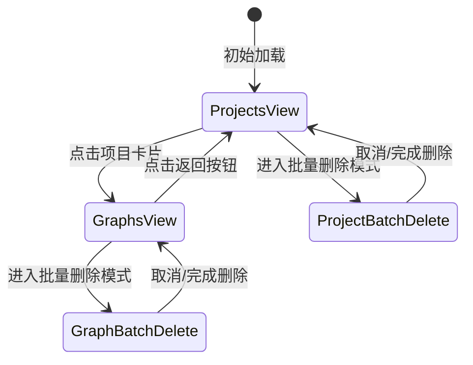

# Design Document: Project Graphs Display

## Overview

本设计文档描述了 project-graphs-display 功能的技术实现方案。该功能扩展了 /creation 页面，使用户能够点击项目卡片后查看该项目下的所有知识图谱，并支持批量删除这些图谱。

### 功能目标

- 在 /creation 页面点击项目卡片后，显示该项目的所有知识图谱
- 在图谱列表视图中保留导航栏的批量删除功能
- 支持批量删除项目下的知识图谱
- 提供清晰的导航和状态管理

### 技术栈

- **前端框架**: Next.js 14 (App Router)
- **状态管理**: Zustand
- **UI 组件**: React + TypeScript
- **样式**: CSS Modules
- **数据库**: PostgreSQL (通过 Prisma)
- **API**: Next.js API Routes

## Architecture

### 系统架构图

```mermaid
graph TB
    subgraph "前端层"
        A[NewCreationWorkflowPage] --> B[ProjectCard]
        A --> C[GraphCard]
        A --> D[BatchDeleteControls]
        A --> E[DeleteConfirmDialog]
    end
    
    subgraph "状态管理层"
        F[ViewState] --> G[selectedProject]
        F --> H[viewMode]
        F --> I[selectedGraphIds]
        F --> J[isBatchDeleteMode]
    end
    
    subgraph "API层"
        K[/api/projects/with-graphs] --> L[GET Projects]
        M[/api/graphs/batch-delete] --> N[DELETE Graphs]
    end
    
    subgraph "数据库层"
        O[(PostgreSQL)]
        O --> P[Project Table]
        O --> Q[Graph Table]
        O --> R[Node Table]
        O --> S[Edge Table]
    end
    
    A --> F
    A --> K
    A --> M
    K --> O
    M --> O
```

### 组件层次结构

```
NewCreationWorkflowPage (主容器)
├── SideNavigation (左侧导航栏)
│   ├── 新建按钮
│   ├── 导入按钮
│   └── AI创建按钮
├── MainContent (主内容区)
│   ├── FilterBar (筛选栏)
│   │   ├── SearchBar (搜索框)
│   │   ├── BatchDeleteControls (批量删除控件)
│   │   └── SortSelect (排序选择)
│   ├── BackButton (返回按钮 - 仅图谱视图)
│   └── ContentGrid (内容网格)
│       ├── ProjectView (项目视图)
│       │   └── ProjectCard[] (项目卡片列表)
│       │       ├── ProjectCardCheckbox (复选框 - 批量删除模式)
│       │       └── ProjectCardContent (卡片内容)
│       └── GraphView (图谱视图)
│           └── GraphCard[] (图谱卡片列表)
│               ├── GraphCardCheckbox (复选框 - 批量删除模式)
│               └── GraphCardContent (卡片内容)
├── CreateProjectModal (创建项目对话框)
└── DeleteConfirmDialog (删除确认对话框)
```

## Components and Interfaces

### 1. 视图状态管理

#### ViewMode 类型
```typescript
type ViewMode = 'projects' | 'graphs';
```

#### 组件状态接口
```typescript
interface CreationPageState {
  // 视图模式
  viewMode: ViewMode;
  selectedProject: Project | null;
  
  // 搜索和排序
  searchQuery: string;
  searchInput: string;
  sortBy: 'updateTime' | 'title';
  
  // 批量删除状态
  isBatchDeleteMode: boolean;
  selectedProjectIds: Set<string>;  // 项目视图使用
  selectedGraphIds: Set<string>;    // 图谱视图使用（新增）
  isDeleting: boolean;
  showDeleteConfirm: boolean;
  
  // 对话框状态
  isModalOpen: boolean;
}
```

### 2. GraphCard 组件（新增）

```typescript
interface GraphCardProps {
  graph: Graph;
  projectName: string;
  isBatchDeleteMode: boolean;
  isSelected: boolean;
  onToggleSelection: (graphId: string) => void;
  onClick: (graph: Graph) => void;
}

function GraphCard({
  graph,
  projectName,
  isBatchDeleteMode,
  isSelected,
  onToggleSelection,
  onClick
}: GraphCardProps): JSX.Element
```

**职责**:
- 显示图谱的基本信息（名称、创建时间、节点数、边数）
- 在批量删除模式下显示复选框
- 处理点击事件（导航到图谱详情或切换选择状态）

### 3. GraphCardCheckbox 组件（新增）

```typescript
interface GraphCardCheckboxProps {
  graphId: string;
  graphName: string;
  isSelected: boolean;
  onToggle: (graphId: string) => void;
}

function GraphCardCheckbox({
  graphId,
  graphName,
  isSelected,
  onToggle
}: GraphCardCheckboxProps): JSX.Element
```

**职责**:
- 渲染复选框
- 处理选择状态切换
- 提供无障碍支持（aria-label）

### 4. BatchDeleteControls 组件（扩展）

现有组件需要扩展以支持图谱批量删除：

```typescript
interface BatchDeleteControlsProps {
  isBatchDeleteMode: boolean;
  selectedCount: number;
  isDeleting: boolean;
  isProjectView: boolean;  // 新增：区分项目视图和图谱视图
  onEnterBatchMode: () => void;
  onConfirm: () => void;
  onCancel: () => void;
}
```

### 5. API 接口

#### 批量删除图谱 API（新增）

**端点**: `POST /api/graphs/batch-delete`

**请求体**:
```typescript
interface BatchDeleteGraphsRequest {
  graphIds: string[];
}
```

**响应**:
```typescript
interface BatchDeleteGraphsResponse {
  success: boolean;
  summary: {
    total: number;
    succeeded: number;
    failed: number;
  };
  deletedNodeCount: number;
  deletedEdgeCount: number;
  errors?: Array<{
    graphId: string;
    error: string;
  }>;
}
```

## Data Models

### 数据库模型（现有）

```prisma
model Project {
  id          String   @id @default(uuid())
  name        String   @db.VarChar(255)
  description String?
  settings    Json?
  nodeCount   Int      @default(0)
  edgeCount   Int      @default(0)
  userId      String
  createdAt   DateTime @default(now())
  updatedAt   DateTime @default(now())
  graphs      Graph[]
  nodes       Node[]
  edges       Edge[]
  user        User     @relation(fields: [userId], references: [id], onDelete: Cascade)
}

model Graph {
  id          String   @id @default(uuid())
  name        String   @db.VarChar(255)
  description String?
  settings    Json?
  isPublic    Boolean  @default(false)
  nodeCount   Int      @default(0)
  edgeCount   Int      @default(0)
  projectId   String?
  createdAt   DateTime @default(now())
  updatedAt   DateTime @default(now())
  nodes       Node[]
  edges       Edge[]
  project     Project? @relation(fields: [projectId], references: [id], onDelete: Cascade)
}
```

### 前端数据模型

```typescript
interface Graph {
  id: string;
  name: string;
  projectId: string;
  projectName?: string;
  createdAt?: string;
  updatedAt?: string;
  nodeCount?: number;
  edgeCount?: number;
}

interface Project {
  id: string;
  name: string;
  description?: string;
  createdAt?: string;
  updatedAt?: string;
  graphs?: Graph[];
  graphCount?: number;
}
```

## State Management

### 视图状态转换



### 状态管理策略

1. **本地状态管理**
   - 使用 React useState 管理组件内部状态
   - viewMode: 控制显示项目列表还是图谱列表
   - selectedProject: 当前选中的项目
   - selectedGraphIds: 图谱视图中选中的图谱ID集合

2. **URL 状态同步**
   - 项目视图: `/creation`
   - 图谱视图: `/creation?projectId={projectId}`
   - 支持深度链接和浏览器前进/后退

3. **数据刷新策略**
   - 删除操作后重新获取项目列表
   - 使用 `cache: 'no-store'` 确保获取最新数据
   - 实现重试机制处理数据库同步延迟

## User Interface Design

### 图谱列表视图布局

```
┌─────────────────────────────────────────────────────────────┐
│ 左侧导航栏 (1/6)                                              │
│ ┌─────────┐                                                  │
│ │ 3DGraph │                                                  │
│ │         │                                                  │
│ │ [新建]  │                                                  │
│ │ [导入]  │                                                  │
│ │ [AI创建]│                                                  │
│ └─────────┘                                                  │
└─────────────────────────────────────────────────────────────┘

┌─────────────────────────────────────────────────────────────┐
│ 主内容区 (5/6)                                                │
│ ┌─────────────────────────────────────────────────────────┐ │
│ │ 我的项目  [搜索框]        [批量删除] [排序: 更新时间▼]  │ │
│ └─────────────────────────────────────────────────────────┘ │
│                                                               │
│ ┌─────────────────────────────────────────────────────────┐ │
│ │ [← 返回项目列表]  项目：示例项目                         │ │
│ └─────────────────────────────────────────────────────────┘ │
│                                                               │
│ ┌──────────┐ ┌──────────┐ ┌──────────┐                      │
│ │ □ 图谱1  │ │ □ 图谱2  │ │ □ 图谱3  │                      │
│ │          │ │          │ │          │                      │
│ │ 2024-01  │ │ 2024-01  │ │ 2024-01  │                      │
│ │ 10节点   │ │ 15节点   │ │ 8节点    │                      │
│ │ 12边     │ │ 20边     │ │ 10边     │                      │
│ └──────────┘ └──────────┘ └──────────┘                      │
└─────────────────────────────────────────────────────────────┘
```

### 批量删除模式

**进入批量删除模式**:
1. 用户点击"批量删除"按钮
2. 所有卡片显示复选框
3. 批量删除控件显示"取消"和"确认删除"按钮

**选择图谱**:
1. 用户点击复选框选择/取消选择图谱
2. 导航栏显示选中数量
3. 确认删除按钮根据选择状态启用/禁用

**执行删除**:
1. 用户点击"确认删除"
2. 显示确认对话框，显示将删除的图谱数量
3. 用户确认后，发送批量删除请求
4. 显示加载状态，禁用操作按钮
5. 删除完成后，刷新列表，显示成功消息

### 样式规范

使用现有的 Morandi 色系：

```css
/* 图谱卡片样式 */
.graphCard {
  background: rgba(255, 255, 255, 0.9);
  border: 1px solid rgba(139, 166, 154, 0.25);
  border-radius: 8px;
  padding: 20px;
  cursor: pointer;
  transition: all 0.3s ease;
}

.graphCard:hover {
  transform: translateY(-2px);
  box-shadow: 0 4px 12px rgba(139, 166, 154, 0.2);
  border-color: rgba(139, 166, 154, 0.4);
}

/* 批量删除模式下的卡片 */
.graphCard.batchDeleteMode {
  cursor: default;
}

.graphCard.selected {
  border-color: #8ba69a;
  background: rgba(139, 166, 154, 0.1);
}
```


## Correctness Properties

*A property is a characteristic or behavior that should hold true across all valid executions of a system-essentially, a formal statement about what the system should do. Properties serve as the bridge between human-readable specifications and machine-verifiable correctness guarantees.*

### Property 1: 项目卡片点击触发视图切换

*For any* 项目，当用户点击该项目的卡片时，系统应该切换到图谱列表视图，并且 selectedProject 状态应该设置为该项目，viewMode 应该设置为 'graphs'

**Validates: Requirements 1.1**

### Property 2: 图谱列表显示完整性

*For any* 项目，当显示该项目的图谱列表视图时，显示的图谱集合应该与该项目的 graphs 数组完全一致（不多不少）

**Validates: Requirements 1.2**

### Property 3: 导航栏在图谱视图中保持可见

*For any* 项目，当切换到该项目的图谱列表视图时，导航栏组件应该仍然渲染并且批量删除功能应该可用

**Validates: Requirements 1.3, 3.1**

### Property 4: 图谱视图显示项目名称

*For any* 项目，当显示该项目的图谱列表视图时，页面应该显示该项目的名称

**Validates: Requirements 1.4**

### Property 5: 图谱卡片显示完整信息

*For any* 图谱，渲染后的图谱卡片应该包含图谱名称、创建时间、节点数量和边数量这四个字段的信息

**Validates: Requirements 2.1, 2.2, 2.3, 2.4**

### Property 6: 图谱卡片包含选择框

*For any* 图谱，在批量删除模式下，该图谱的卡片应该包含一个可交互的选择框元素

**Validates: Requirements 2.5**

### Property 7: 图谱卡片点击触发导航

*For any* 图谱，当用户点击该图谱的卡片（非选择框区域）时，系统应该导航到包含该图谱ID的URL路径

**Validates: Requirements 2.6**

### Property 8: 批量删除按钮状态与选择关联

*For any* 图谱选择状态，当至少选中一个图谱时，批量删除确认按钮应该是启用状态；当没有选中任何图谱时，批量删除确认按钮应该是禁用状态

**Validates: Requirements 3.2, 3.3**

### Property 9: 批量删除仅影响选中图谱

*For any* 图谱选择集合，执行批量删除操作后，只有选中的图谱应该被删除，未选中的图谱应该保持不变

**Validates: Requirements 3.4**

### Property 10: 批量删除不跨项目影响

*For any* 项目A的图谱选择集合，在项目A中执行批量删除操作后，其他项目的图谱数量和内容应该保持不变

**Validates: Requirements 3.5**

### Property 11: 删除按钮触发确认对话框

*For any* 非空的图谱选择集合，当用户点击批量删除确认按钮时，系统应该显示确认对话框

**Validates: Requirements 4.1**

### Property 12: 确认对话框显示正确数量

*For any* 图谱选择集合，确认对话框中显示的删除数量应该等于选择集合的大小

**Validates: Requirements 4.2**

### Property 13: 确认删除执行完整删除

*For any* 图谱选择集合，当用户确认删除操作后，所有选中的图谱都应该从数据库中被删除

**Validates: Requirements 4.3**

### Property 14: 删除后UI更新

*For any* 图谱选择集合，删除操作成功后，图谱列表视图中不应该再显示任何已删除的图谱

**Validates: Requirements 4.4**

### Property 15: 删除失败保留选择状态

*For any* 图谱选择集合，如果删除操作失败，选择状态应该保持不变，用户可以重试操作

**Validates: Requirements 4.6**

### Property 16: 选中图谱提供视觉反馈

*For any* 图谱，当该图谱被选中时，其卡片应该有视觉上的区别（如高亮、边框变化或勾选标记）

**Validates: Requirements 5.1**

### Property 17: 选择框切换状态

*For any* 图谱，点击其选择框两次应该回到初始的选择状态（选中→未选中→选中 或 未选中→选中→未选中）

**Validates: Requirements 5.2**

### Property 18: 全选和取消全选往返

*For any* 项目的图谱列表，执行全选后再执行取消全选，应该回到没有任何图谱被选中的状态

**Validates: Requirements 5.3, 5.4**

### Property 19: 导航栏显示选中数量

*For any* 图谱选择集合，导航栏中显示的选中数量应该等于选择集合的大小

**Validates: Requirements 5.5**

### Property 20: 图谱视图包含返回按钮

*For any* 项目，当显示该项目的图谱列表视图时，页面应该包含一个可点击的返回按钮或面包屑导航

**Validates: Requirements 6.1**

### Property 21: 返回按钮触发视图切换

*For any* 项目，在图谱列表视图中点击返回按钮后，系统应该切换回项目列表视图，viewMode 应该设置为 'projects'

**Validates: Requirements 6.2**

### Property 22: 返回时清除选择状态

*For any* 图谱选择集合，当从图谱列表视图返回到项目列表视图时，图谱选择状态应该被清空

**Validates: Requirements 6.3**

### Property 23: URL反映视图状态

*For any* 视图状态，URL路径应该反映当前的视图模式（项目列表视图对应 /creation，图谱列表视图对应 /creation?projectId={id}）

**Validates: Requirements 6.4**

### Property 24: 深度链接加载正确视图

*For any* 有效的项目ID，当用户直接访问 /creation?projectId={id} 时，系统应该正确加载该项目的图谱列表视图

**Validates: Requirements 6.5**

### Property 25: 图谱列表加载最新数据

*For any* 项目，当加载该项目的图谱列表视图时，显示的图谱数据应该是从数据库获取的最新数据

**Validates: Requirements 7.1**

### Property 26: 删除操作禁用按钮

*For any* 删除操作，在操作执行期间，相关的操作按钮应该处于禁用状态；操作完成后，按钮应该重新启用

**Validates: Requirements 7.4, 7.5**

### Property 27: 加载时显示指示器

*For any* 数据加载操作，在加载期间，系统应该显示加载指示器；加载完成后，指示器应该消失

**Validates: Requirements 8.2**

### Property 28: 删除时显示进度指示器

*For any* 批量删除操作，在操作执行期间，系统应该显示进度指示器或加载状态

**Validates: Requirements 8.3**

## Error Handling

### 错误类型和处理策略

#### 1. 网络错误

**场景**: API 请求失败（网络断开、超时等）

**处理策略**:
- 显示用户友好的错误消息
- 提供重试按钮
- 保持当前状态不变
- 记录错误日志

```typescript
try {
  const response = await fetch('/api/graphs/batch-delete', {
    method: 'POST',
    headers: { 'Content-Type': 'application/json' },
    body: JSON.stringify({ graphIds })
  });
  
  if (!response.ok) {
    throw new Error('网络请求失败');
  }
  
  const data = await response.json();
  // 处理成功响应
} catch (error) {
  console.error('批量删除失败:', error);
  setError('删除操作失败，请检查网络连接后重试');
  setShowRetryButton(true);
}
```

#### 2. 数据不存在错误

**场景**: 访问已删除的项目或图谱

**处理策略**:
- 显示404错误消息
- 自动导航回项目列表
- 清理无效的URL参数和本地状态

```typescript
// 在加载项目数据时
if (!project) {
  setError('项目不存在或已被删除');
  setTimeout(() => {
    router.push('/creation');
  }, 2000);
  return;
}
```

#### 3. 权限错误

**场景**: 用户尝试删除不属于自己的图谱

**处理策略**:
- 显示权限错误消息
- 阻止操作执行
- 不改变当前状态

```typescript
if (response.status === 403) {
  setError('您没有权限执行此操作');
  return;
}
```

#### 4. 部分失败错误

**场景**: 批量删除时部分图谱删除失败

**处理策略**:
- 显示详细的成功/失败统计
- 列出失败的图谱和原因
- 刷新列表显示最新状态
- 允许用户重试失败的项

```typescript
if (data.summary.failed > 0) {
  const failedGraphs = data.errors.map(e => e.graphId).join(', ');
  setError(`部分删除失败：${data.summary.failed} 个图谱删除失败 (${failedGraphs})`);
  setShowRetryButton(true);
}
```

#### 5. 数据库同步延迟

**场景**: 删除操作后立即查询，数据尚未同步

**处理策略**:
- 实现重试机制（最多3次）
- 使用指数退避策略（500ms, 1000ms, 1500ms）
- 添加缓存控制头确保获取最新数据

```typescript
let retryCount = 0;
const maxRetries = 3;
let verified = false;

while (retryCount < maxRetries && !verified) {
  if (retryCount > 0) {
    const delay = 500 * retryCount;
    await new Promise(resolve => setTimeout(resolve, delay));
  }
  
  const response = await fetch('/api/projects/with-graphs', {
    cache: 'no-store',
    headers: {
      'Cache-Control': 'no-cache, no-store, must-revalidate',
      'Pragma': 'no-cache',
    },
  });
  
  const data = await response.json();
  
  // 验证删除是否成功
  const stillExists = data.projects.some(p => 
    p.graphs.some(g => deletedGraphIds.includes(g.id))
  );
  
  if (!stillExists) {
    verified = true;
  }
  
  retryCount++;
}
```

### 错误消息规范

所有错误消息应该：
- 使用中文
- 清晰描述问题
- 提供可能的解决方案
- 避免技术术语

**示例**:
- ✅ "删除操作失败，请检查网络连接后重试"
- ❌ "Error: Network request failed with status 500"

## Testing Strategy

### 测试方法论

本功能采用双重测试策略：

1. **单元测试**: 验证具体示例、边界情况和错误条件
2. **属性测试**: 验证跨所有输入的通用属性

两种测试方法是互补的，共同确保全面的测试覆盖。

### 属性测试配置

**测试库**: `@fast-check/jest` (JavaScript/TypeScript 的属性测试库)

**配置要求**:
- 每个属性测试最少运行 100 次迭代
- 每个测试必须引用设计文档中的属性编号
- 使用标签格式: `Feature: project-graphs-display, Property {number}: {property_text}`

### 测试用例组织

#### 1. 视图切换测试

**单元测试**:
```typescript
describe('View Switching', () => {
  it('should switch to graphs view when project card is clicked', () => {
    // 测试具体的点击行为
  });
  
  it('should switch back to projects view when back button is clicked', () => {
    // 测试返回按钮
  });
  
  it('should show empty state when project has no graphs', () => {
    // 边界情况：空图谱列表
  });
});
```

**属性测试**:
```typescript
describe('View Switching Properties', () => {
  it('Property 1: Project card click triggers view switch', () => {
    fc.assert(
      fc.property(
        fc.record({
          id: fc.uuid(),
          name: fc.string({ minLength: 1, maxLength: 50 }),
          graphs: fc.array(graphArbitrary)
        }),
        (project) => {
          // Feature: project-graphs-display, Property 1
          const result = handleProjectCardClick(project);
          expect(result.viewMode).toBe('graphs');
          expect(result.selectedProject).toEqual(project);
        }
      ),
      { numRuns: 100 }
    );
  });
  
  it('Property 21: Back button triggers view switch', () => {
    fc.assert(
      fc.property(
        fc.record({
          id: fc.uuid(),
          name: fc.string({ minLength: 1, maxLength: 50 }),
          graphs: fc.array(graphArbitrary)
        }),
        (project) => {
          // Feature: project-graphs-display, Property 21
          // 先切换到图谱视图
          const graphsView = handleProjectCardClick(project);
          // 再点击返回
          const projectsView = handleBackButton(graphsView);
          expect(projectsView.viewMode).toBe('projects');
        }
      ),
      { numRuns: 100 }
    );
  });
});
```

#### 2. 批量删除测试

**单元测试**:
```typescript
describe('Batch Delete', () => {
  it('should show confirm dialog when delete button is clicked', () => {
    // 测试对话框显示
  });
  
  it('should delete selected graphs on confirmation', async () => {
    // 测试删除操作
  });
  
  it('should handle partial deletion failures', async () => {
    // 错误情况：部分失败
  });
  
  it('should handle network errors gracefully', async () => {
    // 错误情况：网络失败
  });
});
```

**属性测试**:
```typescript
describe('Batch Delete Properties', () => {
  it('Property 9: Batch delete only affects selected graphs', () => {
    fc.assert(
      fc.property(
        fc.array(graphArbitrary, { minLength: 5, maxLength: 20 }),
        fc.array(fc.integer({ min: 0, max: 19 }), { minLength: 1, maxLength: 10 }),
        async (allGraphs, selectedIndices) => {
          // Feature: project-graphs-display, Property 9
          const selectedIds = selectedIndices.map(i => allGraphs[i].id);
          const unselectedIds = allGraphs
            .filter((_, i) => !selectedIndices.includes(i))
            .map(g => g.id);
          
          await batchDeleteGraphs(selectedIds);
          
          const remainingGraphs = await fetchGraphs();
          const remainingIds = remainingGraphs.map(g => g.id);
          
          // 选中的应该被删除
          selectedIds.forEach(id => {
            expect(remainingIds).not.toContain(id);
          });
          
          // 未选中的应该保留
          unselectedIds.forEach(id => {
            expect(remainingIds).toContain(id);
          });
        }
      ),
      { numRuns: 100 }
    );
  });
  
  it('Property 10: Batch delete does not affect other projects', () => {
    fc.assert(
      fc.property(
        fc.record({
          projectA: projectWithGraphsArbitrary,
          projectB: projectWithGraphsArbitrary
        }),
        fc.array(fc.integer()),
        async ({ projectA, projectB }, selectedIndices) => {
          // Feature: project-graphs-display, Property 10
          const selectedIds = selectedIndices
            .filter(i => i < projectA.graphs.length)
            .map(i => projectA.graphs[i].id);
          
          const projectBGraphCountBefore = projectB.graphs.length;
          
          await batchDeleteGraphs(selectedIds);
          
          const projectBAfter = await fetchProject(projectB.id);
          expect(projectBAfter.graphs.length).toBe(projectBGraphCountBefore);
        }
      ),
      { numRuns: 100 }
    );
  });
});
```

#### 3. 选择状态测试

**单元测试**:
```typescript
describe('Selection State', () => {
  it('should toggle selection when checkbox is clicked', () => {
    // 测试单个选择切换
  });
  
  it('should select all graphs when select all is clicked', () => {
    // 测试全选
  });
  
  it('should clear selection when cancel is clicked', () => {
    // 测试取消选择
  });
});
```

**属性测试**:
```typescript
describe('Selection State Properties', () => {
  it('Property 17: Checkbox toggles selection state', () => {
    fc.assert(
      fc.property(
        graphArbitrary,
        fc.boolean(),
        (graph, initialState) => {
          // Feature: project-graphs-display, Property 17
          let state = initialState;
          
          // 点击两次应该回到初始状态
          state = toggleSelection(graph.id, state);
          state = toggleSelection(graph.id, state);
          
          expect(state).toBe(initialState);
        }
      ),
      { numRuns: 100 }
    );
  });
  
  it('Property 18: Select all then deselect all returns to empty', () => {
    fc.assert(
      fc.property(
        fc.array(graphArbitrary, { minLength: 1, maxLength: 50 }),
        (graphs) => {
          // Feature: project-graphs-display, Property 18
          let selectedIds = new Set<string>();
          
          // 全选
          selectedIds = selectAll(graphs.map(g => g.id));
          expect(selectedIds.size).toBe(graphs.length);
          
          // 取消全选
          selectedIds = deselectAll();
          expect(selectedIds.size).toBe(0);
        }
      ),
      { numRuns: 100 }
    );
  });
});
```

#### 4. 数据显示测试

**单元测试**:
```typescript
describe('Data Display', () => {
  it('should display graph name in card', () => {
    // 测试名称显示
  });
  
  it('should display node and edge counts', () => {
    // 测试统计信息显示
  });
  
  it('should format creation date correctly', () => {
    // 测试日期格式化
  });
});
```

**属性测试**:
```typescript
describe('Data Display Properties', () => {
  it('Property 5: Graph card displays complete information', () => {
    fc.assert(
      fc.property(
        graphArbitrary,
        (graph) => {
          // Feature: project-graphs-display, Property 5
          const rendered = renderGraphCard(graph);
          
          expect(rendered).toContain(graph.name);
          expect(rendered).toContain(graph.createdAt);
          expect(rendered).toContain(String(graph.nodeCount));
          expect(rendered).toContain(String(graph.edgeCount));
        }
      ),
      { numRuns: 100 }
    );
  });
  
  it('Property 2: Graph list displays all project graphs', () => {
    fc.assert(
      fc.property(
        projectWithGraphsArbitrary,
        (project) => {
          // Feature: project-graphs-display, Property 2
          const displayedGraphs = renderGraphList(project);
          
          expect(displayedGraphs.length).toBe(project.graphs.length);
          
          project.graphs.forEach(graph => {
            expect(displayedGraphs.some(d => d.id === graph.id)).toBe(true);
          });
        }
      ),
      { numRuns: 100 }
    );
  });
});
```

### 测试数据生成器

使用 fast-check 的 arbitrary 生成器创建测试数据：

```typescript
import * as fc from 'fast-check';

// 图谱数据生成器
const graphArbitrary = fc.record({
  id: fc.uuid(),
  name: fc.string({ minLength: 1, maxLength: 100 }),
  projectId: fc.uuid(),
  createdAt: fc.date().map(d => d.toISOString()),
  updatedAt: fc.date().map(d => d.toISOString()),
  nodeCount: fc.integer({ min: 0, max: 1000 }),
  edgeCount: fc.integer({ min: 0, max: 5000 })
});

// 项目数据生成器
const projectWithGraphsArbitrary = fc.record({
  id: fc.uuid(),
  name: fc.string({ minLength: 1, maxLength: 100 }),
  description: fc.option(fc.string({ maxLength: 500 })),
  createdAt: fc.date().map(d => d.toISOString()),
  updatedAt: fc.date().map(d => d.toISOString()),
  graphs: fc.array(graphArbitrary, { minLength: 0, maxLength: 20 })
});
```

### 测试覆盖率目标

- **语句覆盖率**: ≥ 90%
- **分支覆盖率**: ≥ 85%
- **函数覆盖率**: ≥ 90%
- **属性测试**: 所有28个正确性属性都应该有对应的属性测试

### 集成测试

除了单元测试和属性测试，还需要进行端到端集成测试：

```typescript
describe('E2E: Project Graphs Display', () => {
  it('should complete full workflow: view graphs -> select -> delete', async () => {
    // 1. 加载项目列表
    // 2. 点击项目卡片
    // 3. 验证图谱列表显示
    // 4. 进入批量删除模式
    // 5. 选择图谱
    // 6. 确认删除
    // 7. 验证删除成功
    // 8. 返回项目列表
  });
});
```

### 性能测试

虽然具体的时间要求（如500ms）不在单元测试范围内，但应该进行性能基准测试：

```typescript
describe('Performance Benchmarks', () => {
  it('should render 100 graphs within reasonable time', () => {
    const graphs = generateGraphs(100);
    const startTime = performance.now();
    renderGraphList(graphs);
    const endTime = performance.now();
    
    // 记录性能数据，但不作为测试失败条件
    console.log(`Rendered 100 graphs in ${endTime - startTime}ms`);
  });
});
```
